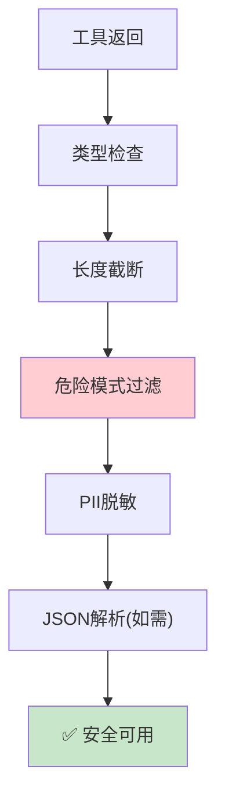

# Agent 工具结果验证最新

> 知识库 79 仅 142 行、知识库 202 有深度。这篇整合为最新——5 层验证 + 质量评估。

---

## 一、验证流程



---

## 二、实现

```python
import re
from dataclasses import dataclass
from typing import Any

@dataclass
class ValidationResult:
    is_valid: bool
    sanitized: Any = None
    issues: list[str] = None
    truncated: bool = False

class ToolResultValidator:
    """工具结果验证器——5层检查。"""

    MAX_LENGTH = 5000
    DANGEROUS = [
        (r"ignore.{0,15}(previous|above|all).{0,15}(instruction|prompt)", "注入指令"),
        (r"__import__\s*\(", "代码注入"),
        (r"eval\s*\(", "代码执行"),
    ]
    PII = [
        (r'\b1[3-9]\d{9}\b', "手机号"),
        (r'\b\d{17}[\dXx]\b', "身份证"),
        (r'sk-[a-zA-Z0-9]{40,}', "API Key"),
    ]

    @classmethod
    def validate(cls, result: Any) -> ValidationResult:
        """完整5层验证。"""
        issues = []
        sanitized = result

        # 1. 类型检查
        result_str = str(sanitized)

        # 2. 长度截断
        truncated = False
        if len(result_str) > cls.MAX_LENGTH:
            sanitized = result_str[:cls.MAX_LENGTH] + "\n[已截断]"
            truncated = True
            issues.append("结果过长，已截断")

        # 3. 危险模式
        for pattern, desc in cls.DANGEROUS:
            if re.search(pattern, result_str, re.IGNORECASE):
                issues.append(f"危险模式: {desc}")
                sanitized = re.sub(pattern, "[已过滤]", sanitized, flags=re.IGNORECASE)

        # 4. PII脱敏
        for pattern, desc in cls.PII:
            if re.search(pattern, result_str):
                issues.append(f"含PII: {desc}")
                sanitized = re.sub(pattern, f"[{desc}脱敏]", sanitized)

        # 5. 空结果
        if not result_str.strip():
            issues.append("工具返回空结果")

        return ValidationResult(
            is_valid=len(issues) == 0 or (truncated and len(issues) == 1),
            sanitized=sanitized,
            issues=issues,
            truncated=truncated,
        )
```

---

## 三、最佳实践

| 实践 | 说明 | 优先级 |
|------|------|--------|
| 所有工具结果验证 | 防恶意数据 | ★★★ |
| 长度限制 | 防上下文溢出 | ★★★ |
| PII脱敏 | 防泄露 | ★★★ |
| 危险模式过滤 | 防注入 | ★★☆ |

---

## 四、检查清单

| 检查项 | 状态 |
|--------|------|
| 有5层验证器 | ☐ |
