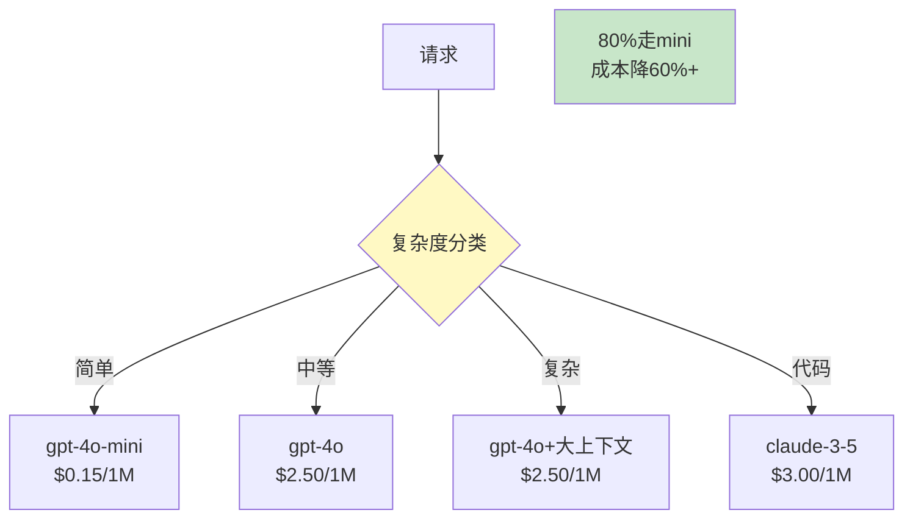

# 多模型智能路由最新

> 知识库 81 仅 159 行、知识库 137 有 LLM 网关。这篇整合为最新——路由策略、降级链和成本对比。

---

## 一、路由架构



---

## 二、实现

```python
from dataclasses import dataclass
from enum import Enum

class ModelTier(str, Enum):
    FAST = "fast"
    STANDARD = "standard"
    POWERFUL = "powerful"

@dataclass
class ModelConfig:
    """模型配置。"""
    model: str
    tier: ModelTier
    input_cost: float   # $/1M tokens
    output_cost: float
    max_tokens: int = 1000

MODELS = {
    "gpt-4o-mini": ModelConfig("gpt-4o-mini", ModelTier.FAST, 0.15, 0.60, 500),
    "gpt-4o": ModelConfig("gpt-4o", ModelTier.STANDARD, 2.50, 10.00, 1000),
    "claude-3-5-sonnet": ModelConfig("claude-3-5-sonnet", ModelTier.POWERFUL, 3.00, 15.00, 2000),
}

class ModelRouter:
    """智能模型路由器。"""

    @staticmethod
    def route(query: str) -> str:
        """根据查询复杂度选模型。"""
        # 简单
        if len(query) < 20 or any(w in query for w in ["你好", "谢谢", "是", "不是"]):
            return "gpt-4o-mini"
        # 代码
        if any(w in query for w in ["代码", "编程", "函数", "bug", "code"]):
            return "claude-3-5-sonnet"
        # 复杂
        if any(w in query for w in ["分析", "对比", "研究", "报告"]):
            return "gpt-4o"
        # 默认
        return "gpt-4o-mini"

    @staticmethod
    def cost_estimate(model: str, input_tokens: int, output_tokens: int) -> float:
        """估算成本。"""
        config = MODELS.get(model, MODELS["gpt-4o-mini"])
        return (input_tokens / 1e6 * config.input_cost +
                output_tokens / 1e6 * config.output_cost)


class FallbackChain:
    """降级链。"""

    CHAIN = ["gpt-4o", "gpt-4o-mini", "claude-3-haiku"]

    @classmethod
    def get_fallback(cls, failed_model: str) -> str | None:
        """获取降级模型。"""
        try:
            idx = cls.CHAIN.index(failed_model)
            if idx + 1 < len(cls.CHAIN):
                return cls.CHAIN[idx + 1]
        except ValueError:
            pass
        return None
```

---

## 三、最佳实践

| 实践 | 说明 | 优先级 |
|------|------|--------|
| 80%走mini | 成本降60%+ | ★★★ |
| 代码走Claude | 代码最强 | ★★★ |
| 有降级链 | 主模型失败→备用 | ★★★ |
| 监控路由分布 | 统计各模型占比 | ★★☆ |

---

## 四、检查清单

| 检查项 | 状态 |
|--------|------|
| 有路由器 | ☐ |
| 有降级链 | ☐ |
