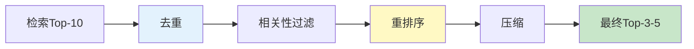

# RAG 检索后处理与过滤最新

> 知识库 80 有 180 行、知识库 210 有深度。这篇整合为最新——去重、过滤、重排序和压缩。

---

## 一、后处理流程



---

## 二、实现

```python
from langchain_core.documents import Document
from dataclasses import dataclass
import hashlib

@dataclass
class PostProcessConfig:
    deduplicate: bool = True
    min_relevance: float = 0.3
    max_results: int = 5
    compress: bool = True
    max_context_tokens: int = 2000

class RetrievalPostProcessor:
    """检索后处理器。"""

    def __init__(self, config: PostProcessConfig = PostProcessConfig()):
        self.config = config

    def process(self, docs: list[Document], query: str) -> list[Document]:
        """完整后处理。"""
        if self.config.deduplicate:
            docs = self._dedupe(docs)
        docs = self._filter_relevance(docs, query)
        docs = self._rerank(docs, query)
        docs = docs[:self.config.max_results]
        if self.config.compress:
            docs = self._compress(docs)
        return docs

    @staticmethod
    def _dedupe(docs: list[Document]) -> list[Document]:
        """去重——content hash。"""
        seen = set()
        result = []
        for doc in docs:
            h = hashlib.md5(doc.page_content[:200].encode()).hexdigest()
            if h not in seen:
                seen.add(h)
                result.append(doc)
        return result

    @staticmethod
    def _filter_relevance(docs: list[Document], query: str) -> list[Document]:
        """相关性过滤——关键词重叠。"""
        query_words = set(query.lower().split())
        if not query_words:
            return docs
        filtered = []
        for doc in docs:
            doc_words = set(doc.page_content.lower().split())
            overlap = len(query_words & doc_words) / max(len(query_words), 1)
            doc.metadata["relevance_score"] = overlap
            if overlap > 0:
                filtered.append(doc)
        return filtered if filtered else docs

    @staticmethod
    def _rerank(docs: list[Document], query: str) -> list[Document]:
        """重排序——按相关度。"""
        return sorted(docs, key=lambda d: d.metadata.get("relevance_score", 0), reverse=True)

    @staticmethod
    def _compress(docs: list[Document]) -> list[Document]:
        """压缩——总长度控制。"""
        result = []
        total = 0
        for doc in docs:
            content = doc.page_content
            if total + len(content) > 2000:
                remaining = 2000 - total
                if remaining > 100:
                    content = content[:remaining] + "..."
                else:
                    break
            result.append(Document(page_content=content, metadata=doc.metadata))
            total += len(content)
        return result
```

---

## 三、最佳实践

| 实践 | 说明 | 优先级 |
|------|------|--------|
| 必须去重 | 减少冗余 | ★★★ |
| 相关性过滤 | 去除不相关 | ★★★ |
| 重排序精排 | 提升Top-K质量 | ★★★ |
| 最终3-5个 | 不贪多 | ★★☆ |

---

## 四、检查清单

| 检查项 | 状态 |
|--------|------|
| 有去重 | ☐ |
| 有过滤 | ☐ |
| 有重排序 | ☐ |
