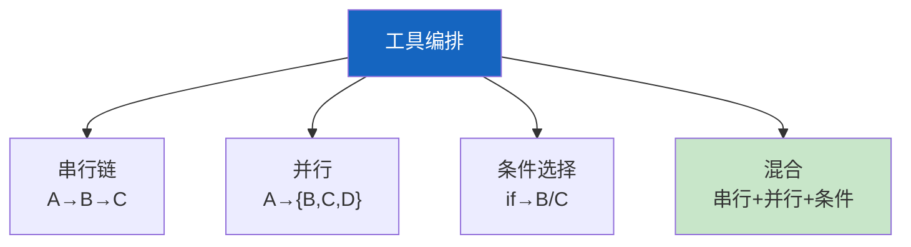

# Agent 工具链编排最新

> 知识库 83 有 185 行。这篇讲透——工具组合模式、依赖管理和执行编排。

---

## 一、工具组合模式



---

## 二、实现

```python
import asyncio
from dataclasses import dataclass, field
from typing import Callable

@dataclass
class ToolChainConfig:
    """工具链配置。"""
    max_tools: int = 10
    timeout_per_tool: int = 30
    max_total_time: int = 60

class ToolChainExecutor:
    """工具链执行器。"""

    def __init__(self, config: ToolChainConfig = ToolChainConfig()):
        self.config = config
        self.execution_log: list[dict] = []

    async def execute_serial(self, tools: list[Callable], initial_input: Any) -> list:
        """串行执行：A→B→C，前一个输出是后一个输入。"""
        result = initial_input
        results = []
        for tool in tools:
            result = await asyncio.wait_for(tool(result), timeout=self.config.timeout_per_tool)
            results.append(result)
            self.execution_log.append({"tool": tool.__name__, "status": "done"})
        return results

    async def execute_parallel(self, tools: list[Callable], input_data: Any) -> list:
        """并行执行：同时执行多个工具。"""
        tasks = [asyncio.wait_for(t(input_data), timeout=self.config.timeout_per_tool) for t in tools]
        results = await asyncio.gather(*tasks, return_exceptions=True)
        return [r if not isinstance(r, Exception) else f"错误: {r}" for r in results]

    async def execute_conditional(self, tools: dict[str, Callable], condition_func: Callable, input_data: Any):
        """条件执行：根据条件选择工具。"""
        selected = condition_func(input_data)
        tool = tools.get(selected)
        if tool:
            return await asyncio.wait_for(tool(input_data), timeout=self.config.timeout_per_tool)
        return None

    def log_summary(self) -> dict:
        return {
            "total_executions": len(self.execution_log),
            "tools_used": list(set(e["tool"] for e in self.execution_log)),
        }
```

---

## 三、最佳实践

| 实践 | 说明 | 优先级 |
|------|------|--------|
| 工具5-10个最佳 | 太多决策混乱 | ★★★ |
| 每个工具有超时 | 防止卡住 | ★★★ |
| 有执行日志 | 可追溯 | ★★☆ |
| 工具描述要精确 | Agent靠描述选 | ★★★ |

---

## 四、检查清单

| 检查项 | 状态 |
|--------|------|
| 有串行/并行/条件执行 | ☐ |
