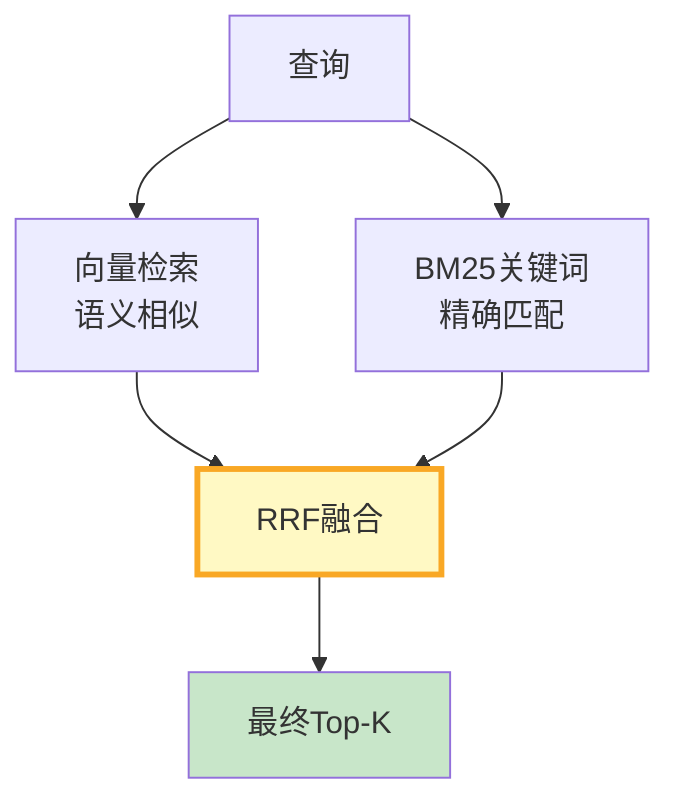

# RAG 混合检索调优最新

> 知识库 87 仅 141 行、知识库 157 和 219 有深度。这篇整合为最新——BM25 参数、权重搜索和中文分词优化。

---

## 一、混合检索架构



---

## 二、实现

```python
from rank_bm25 import BM25Okapi
import jieba
from dataclasses import dataclass

@dataclass
class BM25Config:
    k1: float = 1.5      # 词频饱和(1.0-2.0)
    b: float = 0.75       # 文档长度归一化(0-1)
    epsilon: float = 0.25

class TunableBM25:
    """可调参BM25检索器。"""

    def __init__(self, documents: list[str], config: BM25Config = BM25Config()):
        self.config = config
        self.tokenized = [list(jieba.cut(doc)) for doc in documents]
        self.bm25 = BM25Okapi(self.tokenized, k1=config.k1, b=config.b, epsilon=config.epsilon)

    def search(self, query: str, k: int = 5) -> list:
        tokens = list(jieba.cut(query))
        scores = self.bm25.get_scores(tokens)
        ranked = sorted(enumerate(scores), key=lambda x: x[1], reverse=True)
        return ranked[:k]


class HybridRetriever:
    """混合检索器——向量+BM25+RRF融合。"""

    def __init__(self, vectorstore, bm25: TunableBM25, vec_weight: float = 0.5, kw_weight: float = 0.5):
        self.vectorstore = vectorstore
        self.bm25 = bm25
        self.vec_w = vec_weight
        self.kw_w = kw_weight

    async def retrieve(self, query: str, k: int = 5) -> list:
        """混合检索+RRF融合。"""
        vec_docs = await self.vectorstore.asimilarity_search(query, k=k)
        kw_results = self.bm25.search(query, k=k)

        scores = {}
        for rank, doc in enumerate(vec_docs):
            key = hash(doc.page_content[:200])
            scores[key] = scores.get(key, 0) + self.vec_w / (60 + rank + 1)
        for rank, (idx, _) in enumerate(kw_results):
            key = hash(self.bm25.tokenized[idx][:50])
            scores[key] = scores.get(key, 0) + self.kw_w / (60 + rank + 1)

        sorted_keys = sorted(scores.keys(), key=lambda x: scores[x], reverse=True)
        return sorted_keys[:k]
```

---

## 三、最佳实践

| 实践 | 说明 | 优先级 |
|------|------|--------|
| k1=1.5, b=0.75起步 | BM25标准推荐 | ★★★ |
| 中文用jieba分词 | 基础前提 | ★★★ |
| 权重从0.5/0.5开始 | 均衡默认 | ★★★ |
| RRF比加权更鲁棒 | 不依赖分数归一化 | ★★☆ |

---

## 四、检查清单

| 检查项 | 状态 |
|--------|------|
| 有BM25检索器 | ☐ |
| 有混合检索+RRF | ☐ |
