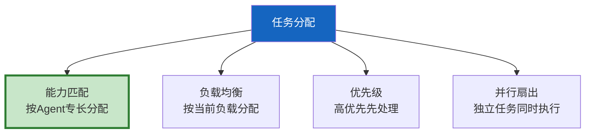

# 多 Agent 任务分配策略最新

> 知识库 90 有 184 行。这篇讲透——任务分解、负载均衡和能力匹配。

---

## 一、任务分配策略



---

## 二、实现

```python
import asyncio
from dataclasses import dataclass, field
from enum import Enum
from typing import Callable

class TaskPriority(int, Enum):
    HIGH = 0
    MEDIUM = 1
    LOW = 2

@dataclass
class AgentCapability:
    """Agent能力。"""
    agent_id: str
    skills: list[str]       # 擅长技能
    current_load: int = 0   # 当前负载(进行中任务数)
    max_load: int = 3       # 最大并发

@dataclass
class SubTask:
    """子任务。"""
    task_id: str
    description: str
    required_skills: list[str] = field(default_factory=list)
    priority: TaskPriority = TaskPriority.MEDIUM
    assigned_to: str = ""

class TaskAllocator:
    """任务分配器。"""

    def __init__(self):
        self.agents: dict[str, AgentCapability] = {}

    def register_agent(self, cap: AgentCapability):
        self.agents[cap.agent_id] = cap

    def allocate(self, task: SubTask) -> str | None:
        """分配任务——能力匹配+负载均衡。"""
        # 1. 能力匹配
        candidates = [
            a for a in self.agents.values()
            if any(s in a.skills for s in task.required_skills)
            and a.current_load < a.max_load
        ]
        if not candidates:
            return None

        # 2. 负载均衡——选负载最低的
        best = min(candidates, key=lambda a: a.current_load)
        best.current_load += 1
        task.assigned_to = best.agent_id
        return best.agent_id

    async def allocate_parallel(self, tasks: list[SubTask]) -> dict:
        """并行分配多个任务。"""
        results = {}
        for task in sorted(tasks, key=lambda t: t.priority):
            agent_id = self.allocate(task)
            results[task.task_id] = agent_id or "无可用Agent"
        return results

    def stats(self) -> dict:
        return {
            "total_agents": len(self.agents),
            "total_load": sum(a.current_load for a in self.agents.values()),
            "by_agent": {a.agent_id: a.current_load for a in self.agents.values()},
        }
```

---

## 三、最佳实践

| 策略 | 说明 | 优先级 |
|------|------|--------|
| 能力匹配优先 | 让专业Agent做专业事 | ★★★ |
| 负载均衡 | 避免一个Agent过载 | ★★★ |
| 优先级排序 | 高优先先分配 | ★★☆ |
| 有最大负载限制 | 防过载 | ★★★ |

---

## 四、检查清单

| 检查项 | 状态 |
|--------|------|
| 有任务分配器 | ☐ |
| 有能力匹配 | ☐ |
