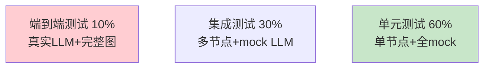

# LangGraph 图测试策略最新

> 知识库 92 有 251 行、知识库 143 有测试自动化。这篇整合为最新——单元测试、集成测试和图结构验证。

---

## 一、测试金字塔



---

## 二、实现

```python
import pytest
from unittest.mock import AsyncMock, MagicMock, patch

class GraphTestUtils:
    """LangGraph图测试工具集。"""

    @staticmethod
    def create_mock_llm(response: str = "测试回答"):
        """创建mock LLM。"""
        mock = AsyncMock()
        mock.ainvoke = AsyncMock(return_value=MagicMock(content=response))
        mock.astream = AsyncMock(return_value=iter([MagicMock(content=response)]))
        return mock

    @staticmethod
    def create_mock_vectorstore(docs: list = None):
        """创建mock向量库。"""
        from langchain_core.documents import Document
        mock = AsyncMock()
        mock.asimilarity_search = AsyncMock(return_value=docs or [Document(page_content="测试文档")])
        return mock

    @staticmethod
    def assert_state_transition(state_before: dict, state_after: dict, changed_keys: list[str]):
        """断言状态转换——验证指定字段已变更。"""
        for key in changed_keys:
            assert key in state_after, f"字段'{key}'不在输出状态中"
            if key in state_before:
                assert state_before[key] != state_after[key] or state_after[key] is not None, \
                    f"字段'{key}'未发生变化"


# 单元测试示例
class TestRetrieveNode:
    """检索节点单元测试。"""

    @pytest.mark.asyncio
    async def test_retrieve_returns_documents(self):
        """测试检索返回文档。"""
        from langchain_core.documents import Document
        mock_vs = GraphTestUtils.create_mock_vectorstore([
            Document(page_content="RAG文档1"),
            Document(page_content="RAG文档2"),
        ])
        state = {"query": "什么是RAG", "documents": []}
        # 调用检索节点
        result = await retrieve_node(state, mock_vs)
        assert len(result["documents"]) == 2

    @pytest.mark.asyncio
    async def test_retrieve_empty_results(self):
        """测试无检索结果。"""
        mock_vs = GraphTestUtils.create_mock_vectorstore([])
        state = {"query": "无结果查询", "documents": []}
        result = await retrieve_node(state, mock_vs)
        assert result["documents"] == []


class TestConditionalRouting:
    """条件路由测试。"""

    def test_route_to_search(self):
        state = {"intent": "search"}
        assert route_func(state) == "search_node"

    def test_route_to_generate(self):
        state = {"intent": "qa"}
        assert route_func(state) == "generate_node"

    def test_route_default(self):
        state = {"intent": "unknown"}
        assert route_func(state) == "generate_node"


class TestGraphStructure:
    """图结构验证测试。"""

    def test_all_nodes_registered(self, compiled_graph):
        """验证所有节点已注册。"""
        # 检查图结构
        assert compiled_graph is not None

    def test_start_to_first_node(self, compiled_graph):
        """验证START连接到第一个节点。"""
        # 检查边的存在
        pass
```

---

## 三、最佳实践

| 层级 | 策略 | 优先级 |
|------|------|--------|
| 单元测试 | 全mock，测节点逻辑 | ★★★ |
| 集成测试 | mock LLM，测多节点 | ★★★ |
| 端到端 | 真实LLM，测完整流程 | ★★☆ |
| 路由测试 | 条件边各分支 | ★★☆ |

---

## 四、检查清单

| 检查项 | 状态 |
|--------|------|
| 有测试工具集 | ☐ |
| 有单元测试示例 | ☐ |
| 有路由测试 | ☐ |
