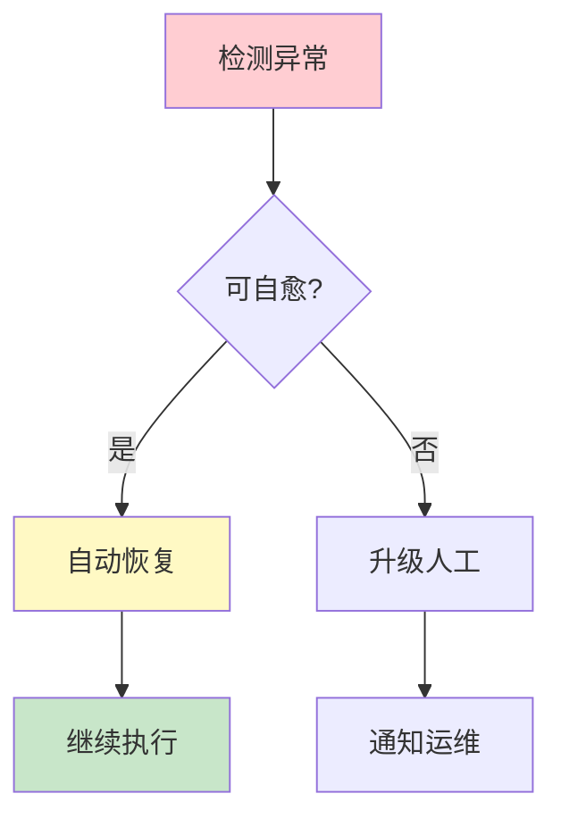

# Agent 自愈与自动恢复最新

> 知识库 96 有 230 行、知识库 204 有深度。这篇整合为最新——异常检测、自动恢复和升级机制。

---

## 一、自愈流程



---

## 二、实现

```python
from dataclasses import dataclass, field
from datetime import datetime
from enum import Enum

class AnomalyType(str, Enum):
    LOOP = "loop"
    TIMEOUT = "timeout"
    HIGH_ERROR = "high_error"
    NO_PROGRESS = "no_progress"
    STUCK = "stuck"

@dataclass
class Anomaly:
    type: AnomalyType
    severity: str       # low/medium/high
    description: str
    auto_recoverable: bool = True

class AnomalyDetector:
    """异常检测器。"""

    def __init__(self, window: int = 20):
        self.window = window
        self.actions: list[dict] = []

    def record(self, action: str, result: str, latency: float = 0):
        self.actions.append({"action": action, "result": result, "latency": latency})
        if len(self.actions) > self.window:
            self.actions.pop(0)

    def detect(self) -> list[Anomaly]:
        """检测所有异常。"""
        anomalies = []

        # 循环检测
        if len(self.actions) >= 3:
            recent = self.actions[-3:]
            if all(a["action"] == recent[0]["action"] and a["result"] == recent[0]["result"] for a in recent):
                anomalies.append(Anomaly(
                    type=AnomalyType.LOOP, severity="high",
                    description=f"循环: {recent[0]['action']}×3",
                ))

        # 错误率检测
        recent_results = [a["result"] for a in self.actions[-10:]]
        error_count = sum(1 for r in recent_results if "error" in r.lower() or "失败" in r)
        if len(recent_results) >= 5 and error_count / len(recent_results) > 0.5:
            anomalies.append(Anomaly(
                type=AnomalyType.HIGH_ERROR, severity="high",
                description=f"错误率{error_count}/{len(recent_results)}",
            ))

        return anomalies


class RecoveryEngine:
    """自动恢复引擎。"""

    STRATEGIES = {
        AnomalyType.LOOP: ["增加max_iterations", "修改Prompt换方法", "跳过当前工具"],
        AnomalyType.TIMEOUT: ["重试(减少参数)", "用更快模型", "跳过超时步骤"],
        AnomalyType.HIGH_ERROR: ["检查最近变更", "降低temperature", "切换备用模型"],
        AnomalyType.NO_PROGRESS: [None],  # 需人工
    }

    @classmethod
    def attempt_recovery(cls, anomaly: Anomaly) -> dict:
        """尝试自动恢复。"""
        if not anomaly.auto_recoverable:
            return {"recovered": False, "action": "escalate_to_human"}

        strategies = cls.STRATEGIES.get(anomaly.type, [])
        if not strategies or strategies[0] is None:
            return {"recovered": False, "action": "escalate_to_human"}

        return {"recovered": True, "action": strategies[0], "all_strategies": strategies}
```

---

## 三、最佳实践

| 实践 | 说明 | 优先级 |
|------|------|--------|
| 循环检测必须有 | 防死循环 | ★★★ |
| 能自愈先自愈 | 减少人工 | ★★★ |
| 无法自愈要升级 | 不能静默失败 | ★★★ |

---

## 四、检查清单

| 检查项 | 状态 |
|--------|------|
| 有异常检测器 | ☐ |
| 有恢复引擎 | ☐ |
