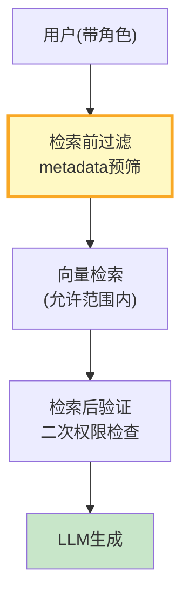

# RAG 文档级权限控制最新

> 知识库 102 仅 165 行、知识库 187 有深度。这篇整合为最新——ACL 模型、检索前过滤和检索后验证。

---

## 一、权限控制架构



---

## 二、实现

```python
from dataclasses import dataclass, field
from enum import Enum
from langchain_core.documents import Document

class AccessLevel(str, Enum):
    PUBLIC = "public"
    INTERNAL = "internal"
    DEPARTMENT = "department"
    CONFIDENTIAL = "confidential"

@dataclass
class DocumentACL:
    doc_id: str
    access_level: AccessLevel = AccessLevel.PUBLIC
    allowed_departments: list[str] = field(default_factory=list)
    allowed_users: list[str] = field(default_factory=list)
    excluded_users: list[str] = field(default_factory=list)

@dataclass
class UserContext:
    user_id: str
    department: str = ""
    roles: list[str] = field(default_factory=list)
    accessible_doc_ids: set[str] = field(default_factory=set)

class PermissionChecker:
    """权限检查器。"""

    @staticmethod
    def can_access(user: UserContext, acl: DocumentACL) -> bool:
        if user.user_id in acl.excluded_users: return False
        if acl.access_level == AccessLevel.PUBLIC: return True
        if acl.doc_id in user.accessible_doc_ids: return True
        if "admin" in user.roles: return True
        if acl.access_level == AccessLevel.DEPARTMENT and user.department in acl.allowed_departments: return True
        if user.user_id in acl.allowed_users: return True
        if acl.access_level == AccessLevel.INTERNAL and user.roles: return True
        return False

    @staticmethod
    def filter_documents(user: UserContext, docs: list[Document], acl_map: dict) -> list[Document]:
        """过滤用户有权访问的文档。"""
        result = []
        for doc in docs:
            doc_id = doc.metadata.get("doc_id", "")
            acl = acl_map.get(doc_id)
            if not acl or PermissionChecker.can_access(user, acl):
                result.append(doc)
        return result


class PreRetrievalFilter:
    """检索前过滤——用metadata限制检索范围。"""

    @staticmethod
    def build_filter(user: UserContext) -> dict:
        """根据用户权限构建检索过滤器。"""
        if "admin" in user.roles:
            return {}  # 管理员无过滤
        conditions = [{"access_level": "public"}]
        if user.department:
            conditions.append({"access_level": "department", "department": user.department})
        return {"$or": conditions} if len(conditions) > 1 else conditions[0]
```

---

## 三、最佳实践

| 实践 | 说明 | 优先级 |
|------|------|--------|
| 检索前用metadata过滤 | 减少无权限文档计算 | ★★★ |
| 检索后二次验证 | 防metadata被绕过 | ★★★ |
| 权限变更时清缓存 | 保证一致性 | ★★★ |

---

## 四、检查清单

| 检查项 | 状态 |
|--------|------|
| 有ACL模型 | ☐ |
| 有检索前过滤 | ☐ |
