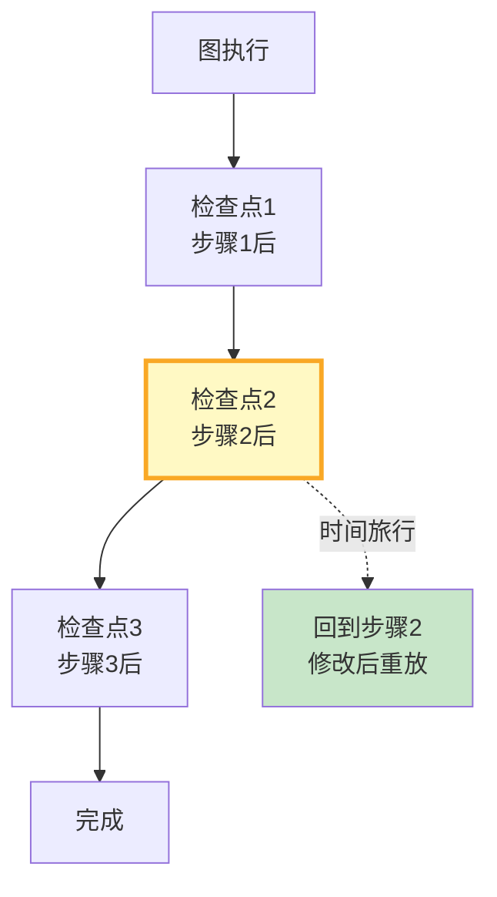

# LangGraph 状态快照与对比最新

> 知识库 104 仅 168 行。这篇讲透——检查点快照、状态对比和时间旅行。

---

## 一、状态快照流程



---

## 二、实现

```python
from dataclasses import dataclass, field
from datetime import datetime
from typing import Any

@dataclass
class StateSnapshot:
    """状态快照。"""
    checkpoint_id: str
    thread_id: str
    step: str           # 当前所在节点
    state_values: dict  # State的完整值
    timestamp: str = field(default_factory=lambda: datetime.now().isoformat())

class StateSnapshotManager:
    """状态快照管理器。"""

    def __init__(self):
        self.snapshots: list[StateSnapshot] = []

    def capture(self, graph, thread_id: str) -> StateSnapshot:
        """捕获当前状态快照。"""
        config = {"configurable": {"thread_id": thread_id}}
        state = graph.get_state(config)

        snapshot = StateSnapshot(
            checkpoint_id=state.config.get("configurable", {}).get("checkpoint_id", ""),
            thread_id=thread_id,
            step=str(state.next),
            state_values={k: str(v)[:100] for k, v in (state.values or {}).items()},
        )
        self.snapshots.append(snapshot)
        return snapshot

    def compare(self, snap1: StateSnapshot, snap2: StateSnapshot) -> dict:
        """对比两个快照。"""
        changes = {}
        for key in set(list(snap1.state_values.keys()) + list(snap2.state_values.keys())):
            v1 = snap1.state_values.get(key, "")
            v2 = snap2.state_values.get(key, "")
            if v1 != v2:
                changes[key] = {"before": v1, "after": v2}
        return {
            "total_fields": len(set(list(snap1.state_values.keys()) + list(snap2.state_values.keys()))),
            "changed_fields": len(changes),
            "changes": changes,
        }

    def get_history(self, thread_id: str) -> list[dict]:
        """获取检查点历史。"""
        return [
            {"step": s.step, "checkpoint_id": s.checkpoint_id, "timestamp": s.timestamp}
            for s in self.snapshots if s.thread_id == thread_id
        ]

    def time_travel(self, graph, thread_id: str, checkpoint_id: str) -> dict:
        """时间旅行——回到指定检查点重新执行。"""
        config = {
            "configurable": {
                "thread_id": thread_id,
                "checkpoint_id": checkpoint_id,
            }
        }
        # 传入None表示从该检查点继续执行
        result = graph.invoke(None, config)
        return result
```

---

## 三、最佳实践

| 实践 | 说明 | 优先级 |
|------|------|--------|
| 每步自动快照 | Checkpointer内置 | ★★★ |
| 支持状态对比 | 调试时看变化 | ★★☆ |
| 时间旅行用于调试 | 回到出错前重放 | ★★☆ |
| 生产慎用回退 | 可能数据不一致 | ★★☆ |

---

## 四、检查清单

| 检查项 | 状态 |
|--------|------|
| 有快照管理器 | ☐ |
| 有状态对比 | ☐ |
