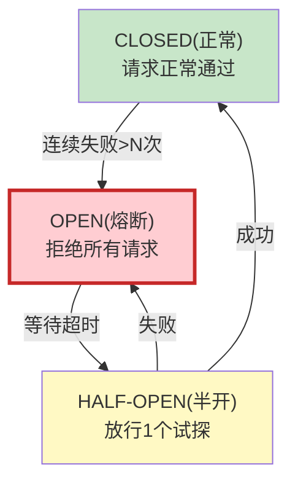

# LLM 应用断路器模式最新

> 知识库 108 有 200 行。这篇讲透——熔断、半开恢复和降级策略。

---

## 一、断路器状态机



---

## 二、实现

```python
import time
from dataclasses import dataclass
from enum import Enum

class CircuitState(str, Enum):
    CLOSED = "closed"
    OPEN = "open"
    HALF_OPEN = "half_open"

@dataclass
class CircuitConfig:
    failure_threshold: int = 5     # 连续失败次数触发熔断
    recovery_timeout: int = 30    # 熔断后等待恢复时间(秒)
    half_open_max: int = 1         # 半开状态最多放行请求数

class CircuitBreaker:
    """断路器——保护LLM调用不被连续失败拖垮。"""

    def __init__(self, config: CircuitConfig = CircuitConfig()):
        self.config = config
        self.state: CircuitState = CircuitState.CLOSED
        self.failure_count: int = 0
        self.last_failure_time: float = 0
        self.half_open_calls: int = 0

    def can_request(self) -> bool:
        """是否允许请求通过。"""
        if self.state == CircuitState.CLOSED:
            return True
        elif self.state == CircuitState.OPEN:
            # 检查是否过了恢复超时
            if time.time() - self.last_failure_time > self.config.recovery_timeout:
                self.state = CircuitState.HALF_OPEN
                self.half_open_calls = 0
                return True
            return False  # 熔断中，拒绝
        elif self.state == CircuitState.HALF_OPEN:
            if self.half_open_calls < self.config.half_open_max:
                self.half_open_calls += 1
                return True
            return False

    def record_success(self):
        """记录成功。"""
        if self.state == CircuitState.HALF_OPEN:
            # 半开状态成功→恢复
            self.state = CircuitState.CLOSED
        self.failure_count = 0

    def record_failure(self):
        """记录失败。"""
        self.failure_count += 1
        self.last_failure_time = time.time()

        if self.state == CircuitState.HALF_OPEN:
            # 半开状态失败→重新熔断
            self.state = CircuitState.OPEN
        elif self.state == CircuitState.CLOSED:
            if self.failure_count >= self.config.failure_threshold:
                self.state = CircuitState.OPEN

    def status(self) -> dict:
        return {
            "state": self.state.value,
            "failure_count": self.failure_count,
            "threshold": self.config.failure_threshold,
        }
```

---

## 三、最佳实践

| 实践 | 说明 | 优先级 |
|------|------|--------|
| 5次失败触发熔断 | 防止连续失败 | ★★★ |
| 30秒后半开试探 | 自动恢复 | ★★★ |
| 熔断时有降级 | 不能只报错 | ★★★ |
| 半开1个试探 | 逐步恢复 | ★★☆ |

---

## 四、检查清单

| 检查项 | 状态 |
|--------|------|
| 有断路器 | ☐ |
| 有三态状态机 | ☐ |
