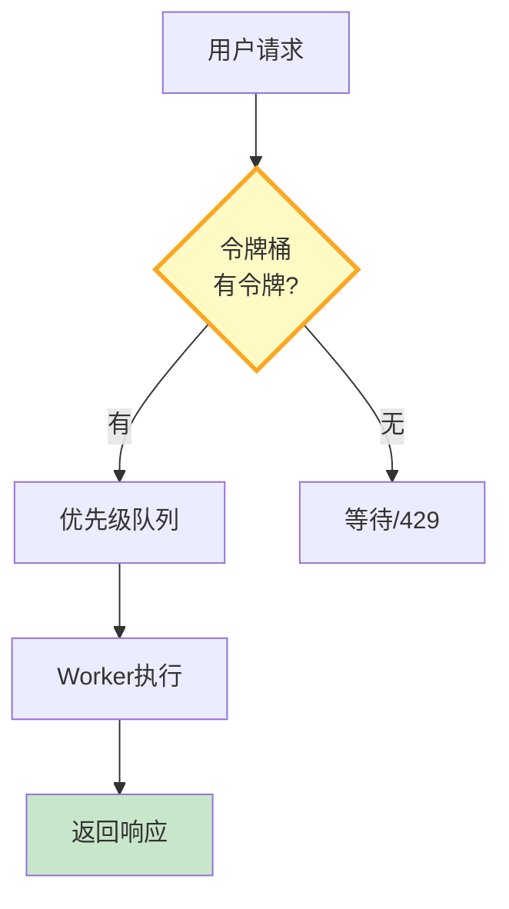

# LLM 应用流量整形与请求队列最新

> 知识库 109 仅 162 行、知识库 198 有限流深度。这篇整合为最新——令牌桶、优先级队列和请求调度。

---

## 一、流量整形架构



---

## 二、实现

```python
import time, asyncio
from dataclasses import dataclass
from collections import deque
from enum import Enum

class Priority(int, Enum):
    HIGH = 0
    MEDIUM = 1
    LOW = 2

@dataclass
class TokenBucket:
    """令牌桶限流器。"""
    capacity: int = 100      # 桶容量(最大突发)
    rate: float = 10         # 每秒补充令牌数
    tokens: float = 0
    last_refill: float = 0

    def __post_init__(self):
        self.tokens = self.capacity
        self.last_refill = time.time()

    def _refill(self):
        now = time.time()
        elapsed = now - self.last_refill
        self.tokens = min(self.capacity, self.tokens + elapsed * self.rate)
        self.last_refill = now

    def try_acquire(self) -> bool:
        """尝试获取令牌。"""
        self._refill()
        if self.tokens >= 1:
            self.tokens -= 1
            return True
        return False


class PriorityQueue:
    """优先级请求队列。"""

    def __init__(self):
        self._queues: dict[Priority, deque] = {p: deque() for p in Priority}
        self._total: int = 0

    async def put(self, item, priority: Priority = Priority.MEDIUM):
        """入队。"""
        self._queues[priority].append(item)
        self._total += 1

    def get(self):
        """出队——按优先级。"""
        for p in sorted(Priority):
            if self._queues[p]:
                self._total -= 1
                return self._queues[p].popleft()
        return None

    @property
    def size(self) -> int:
        return self._total


class TrafficShaper:
    """流量整形器——组合令牌桶+优先级队列。"""

    def __init__(self, bucket: TokenBucket = None):
        self.bucket = bucket or TokenBucket()
        self.queue = PriorityQueue()

    async def submit(self, request, priority: Priority = Priority.MEDIUM) -> dict:
        """提交请求。"""
        if not self.bucket.try_acquire():
            # 限流
            return {"status": "rate_limited", "retry_after": 1.0}

        await self.queue.put(request, priority)
        return {"status": "queued", "position": self.queue.size}
```

---

## 三、最佳实践

| 实践 | 说明 | 优先级 |
|------|------|--------|
| 令牌桶限流 | 允许突发 | ★★★ |
| 优先级队列 | VIP先处理 | ★★☆ |
| 429返回重试时间 | 用户知道等多久 | ★★★ |
| 按用户分级限流 | 免费/付费不同 | ★★☆ |

---

## 四、检查清单

| 检查项 | 状态 |
|--------|------|
| 有令牌桶 | ☐ |
| 有优先级队列 | ☐ |
