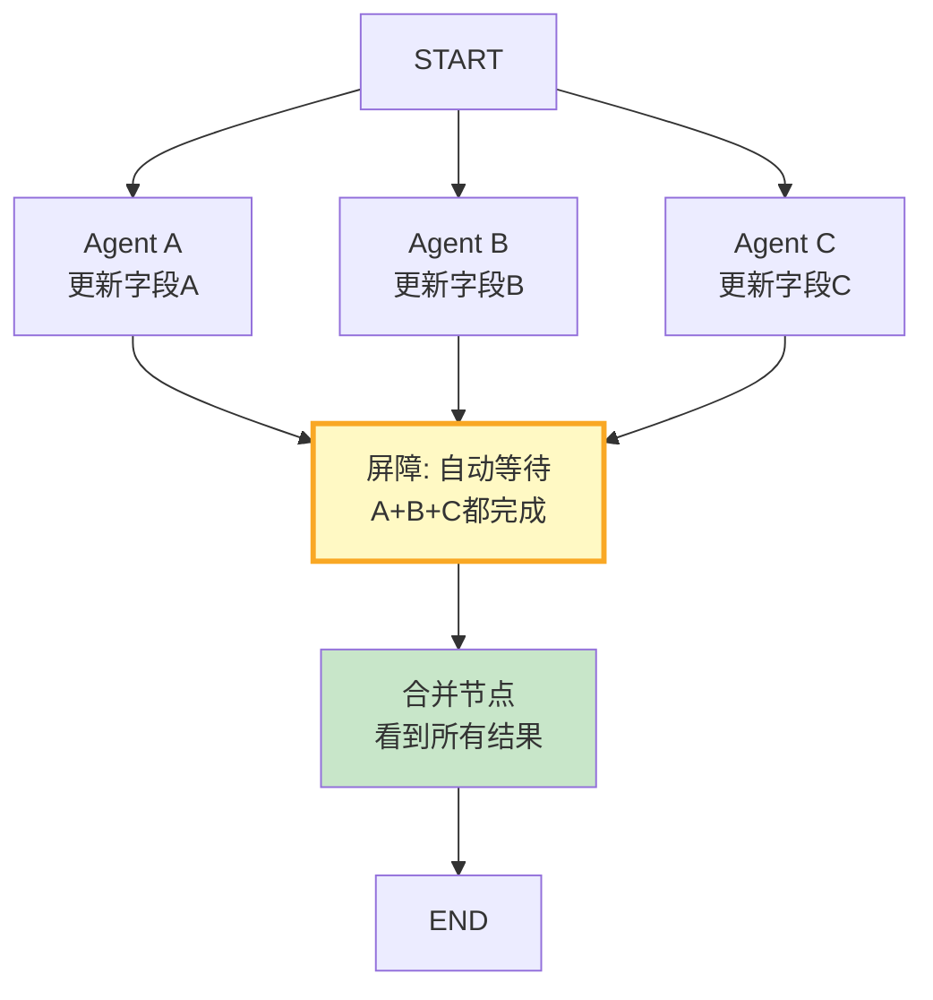

# 多 Agent 状态同步机制最新

> 知识库 110 仅 122 行。这篇讲透——并行 Agent 的状态同步、屏障等待和冲突解决。

---

## 一、状态同步架构



---

## 二、实现

```python
from langgraph.graph import StateGraph, START, END
from typing import TypedDict, Annotated
from operator import add

class ParallelState(TypedDict):
    task: str
    research_a: Annotated[list[str], add]  # Agent A的结果(追加)
    research_b: Annotated[list[str], add]  # Agent B的结果(追加)
    research_c: Annotated[list[str], add]  # Agent C的结果(追加)
    merged_result: str

class StateSyncManager:
    """状态同步管理器。"""

    @staticmethod
    def build_parallel_graph(agent_a, agent_b, agent_c, merger):
        """构建并行Agent图。"""
        graph = StateGraph(ParallelState)

        async def node_a(state):
            result = await agent_a(state["task"])
            return {"research_a": [result]}

        async def node_b(state):
            result = await agent_b(state["task"])
            return {"research_b": [result]}

        async def node_c(state):
            result = await agent_c(state["task"])
            return {"research_c": [result]}

        async def merge_node(state):
            all_results = state.get("research_a", []) + state.get("research_b", []) + state.get("research_c", [])
            merged = await merger(all_results)
            return {"merged_result": merged}

        graph.add_node("agent_a", node_a)
        graph.add_node("agent_b", node_b)
        graph.add_node("agent_c", node_c)
        graph.add_node("merge", merge_node)

        # 并行扇出
        graph.add_edge(START, "agent_a")
        graph.add_edge(START, "agent_b")
        graph.add_edge(START, "agent_c")

        # 屏障：A/B/C都完成后到merge
        graph.add_edge("agent_a", "merge")
        graph.add_edge("agent_b", "merge")
        graph.add_edge("agent_c", "merge")
        graph.add_edge("merge", END)

        return graph.compile()


class ConflictResolver:
    """冲突解决器——多Agent更新同一字段时。"""

    @staticmethod
    def last_write_wins(results: list[dict]) -> dict:
        """最后写入胜出。"""
        return results[-1] if results else {}

    @staticmethod
    def merge_lists(results: list[list]) -> list:
        """列表合并去重。"""
        seen = set()
        merged = []
        for lst in results:
            for item in lst:
                key = hash(str(item)[:100])
                if key not in seen:
                    seen.add(key)
                    merged.append(item)
        return merged

    @staticmethod
    def vote(results: list) -> any:
        """投票——取多数。"""
        from collections import Counter
        if not results:
            return None
        return Counter(results).most_common(1)[0][0]
```

---

## 三、最佳实践

| 实践 | 说明 | 优先级 |
|------|------|--------|
| 不同字段用add reducer | 各Agent更新不同字段 | ★★★ |
| 共享字段用合并 | 列表追加+去重 | ★★☆ |
| 合并节点在最后 | 等全部完成再合并 | ★★★ |
| 无并发写同一字段 | 避免冲突 | ★★★ |

---

## 四、检查清单

| 检查项 | 状态 |
|--------|------|
| 有并行图构建 | ☐ |
| 有冲突解决 | ☐ |
