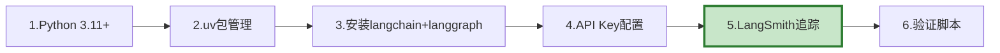

# 学习课程 01：前置知识准备最新

> 学习课程 01 有 176 行。这篇基于 2025 年最新工具链更新——Python 环境、uv 包管理、API Key 和 LangSmith 配置。

---

## 一、环境准备清单



---

## 二、快速安装

```bash
# 1. 安装uv（比pip快10倍）
curl -LsSf https://astral.sh/uv/install.sh | sh
uv python install 3.11

# 2. 创建项目
uv init my-llm-app && cd my-llm-app

# 3. 安装核心依赖
uv add langchain langgraph langchain-openai langsmith

# 4. 向量库（选一个）
uv add chromadb  # 开发用，轻量

# 5. 开发工具
uv add --dev pytest pytest-asyncio
```

---

## 三、配置

```bash
# .env 文件
OPENAI_API_KEY=sk-xxx
LANGSMITH_TRACING=true
LANGSMITH_API_KEY=ls-xxx
LANGSMITH_PROJECT=my-project
```

---

## 四、验证

```python
# verify.py
import asyncio
from langchain_openai import ChatOpenAI
from langchain_core.messages import HumanMessage
from langgraph.graph import StateGraph, START, END

async def verify():
    results = {}

    # 1. LLM
    try:
        llm = ChatOpenAI(model="gpt-4o-mini")
        resp = await llm.ainvoke([HumanMessage(content="说OK")])
        results["llm"] = "✅ 正常" if "OK" in resp.content else "⚠️ 异常"
    except Exception as e:
        results["llm"] = f"❌ {e}"

    # 2. LangGraph
    try:
        graph = StateGraph(dict)
        results["langgraph"] = "✅ 正常"
    except Exception:
        results["langgraph"] = "❌ 未安装"

    # 3. LangSmith
    import os
    results["langsmith"] = "✅ 已启用" if os.getenv("LANGSMITH_TRACING") == "true" else "⚠️ 未启用"

    print("=== 环境验证 ===")
    for k, v in results.items():
        print(f"{k}: {v}")

asyncio.run(verify())
```

---

## 五、最佳实践

| 实践 | 说明 | 优先级 |
|------|------|--------|
| 用uv替代pip | 速度快10倍 | ★★★ |
| API Key用.env | 不硬编码 | ★★★ |
| Python 3.11+ | 性能更好 | ★★☆ |
| LangSmith开发时就开 | 方便调试 | ★★☆ |
| 有验证脚本 | 上线前检查 | ★★☆ |

---

## 六、检查清单

| 检查项 | 状态 |
|--------|------|
| Python环境就绪 | ☐ |
| 依赖已安装 | ☐ |
| API Key配置 | ☐ |
| 验证脚本通过 | ☐ |
