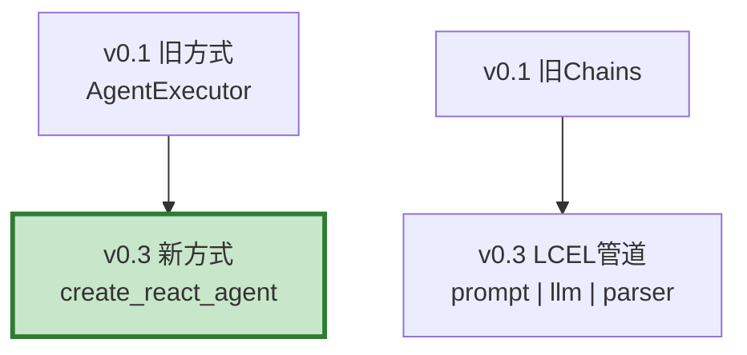

# 学习课程 02：LangChain 入门最新

> 学习课程 02 有 234 行。这篇基于 v0.3 更新——LCEL 管道、Runnable 接口和第一个程序。

---

## 一、v0.3 核心变化



---

## 二、第一个程序

```python
from langchain_openai import ChatOpenAI
from langchain_core.prompts import ChatPromptTemplate
from langchain_core.output_parsers import StrOutputParser

# 1. 创建LLM
llm = ChatOpenAI(model="gpt-4o-mini", streaming=True)

# 2. 创建Prompt
prompt = ChatPromptTemplate.from_template("用中文回答: {question}")

# 3. 创建解析器
parser = StrOutputParser()

# 4. 用LCEL管道组合（|管道符）
chain = prompt | llm | parser

# 5. 调用
result = chain.invoke({"question": "什么是RAG?"})
print(result)

# 流式调用
for chunk in chain.stream({"question": "解释量子计算"}):
    print(chunk, end="", flush=True)
```

---

## 三、Runnable 接口

```python
class RunnableGuide:
    """Runnable统一接口——所有组件都支持。"""

    METHODS = {
        "invoke": "同步调用: chain.invoke(input)",
        "ainvoke": "异步调用: await chain.ainvoke(input)",
        "stream": "同步流式: for chunk in chain.stream(input)",
        "astream": "异步流式: async for chunk in chain.astream(input)",
        "batch": "批量: chain.batch([input1, input2])",
    }

    COMBINATORS = {
        "| (管道)": "顺序执行: prompt | llm | parser",
        "with_fallbacks": "降级: llm.with_fallbacks([backup_llm])",
        "with_retry": "重试: llm.with_retry(stop_after_attempt=3)",
        "bind_tools": "绑定工具: llm.bind_tools([search, calc])",
    }
```

---

## 四、最佳实践

| 实践 | 说明 | 优先级 |
|------|------|--------|
| 用LCEL管道符 | 优雅组合 | ★★★ |
| 用Runnable接口 | invoke/stream/batch统一 | ★★★ |
| streaming=True | 支持流式输出 | ★★☆ |
| 用ChatPromptTemplate | 比字符串拼接好 | ★★☆ |

---

## 五、检查清单

| 检查项 | 状态 |
|--------|------|
| 能运行第一个程序 | ☐ |
| 知道LCEL管道 | ☐ |
| 知道Runnable接口 | ☐ |
