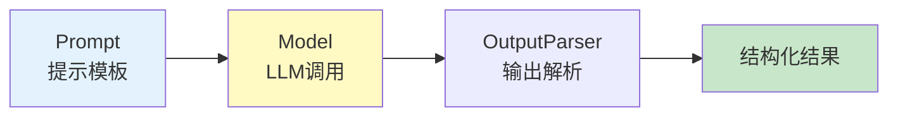

# 学习课程 03：核心概念最新

> 学习课程 03 有 333 行。这篇基于 v0.3 更新——Models、Prompts、Parsers 三大核心概念。

---

## 一、三大核心概念



---

## 二、Models

```python
from langchain_openai import ChatOpenAI

# 基本调用
llm = ChatOpenAI(model="gpt-4o-mini", temperature=0, streaming=True)

# 同步
response = llm.invoke("你好")
print(response.content)

# 异步
response = await llm.ainvoke("你好")

# 流式
async for chunk in llm.astream("解释RAG"):
    print(chunk.content, end="")

# 批量
results = await llm.abatch(["问题1", "问题2", "问题3"])
```

---

## 三、Prompts

```python
from langchain_core.prompts import ChatPromptTemplate

# 1. 基本模板
prompt = ChatPromptTemplate.from_template("回答: {question}")

# 2. 带系统消息
prompt = ChatPromptTemplate.from_messages([
    ("system", "你是专业助手，用中文回答。"),
    ("human", "{question}"),
])

# 3. Few-Shot
prompt = ChatPromptTemplate.from_messages([
    ("system", "你是分类器。"),
    ("human", "文本: {input}"),
    ("ai", "分类: {category}"),
    ("human", "文本: {new_input}"),
])
```

---

## 四、Parsers

```python
from langchain_core.output_parsers import StrOutputParser, JsonOutputParser
from pydantic import BaseModel, Field

# 1. 字符串解析
str_parser = StrOutputParser()

# 2. JSON解析
class AnalysisResult(BaseModel):
    sentiment: str = Field(description="情感: positive/negative/neutral")
    confidence: float = Field(description="置信度0-1")

json_parser = JsonOutputParser(pydantic_object=AnalysisResult)

# 3. 组合使用
chain = prompt | llm | json_parser
result = chain.invoke({"question": "分析'今天天气真好'"})
# → {"sentiment": "positive", "confidence": 0.95}
```

---

## 五、组合：LCEL管道

```python
# 完整管线
chain = (
    ChatPromptTemplate.from_template("基于以下信息回答:\n{context}\n\n问题: {question}")
    | ChatOpenAI(model="gpt-4o-mini")
    | StrOutputParser()
)

result = chain.invoke({"context": "RAG是检索增强生成", "question": "什么是RAG?"})
```

---

## 六、最佳实践

| 概念 | 实践 | 优先级 |
|------|------|--------|
| Model | temperature=0用于事实问答 | ★★★ |
| Prompt | 用ChatPromptTemplate | ★★★ |
| Parser | 用Pydantic结构化输出 | ★★★ |
| 组合 | LCEL管道符| | ★★★ |

---

## 七、检查清单

| 检查项 | 状态 |
|--------|------|
| 理解三大概念 | ☐ |
| 能用LCEL组合 | ☐ |
| 能用Pydantic解析 | ☐ |
