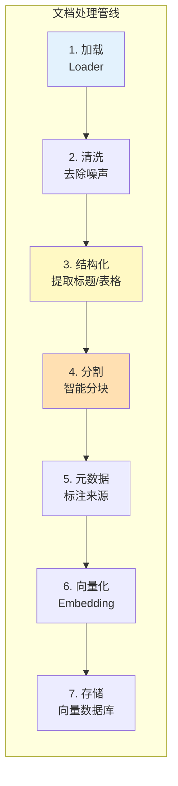
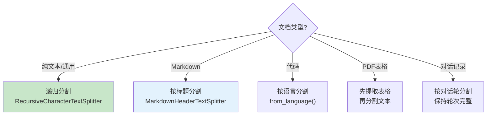

# 文档处理管线

> 真实世界的文档不是干净的 TXT——PDF 有表格、图片、多栏排版。这份指南覆盖从原始文档到向量库的完整处理管线。

---

## 一、文档处理的挑战

```mermaid
graph TB
    subgraph 理想vs现实 ["理想 vs 现实"}
        I["理想: 干净的TXT<br/>内容结构清晰<br/>一行一句话"]
        R["现实: PDF有表格/图片/多栏<br/>Word有格式/批注<br/>网页有广告/导航<br/>扫描件需要OCR"]
    end

    style 理想vs现实 fill:#E3F2FD
```

## 二、完整管线架构



## 三、各格式文档加载

### 3.1 PDF 文档

```python
from langchain_community.document_loaders import PyPDFLoader

# 基础加载
loader = PyPDFLoader("report.pdf")
pages = loader.load()
# 每页是一个Document，metadata包含page_number

# PDF的挑战：
# 1. 多栏排版 → 文字顺序混乱
# 2. 表格 → 被拆成碎片
# 3. 图片中的文字 → 需要OCR
# 4. 扫描件 → 图片型PDF，需要OCR

# 高级：用PyMuPDF处理复杂PDF
from langchain_community.document_loaders import PyMuPDFLoader
loader = PyMuPDFLoader("complex.pdf")  # 对多栏排版更友好
```

### 3.2 Word 文档

```python
from langchain_community.document_loaders import Docx2txtLoader

loader = Docx2txtLoader("document.docx")
docs = loader.load()
```

### 3.3 Excel/CSV

```python
from langchain_community.document_loaders import CSVLoader

loader = CSVLoader("data.csv")
docs = loader.load()
# 每行是一个Document，metadata包含row number

# Excel需要先转CSV或用unstructured
from langchain_community.document_loaders import UnstructuredExcelLoader
loader = UnstructuredExcelLoader("data.xlsx")
```

### 3.4 HTML/网页

```python
from langchain_community.document_loaders import WebBaseLoader

loader = WebBaseLoader("https://example.com/article")
docs = loader.load()
# 会自动去除HTML标签，提取正文

# 多个URL批量加载
loader = WebBaseLoader(["url1", "url2", "url3"])
docs = loader.load()
```

### 3.5 Markdown

```python
from langchain_community.document_loaders import UnstructuredMarkdownLoader

loader = UnstructuredMarkdownLoader("README.md")
docs = loader.load()
```

### 3.6 扫描件/图片（OCR）

```python
# 需要安装: pip install pytesseract pillow
from langchain_community.document_loaders import UnstructuredImageLoader

loader = UnstructuredImageLoader("scanned_document.png")
docs = loader.load()  # 自动OCR提取文字

# 多模态方式（更准确）
from langchain_openai import ChatOpenAI
from langchain_core.messages import HumanMessage
import base64

llm = ChatOpenAI(model="gpt-4o-mini")

def ocr_with_llm(image_path: str) -> str:
    """用多模态LLM做OCR"""
    with open(image_path, "rb") as f:
        img_b64 = base64.b64encode(f.read()).decode()
    
    msg = HumanMessage(content=[
        {"type": "text", "text": "提取这张图片中的所有文字，保持原始结构。"},
        {"type": "image_url", "image_url": {"url": f"data:image/png;base64,{img_b64}"}},
    ])
    return llm.invoke([msg]).content
```

## 四、文档清洗

```python
import re

def clean_document(text: str) -> str:
    """清洗文档内容"""
    # 去除多余空白
    text = re.sub(r'\n{3,}', '\n\n', text)
    text = re.sub(r' {2,}', ' ', text)

    # 去除页眉页脚（常见模式）
    text = re.sub(r'第\d+页.*?第\d+页', '', text)
    text = re.sub(r'Page \d+ of \d+', '', text)

    # 去除水印文字
    text = re.sub(r'(?i)confidential|draft|watermark', '', text)

    # 去除控制字符
    text = re.sub(r'[\x00-\x08\x0b\x0c\x0e-\x1f\x7f-\x9f]', '', text)

    return text.strip()

# 应用清洗
for doc in documents:
    doc.page_content = clean_document(doc.page_content)
```

## 五、智能分割策略

### 5.1 按文档结构分割

```python
from langchain_text_splitters import (
    RecursiveCharacterTextSplitter,
    MarkdownHeaderTextSplitter,
)

# 策略1：递归分割（通用）
splitter = RecursiveCharacterTextSplitter(
    chunk_size=500,
    chunk_overlap=50,
    separators=["\n\n", "\n", "。", "！", "？", "；", "，", " ", ""]
)

# 策略2：按Markdown标题分割（保留结构）
md_splitter = MarkdownHeaderTextSplitter(
    headers_to_split_on=[
        ("#", "Header 1"),
        ("##", "Header 2"),
        ("###", "Header 3"),
    ]
)
# Markdown文档按标题分块，每块带标题元数据

# 策略3：代码文档分割（保留代码块完整）
from langchain_text_splitters import Language
code_splitter = RecursiveCharacterTextSplitter.from_language(
    language=Language.PYTHON,
    chunk_size=500,
    chunk_overlap=50,
)
```

### 5.2 表格特殊处理

```python
def extract_tables_from_pdf(pdf_path: str) -> list:
    """从PDF中提取表格"""
    import pdfplumber
    tables = []

    with pdfplumber.open(pdf_path) as pdf:
        for page in pdf.pages:
            page_tables = page.extract_tables()
            for table in page_tables:
                # 将表格转为文本
                table_text = "\n".join(
                    " | ".join(str(cell or "") for cell in row)
                    for row in table
                )
                tables.append(table_text)

    return tables

# 表格转为Document
from langchain_core.documents import Document
table_docs = [Document(page_content=t, metadata={"type": "table"}) for t in tables]
```

## 六、元数据标注

```python
from langchain_core.documents import Document
import os
from datetime import datetime

def enrich_metadata(docs: list[Document], source_file: str) -> list[Document]:
    """为文档块添加丰富的元数据"""
    file_stats = os.stat(source_file)

    for doc in docs:
        doc.metadata.update({
            "source": os.path.basename(source_file),
            "file_type": os.path.splitext(source_file)[1],
            "file_size": file_stats.st_size,
            "created_at": datetime.fromtimestamp(file_stats.st_ctime).isoformat(),
            "chunk_length": len(doc.page_content),
        })

    return docs
```

## 七、完整管线实现

```python
import os
from langchain_core.documents import Document
from langchain_community.document_loaders import (
    TextLoader, PyPDFLoader, UnstructuredMarkdownLoader, WebBaseLoader
)
from langchain_text_splitters import RecursiveCharacterTextSplitter
from langchain_openai import OpenAIEmbeddings
from langchain_community.vectorstores import FAISS
import re

class DocumentPipeline:
    """完整文档处理管线"""

    def __init__(self, embeddings=None):
        self.embeddings = embeddings or OpenAIEmbeddings()
        self.splitter = RecursiveCharacterTextSplitter(
            chunk_size=500,
            chunk_overlap=50,
            separators=["\n\n", "\n", "。", "！", "？", "；", "，", " ", ""]
        )

    def load(self, source: str) -> list[Document]:
        """根据文件类型选择加载器"""
        if source.startswith("http"):
            loader = WebBaseLoader(source)
        elif source.endswith(".pdf"):
            loader = PyPDFLoader(source)
        elif source.endswith(".md"):
            loader = UnstructuredMarkdownLoader(source)
        elif source.endswith(".txt"):
            loader = TextLoader(source, encoding="utf-8")
        else:
            raise ValueError(f"不支持的文件类型: {source}")

        return loader.load()

    def clean(self, docs: list[Document]) -> list[Document]:
        """清洗文档"""
        for doc in docs:
            # 去除多余空白和控制字符
            text = re.sub(r'\n{3,}', '\n\n', doc.page_content)
            text = re.sub(r' {2,}', ' ', text)
            text = re.sub(r'[\x00-\x08\x0b\x0c\x0e-\x1f\x7f-\x9f]', '', text)
            doc.page_content = text.strip()
        return docs

    def split(self, docs: list[Document]) -> list[Document]:
        """分割文档"""
        return self.splitter.split_documents(docs)

    def enrich(self, docs: list[Document], source: str) -> list[Document]:
        """添加元数据"""
        filename = os.path.basename(source)
        for doc in docs:
            doc.metadata.setdefault("source", filename)
            doc.metadata.setdefault("file_type", os.path.splitext(source)[1])
        return docs

    def process(self, sources: list[str]) -> list[Document]:
        """完整管线：加载→清洗→分割→标注"""
        all_chunks = []

        for source in sources:
            print(f"处理: {source}")
            docs = self.load(source)
            docs = self.clean(docs)
            chunks = self.split(docs)
            chunks = self.enrich(chunks, source)
            all_chunks.extend(chunks)
            print(f"  → {len(chunks)} 个文档块")

        print(f"总计: {len(all_chunks)} 个文档块")
        return all_chunks

    def build_vectorstore(self, sources: list[str]) -> FAISS:
        """完整管线 + 向量化 + 存储"""
        chunks = self.process(sources)
        return FAISS.from_documents(chunks, self.embeddings)

# 使用
pipeline = DocumentPipeline()
vectorstore = pipeline.build_vectorstore([
    "docs/report.pdf",
    "docs/notes.txt",
    "docs/guide.md",
])
```

## 八、分割策略选择


