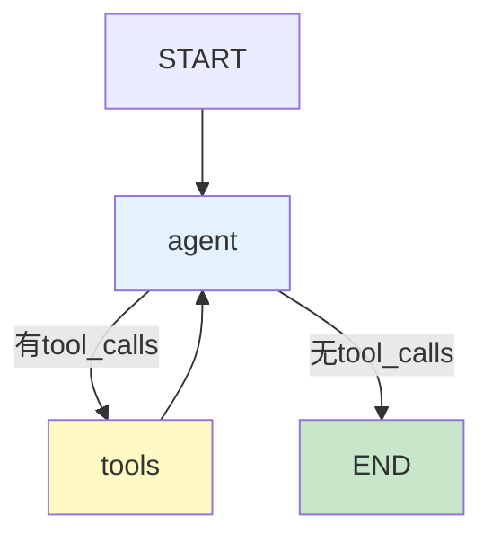

# 学习课程 10：LangGraph 核心概念最新

> 学习课程 10 有 413 行。这篇基于 v0.3 更新——State/Reducer、节点设计、条件路由和循环。

---

## 一、State 与 Reducer

```mermaid
graph TB
    subgraph State {"State设计"}
        S1["messages<br/>Annotated[list, add_messages]<br/>自动追加"]
        S2["result<br/>str<br/>覆盖更新"]
        S3["items<br/>Annotated[list, add]<br/>列表追加"]
    end

    style S1 fill:#C8E6C9,stroke:#2E7D32,stroke-width:3px
```

```python
from typing import TypedDict, Annotated
from langgraph.graph.message import add_messages
from operator import add

class AgentState(TypedDict):
    messages: Annotated[list, add_messages]  # 自动追加消息
    retrieved_docs: Annotated[list[str], add]  # 列表追加
    current_node: str  # 直接覆盖
    result: str  # 直接覆盖
```

---

## 二、节点设计

```python
# 节点函数：接收State→处理→返回State更新
async def retrieve_node(state: AgentState) -> dict:
    """检索节点。"""
    docs = await vectorstore.asimilarity_search(state["messages"][-1].content, k=3)
    return {"retrieved_docs": [d.page_content for d in docs]}

async def generate_node(state: AgentState) -> dict:
    """生成节点。"""
    context = "\n".join(state["retrieved_docs"])
    response = await llm.ainvoke([HumanMessage(content=f"基于:\n{context}\n\n{state['messages'][-1].content}")])
    return {"messages": [response], "result": response.content}
```

---

## 三、条件路由+循环

```python
from langgraph.graph import StateGraph, START, END

def should_continue(state: AgentState) -> str:
    """路由：判断是否需要继续循环。"""
    last_msg = state["messages"][-1]
    if hasattr(last_msg, "tool_calls") and last_msg.tool_calls:
        return "tools"  # 有工具调用→执行工具
    return "end"  # 无工具调用→结束

graph = StateGraph(AgentState)
graph.add_node("agent", agent_node)
graph.add_node("tools", tool_node)

graph.add_edge(START, "agent")
graph.add_conditional_edges("agent", should_continue, {
    "tools": "tools",
    "end": END,
})
graph.add_edge("tools", "agent")  # 工具执行后回到Agent（循环）

app = graph.compile(checkpointer=MemorySaver())
```



---

## 四、最佳实践

| 概念 | 实践 | 优先级 |
|------|------|--------|
| State | 用TypedDict+Reducer | ★★★ |
| 节点 | 函数接收State返回更新 | ★★★ |
| 路由 | 纯函数不依赖外部 | ★★★ |
| 循环 | 有max_iterations防死循环 | ★★★ |
| 持久化 | Checkpointer必配 | ★★★ |

---

## 五、检查清单

| 检查项 | 状态 |
|--------|------|
| 理解State+Reducer | ☐ |
| 能设计节点函数 | ☐ |
| 能用条件路由+循环 | ☐ |
