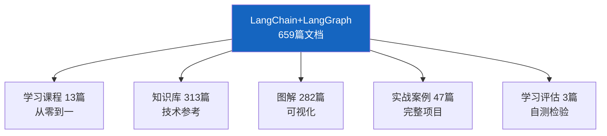
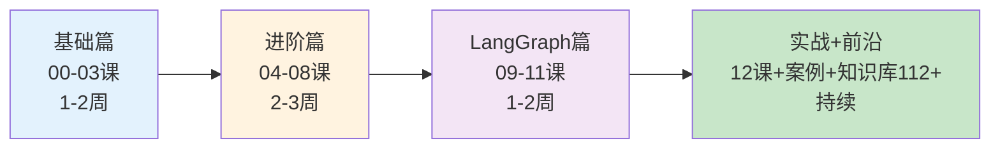

# 学习课程 00：课程总览与学习路径最新

> 学习课程 00 有 157 行。这篇基于 659 篇文档的完整知识体系更新——学习路径、阶段划分和推荐节奏。

---

## 一、知识体系全景

---

## 二、四阶段学习路径

| 阶段 | 课程 | 时间 | 目标 |
|------|------|------|------|
| 基础篇 | 00-03 课 | 1-2 周 | 跑通第一个程序，理解 LCEL |
| 进阶篇 | 04-08 课 | 2-3 周 | 掌握 Memory/Chains/Agents/RAG |
| LangGraph 篇 | 09-11 课 | 1-2 周 | 用 StateGraph 构建工作流 |
| 实战+前沿 | 12 课+案例+知识库 | 持续 | 综合项目+前沿主题 |

---

## 三、推荐学习方式

1. 按顺序学习课程 00-12
2. 学完每课看对应图解
3. 遇到概念查知识库
4. 学完做实战案例
5. 用学习评估自测

---

## 四、检查清单

| 检查项 | 状态 |
|--------|------|
| 知道四阶段路径 | ☐ |
| 知道659篇文档结构 | ☐ |
