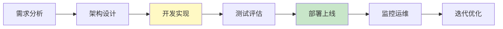

# 学习课程 12：实战项目——从零到一最新

> 学习课程 12 有 448 行。这篇基于 v0.3 更新——从需求到部署的完整项目流程。

---

## 一、项目流程



---

## 二、从零构建一个RAG Agent

```python
# 完整项目代码框架
from langgraph.prebuilt import create_react_agent
from langchain_openai import ChatOpenAI, OpenAIEmbeddings
from langchain_community.vectorstores import Chroma
from langchain_text_splitters import RecursiveCharacterTextSplitter
from langchain_core.tools import tool

# 1. 建向量库
splitter = RecursiveCharacterTextSplitter(chunk_size=500, chunk_overlap=50)
embeddings = OpenAIEmbeddings()
vectorstore = Chroma.from_texts(chunks, embeddings, persist_directory="./db")

# 2. 定义工具
@tool
def search_kb(query: str) -> str:
    """搜索知识库。何时使用：用户问知识库相关问题。"""
    docs = vectorstore.similarity_search(query, k=3)
    return "\n".join(d.page_content for d in docs)

# 3. 创建Agent
llm = ChatOpenAI(model="gpt-4o-mini", streaming=True)
agent = create_react_agent(
    llm, [search_kb],
    checkpointer=MemorySaver(),
    prompt="你是知识库问答助手。基于检索到的信息回答。",
)

# 4. 部署（FastAPI）
from fastapi import FastAPI
app = FastAPI()

@app.post("/chat")
async def chat(request: dict):
    config = {"configurable": {"thread_id": request.get("session_id", "default")}}
    result = await agent.ainvoke(
        {"messages": [{"role": "user", "content": request["message"]}]},
        config,
    )
    return {"response": result["messages"][-1].content}
```

---

## 三、部署检查清单

| 步骤 | 检查项 | 状态 |
|------|--------|------|
| 1 | 向量库已建 | ☐ |
| 2 | Agent可运行 | ☐ |
| 3 | FastAPI端点 | ☐ |
| 4 | 健康检查 | ☐ |
| 5 | 监控配置 | ☐ |
| 6 | 灰度发布 | ☐ |

---

## 四、最佳实践

| 阶段 | 实践 | 优先级 |
|------|------|--------|
| 开发 | 先跑通再优化 | ★★★ |
| 测试 | 有评测集 | ★★★ |
| 部署 | 灰度+回滚 | ★★★ |
| 运维 | SLO+监控 | ★★☆ |

---

## 五、检查清单

| 检查项 | 状态 |
|--------|------|
| 能从零构建项目 | ☐ |
| 能部署上线 | ☐ |
