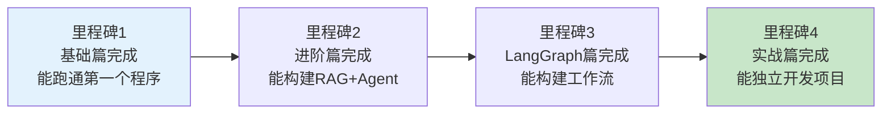

# 学习评估 01：学习里程碑与进度跟踪最新

> 学习评估 01 的最新版——基于 659 篇文档体系更新里程碑。

---

## 一、四阶段里程碑

---

## 二、里程碑详细

### 里程碑 1：基础篇（00-03 课）

| 检查项 | 达成标准 |
|--------|----------|
| 环境配置完成 | 验证脚本通过 |
| 理解LCEL管道 | 能写 prompt | llm | parser |
| 理解Runnable接口 | 知道 invoke/stream/batch |
| 理解三大概念 | Models/Prompts/Parsers |

### 里程碑 2：进阶篇（04-08 课）

| 检查项 | 达成标准 |
|--------|----------|
| 理解Memory | 能用 Checkpointer+Store |
| 能构建RAG | 能建向量库+检索+生成 |
| 能创建Agent | 能用 create_react_agent |
| 流式输出 | 能做 SSE 流式 |

### 里程碑 3：LangGraph 篇（09-11 课）

| 检查项 | 达成标准 |
|--------|----------|
| 能构建StateGraph | 节点+边+条件路由 |
| 理解State+Reducer | add_messages/add |
| 能构建多Agent | Supervisor模式 |
| 能人机交互 | interrupt+Command |

### 里程碑 4：实战篇（12 课+案例）

| 检查项 | 达成标准 |
|--------|----------|
| 能从零构建项目 | 需求→开发→部署 |
| 完成3个实战案例 | 从47个案例中选 |
| 有评估能力 | 用RAGAS评估 |
| 能部署上线 | Docker+灰度 |

---

## 三、检查清单

| 里程碑 | 达成 |
|--------|------|
| 里程碑1: 基础篇 | ☐ |
| 里程碑2: 进阶篇 | ☐ |
| 里程碑3: LangGraph篇 | ☐ |
| 里程碑4: 实战篇 | ☐ |
