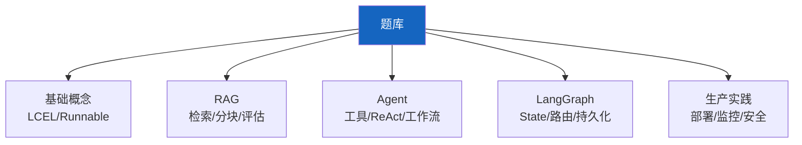

# 学习评估 02：知识检验题库与面试准备最新

> 学习评估 02 的最新版——基于 659 篇文档更新题库，覆盖 LangChain+LangGraph 全知识点。

---

## 一、题库分类

---

## 二、高频面试题

### 基础概念

1. **LCEL 和旧 Chains 有什么区别？**
   - LCEL 用管道符 | 组合，旧 Chains 用类继承
   - LCEL 统一 Runnable 接口（invoke/stream/batch）
   - 旧 Chains 已废弃

2. **Runnable 接口有哪些方法？**
   - invoke/ainvoke（同步/异步调用）
   - stream/astream（同步/异步流式）
   - batch/abatch（批量）

### RAG

3. **RAG 的效果 80% 取决于什么？**
   - 数据质量（分块策略+嵌入模型+向量库）

4. **chunk_size 怎么选？**
   - 300-1000 字符，太小丢上下文，太大稀释信号
   - 推荐从 500 开始，用 RAGAS 评估调整

### Agent

5. **create_react_agent 的工作原理？**
   - LLM 推理→有 tool_calls→执行工具→回 LLM→无 tool_calls→回答
   - ToolNode 批量执行工具调用

6. **工具数量多少合适？**
   - 5-10 个最佳，太多 Agent 决策准确率下降

### LangGraph

7. **State 的 Reducer 有什么用？**
   - 定义字段更新方式：add_messages=追加，add=列表追加，无=覆盖
   - 并行 Agent 用 add 自动合并结果

8. **interrupt 如何恢复？**
   - Command(resume=data)
   - 必须配 checkpointer，否则无法恢复

### 生产实践

9. **LLM 应用的最大瓶颈在哪？**
   - LLM API 调用（延迟 1-3 秒）
   - 解决：模型路由+语义缓存+流式输出

10. **如何降低成本？**
    - 模型路由 80% 走 mini
    - 语义缓存 30% 命中
    - 上下文压缩 50%
    - 批量 API 50% 折扣

---

## 三、检查清单

| 题库类别 | 已掌握 |
|----------|--------|
| 基础概念 | ☐ |
| RAG | ☐ |
| Agent | ☐ |
| LangGraph | ☐ |
| 生产实践 | ☐ |
