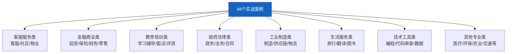

# 案例库导读最新

> 案例库 00 仅 51 行。这篇基于 48 个实战案例更新——案例分类、难度分级和推荐学习路径。

---

## 一、48 个案例分类

---

## 二、难度分级

| 难度 | 案例 | 适合学完 |
|------|------|----------|
| ★★☆ | 基础案例 | 第 03-06 课 |
| ★★★ | 进阶案例 | 第 08-10 课 |
| ★★★ | 高级案例 | 第 11-12 课+知识库 |

---

## 三、推荐学习路径

1. 先做案例 01（智能客服）——入门
2. 再做案例 02（RAG 问答）——核心
3. 选做 3-5 个感兴趣领域的案例
4. 最后做案例 10（进阶RAG）——综合

---

## 四、检查清单

| 检查项 | 状态 |
|--------|------|
| 知道案例分类 | ☐ |
| 知道推荐路径 | ☐ |
