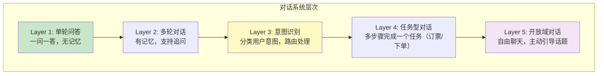
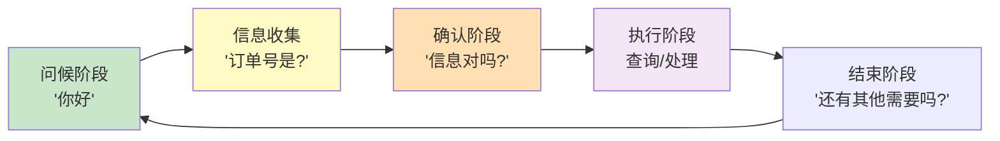
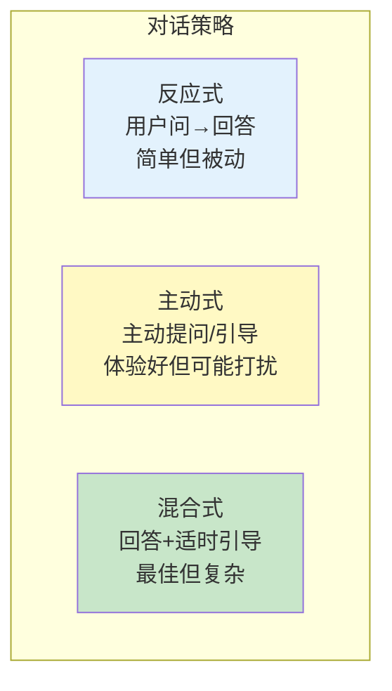

# 对话系统设计模式

> 聊天机器人不只是"一问一答"。本指南覆盖多轮对话、意图识别、对话管理、主动引导等设计模式。

---

## 一、对话系统的层次



## 二、意图识别模式

### 2.1 为什么需要意图识别

```mermaid
graph LR
    subgraph 无意图识别 ["无意图识别"}
        U1["用户: '我订的耳机到哪了'"]
        U1 --> LLM1["LLM直接回答<br/>(可能不了解订单系统)"]
    end

    subgraph 有意图识别 {"有意图识别"}
        U2["用户: '我订的耳机到哪了'"]
        U2 --> CLASSIFY["意图分类:<br/>→ 订单查询"]
        CLASSIFY --> ROUTE["路由到订单Agent<br/>(有工具权限)"]
    end

    style 无意图识别 fill:#FFCDD2
    style 有意图识别 fill:#C8E6C9
```

### 2.2 实现

```python
from langchain_openai import ChatOpenAI
from langchain_core.prompts import ChatPromptTemplate
from langchain_core.output_parsers import StrOutputParser
from langgraph.graph import StateGraph, START, END
from typing import TypedDict, Annotated
from operator import add
from langchain_core.messages import AnyMessage

llm = ChatOpenAI(model="gpt-4o-mini", temperature=0)

class DialogState(TypedDict):
    messages: Annotated[list[AnyMessage], add]
    user_input: str
    intent: str          # 识别的意图
    response: str         # 最终回复

def classify_intent_node(state: DialogState) -> dict:
    """意图识别节点"""
    prompt = ChatPromptTemplate.from_template(
        """分析用户输入的意图，只返回以下类别之一：
        - order_query: 订单查询、物流跟踪
        - product_info: 产品咨询、规格、价格
        - complaint: 投诉、不满
        - greeting: 问候、闲聊
        - other: 其他

        用户输入：{input}
        意图："""
    )
    chain = prompt | llm | StrOutputParser()
    intent = chain.invoke({"input": state["user_input"]}).strip().lower()

    # 归一化
    valid_intents = ["order_query", "product_info", "complaint", "greeting", "other"]
    if intent not in valid_intents:
        intent = "other"

    return {"intent": intent}

def order_agent_node(state: DialogState) -> dict:
    """订单查询Agent"""
    # 这里可以调用订单查询工具
    response = f"我来帮您查询订单。请提供您的订单号。"
    return {"response": response}

def product_agent_node(state: DialogState) -> dict:
    """产品咨询Agent"""
    prompt = ChatPromptTemplate.from_template(
        "你是产品顾问。回答用户的产品问题：{input}"
    )
    chain = prompt | llm | StrOutputParser()
    response = chain.invoke({"input": state["user_input"]})
    return {"response": response}

def complaint_agent_node(state: DialogState) -> dict:
    """投诉处理Agent"""
    response = "非常抱歉给您带来不便。我已经记录了您的投诉，将转给专门团队处理。请问还有什么可以帮您的？"
    return {"response": response}

def greeting_agent_node(state: DialogState) -> dict:
    """问候Agent"""
    prompt = ChatPromptTemplate.from_template("友好回应用户的问候：{input}")
    chain = prompt | llm | StrOutputParser()
    response = chain.invoke({"input": state["user_input"]})
    return {"response": response}

def other_agent_node(state: DialogState) -> dict:
    """通用Agent"""
    prompt = ChatPromptTemplate.from_template("回答用户问题：{input}")
    chain = prompt | llm | StrOutputParser()
    response = chain.invoke({"input": state["user_input"]})
    return {"response": response}

def route_by_intent(state: DialogState) -> str:
    """根据意图路由"""
    return state.get("intent", "other")

# 构建图
graph = StateGraph(DialogState)
graph.add_node("classify", classify_intent_node)
graph.add_node("order", order_agent_node)
graph.add_node("product", product_agent_node)
graph.add_node("complaint", complaint_agent_node)
graph.add_node("greeting", greeting_agent_node)
graph.add_node("other", other_agent_node)

graph.add_edge(START, "classify")
graph.add_conditional_edges(
    "classify",
    route_by_intent,
    {
        "order_query": "order",
        "product_info": "product",
        "complaint": "complaint",
        "greeting": "greeting",
        "other": "other",
    }
)
for node in ["order", "product", "complaint", "greeting", "other"]:
    graph.add_edge(node, END)

app = graph.compile()
```

## 三、对话状态管理模式

```mermaid
graph TB
    subgraph 对话状态 ["对话中需要维护的状态"}
        S1["用户信息<br/>姓名/ID/偏好"]
        S2["对话阶段<br/>问候→信息收集→处理→确认→结束"]
        S3["槽位填充<br/>订单号/日期/产品名"]
        S4["上下文<br/>之前提到的实体"]
    end

    style 对话状态 fill:#E3F2FD
```

### 3.1 槽位填充模式

```python
class TaskState(TypedDict):
    messages: Annotated[list[AnyMessage], add]
    intent: str
    slots: dict       # 填充的槽位
    stage: str        # 对话阶段: collect → confirm → execute → done

def slot_filling_node(state: TaskState) -> dict:
    """槽位填充：检查是否收集了所有必要信息"""
    required_slots = {"order_id": "订单号", "phone": "手机号"}
    filled = state.get("slots", {})
    missing = [name for name in required_slots if name not in filled]

    if missing:
        # 询问缺失的信息
        slot_name = missing[0]
        prompt = f"请问您的{required_slots[slot_name]}是什么？"
        return {"stage": "collect", "response": prompt}
    else:
        # 信息齐全，进入确认
        return {"stage": "confirm"}

def confirm_node(state: TaskState) -> dict:
    """确认信息"""
    slots = state.get("slots", {})
    prompt = f"请确认：订单号{slots.get('order_id')}，手机号{slots.get('phone')}，对吗？"
    return {"stage": "execute", "response": prompt}
```

### 3.2 对话阶段流转



## 四、主动引导模式

```python
def proactive_guidance_node(state: DialogState) -> dict:
    """主动引导：当用户输入模糊时，主动提供选项"""
    user_input = state["user_input"]

    prompt = ChatPromptTemplate.from_template(
        """分析用户输入是否足够明确。如果不够明确，提供2-3个选项引导用户。

        用户输入：{input}

        如果明确，回复"CLEAR"。
        如果不明确，提供选项。
        格式：
        您是想了解：
        1. ...
        2. ...
        3. ...
        """
    )
    chain = prompt | llm | StrOutputParser()
    result = chain.invoke({"input": user_input})

    if "CLEAR" in result:
        return {"intent": "clear"}
    else:
        return {"response": result}
```

## 五、对话策略对比



## 六、多轮对话中的指代消解

```python
def resolve_coreference(state: DialogState) -> dict:
    """消解用户问题中的指代词"""
    history = state.get("messages", [])
    current_input = state["user_input"]

    if not history:
        return {}

    # 用LLM消解指代
    history_text = "\n".join(
        f"{m.type}: {m.content[:200]}" for m in history[-6:]
    )

    prompt = ChatPromptTemplate.from_template(
        """根据对话历史，消解当前问题中的指代词。

        对话历史：
        {history}

        当前问题：{input}

        消解后的问题（替换指代词为具体实体）：
        """
    )
    chain = prompt | llm | StrOutputParser()
    resolved = chain.invoke({"history": history_text, "input": current_input})

    return {"user_input": resolved}

# 示例：
# 历史: 用户问"蓝牙耳机的价格" → AI回答"299元"
# 当前: "那个有保修吗"
# 消解后: "蓝牙耳机有保修吗"
```

## 七、对话系统模式选择

```mermaid
graph TD
    Q{"对话场景?"}
    Q -->|"简单FAQ问答"| S1["单轮问答<br/>无需意图识别"]
    Q -->|"客服系统"| S2["意图识别+路由<br/>不同意图不同Agent"]
    Q -->\""订票/下单\\""| S3["任务型对话<br/>槽位填充+多步确认"]
    Q -->\""自由聊天\\""| S4["开放域对话<br/>主动引导+记忆"]

    style S1 fill:#C8E6C9
    style S2 fill:#E3F2FD
    style S3 fill:#FFF9C4
    style S4 fill:#F3E5F5
```
