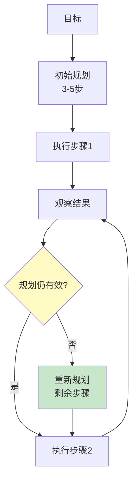

# Agent 多轮规划深度

> 知识库 209 和 264 已有基础。这篇深入——动态重新规划、子目标管理和规划质量评估。

---

## 一、多轮规划架构



---

## 二、实现

```python
from dataclasses import dataclass, field
from enum import Enum
from datetime import datetime

class StepStatus(str, Enum):
    PENDING = "pending"
    EXECUTING = "executing"
    DONE = "done"
    FAILED = "failed"
    SKIPPED = "skipped"

@dataclass
class PlanStep:
    step_id: int
    action: str
    sub_goal: str = ""
    status: StepStatus = StepStatus.PENDING
    result: str = ""
    timestamp: str = field(default_factory=lambda: datetime.now().isoformat())

@dataclass
class MultiTurnPlan:
    """多轮规划。"""
    goal: str
    steps: list[PlanStep] = field(default_factory=list)
    current_step: int = 0
    replan_count: int = 0

    def add_step(self, action: str, sub_goal: str = ""):
        self.steps.append(PlanStep(
            step_id=len(self.steps) + 1, action=action, sub_goal=sub_goal,
        ))

    def current(self) -> PlanStep | None:
        if self.current_step < len(self.steps):
            return self.steps[self.current_step]
        return None

    def advance(self):
        """推进到下一步。"""
        if self.current_step < len(self.steps):
            self.steps[self.current_step].status = StepStatus.DONE
            self.current_step += 1

    def needs_replan(self, result: str) -> bool:
        """判断是否需要重新规划。"""
        current = self.current()
        if not current:
            return False
        # 简化：如果结果包含错误关键词
        error_keywords = ["错误", "失败", "无法", "error", "failed"]
        return any(kw in result.lower() for kw in error_keywords)

    def replan(self, new_steps: list[str]):
        """重新规划剩余步骤。"""
        # 删除未执行的步骤
        self.steps = self.steps[:self.current_step + 1]
        for action in new_steps:
            self.add_step(action)
        self.replan_count += 1

    def progress(self) -> dict:
        """进度报告。"""
        total = len(self.steps)
        done = sum(1 for s in self.steps if s.status == StepStatus.DONE)
        return {
            "goal": self.goal,
            "total_steps": total,
            "completed": done,
            "current_step": self.current_step + 1 if self.current_step < total else total,
            "replan_count": self.replan_count,
            "progress_pct": round(done / max(total, 1) * 100),
        }


class DynamicPlanner:
    """动态规划器——支持重新规划。"""

    async def create_plan(self, goal: str, llm) -> MultiTurnPlan:
        """创建初始规划。"""
        from langchain_core.messages import HumanMessage
        prompt = f"""为以下目标制定3-5步计划。

目标: {goal}

输出JSON数组:
```json
[{{"action": "...", "sub_goal": "这一步要实现什么"}}]
```"""
        response = await llm.ainvoke([HumanMessage(content=prompt)])
        import re, json
        match = re.search(r'\[.*\]', response.content, re.DOTALL)
        plan = MultiTurnPlan(goal=goal)
        if match:
            steps = json.loads(match.group())
            for s in steps:
                plan.add_step(s.get("action", ""), s.get("sub_goal", ""))
        return plan

    async def replan(self, plan: MultiTurnPlan, failed_result: str, llm) -> MultiTurnPlan:
        """重新规划。"""
        from langchain_core.messages import HumanMessage
        completed = [s.action for s in plan.steps[:plan.current_step + 1]]
        prompt = f"""重新规划。

原始目标: {plan.goal}
已完成: {completed}
失败结果: {failed_result[:200]}

给出新的剩余步骤:
```json
[{{"action": "...", "sub_goal": "..."}}]
```"""
        response = await llm.ainvoke([HumanMessage(content=prompt)])
        import re, json
        match = re.search(r'\[.*\]', response.content, re.DOTALL)
        if match:
            new_steps = [s["action"] for s in json.loads(match.group())]
            plan.replan(new_steps)
        return plan
```

---

## 三、最佳实践

| 实践 | 说明 | 优先级 |
|------|------|--------|
| 每步后评估 | 判断是否需要重新规划 | ★★★ |
| 重新规划留已完成 | 不重复执行 | ★★★ |
| 有replan计数 | 防止无限重新规划 | ★★☆ |
| 子目标管理 | 每步知道要实现什么 | ★★☆ |

---

## 四、检查清单

| 检查项 | 状态 |
|--------|------|
| 有多轮规划 | ☐ |
| 有动态重新规划 | ☐ |
