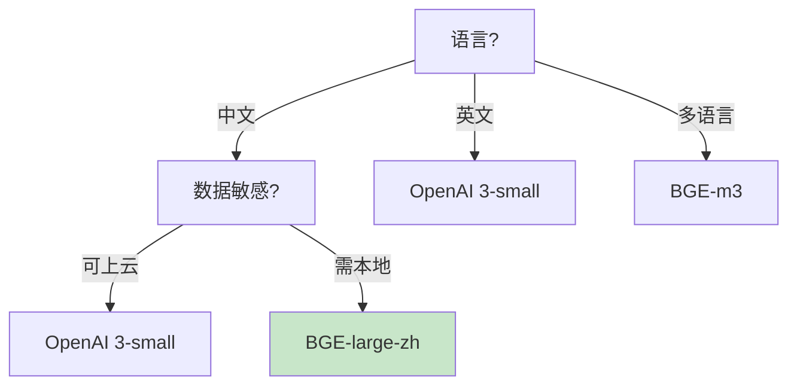

# Embedding 模型选择指南最新

> 知识库 51 仅 127 行、知识库 148 有进阶。这篇整合为最新——模型对比、维度选择和评估方法。

---

## 一、模型对比

| 模型 | 维度 | 中文 | 英文 | 成本 | 本地 |
|------|------|------|------|------|------|
| OpenAI 3-small | 1536 | ★★★★ | ★★★★★ | 低 | ❌ |
| OpenAI 3-large | 3072 | ★★★★ | ★★★★★ | 中 | ❌ |
| BGE-large-zh | 1024 | ★★★★★ | ★★★★ | 免费 | ✅ |
| BGE-m3 | 1024 | ★★★★★ | ★★★★★ | 免费 | ✅ |
| Cohere v3 | 1024 | ★★★ | ★★★★★ | 中 | ❌ |

---

## 二、选型决策



---

## 三、评估方法

```python
class EmbeddingEvaluator:
    """嵌入模型评估器。"""

    @staticmethod
    def evaluate(embeddings, test_cases: list[dict]) -> dict:
        """用真实数据评估。"""
        import numpy as np
        recalls = []

        for tc in test_cases:
            query_vec = np.array(embeddings.embed_query(tc["query"]))
            doc_vecs = np.array([embeddings.embed_query(d) for d in tc.get("all_docs", [])])

            # 计算相似度
            sims = doc_vecs @ query_vec
            top_k_idx = np.argsort(sims)[-5:][::-1]
            expected = set(tc.get("relevant_docs", []))
            retrieved = set(top_k_idx)
            recall = len(expected & retrieved) / max(len(expected), 1)
            recalls.append(recall)

        return {
            "avg_recall": round(np.mean(recalls), 4),
            "min_recall": round(np.min(recalls), 4),
            "max_recall": round(np.max(recalls), 4),
        }
```

---

## 四、最佳实践

| 实践 | 说明 | 优先级 |
|------|------|--------|
| 中文用BGE | 中文最强 | ★★★ |
| 1024维平衡 | 精度+成本 | ★★★ |
| 用真实数据评估 | 不靠排行榜 | ★★★ |
| 不轻易换模型 | 换要重建索引 | ★★★ |

---

## 五、检查清单

| 检查项 | 状态 |
|--------|------|
| 有模型对比表 | ☐ |
| 有选型决策 | ☐ |
| 有评估方法 | ☐ |
