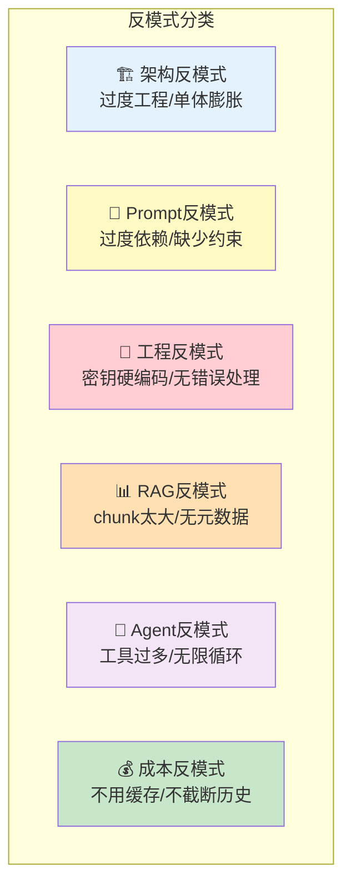

# 常见反模式与陷阱

> 有些错误反复出现。这份指南帮你识别并避免 LLM 应用开发中最常见的反模式。

---

## 一、反模式全景



## 二、架构反模式

### 2.1 过度工程化

```mermaid
graph TB
    subgraph 反模式 ["❌ 过度工程化"}
        B1["简单FAQ问答<br/>→ 用LangGraph多Agent<br/>→ 3层子图嵌套<br/>→ 意图识别+路由+确认"]
        Note1["杀鸡用牛刀<br/>维护成本远大于收益"]
    end

    subgraph 正确 ["✅ 适度设计"}
        G1["简单FAQ<br/>→ prompt | llm | parser<br/>→ 需要时再增加复杂度"]
    end

    style 反模式 fill:#FFCDD2
    style 正确 fill:#C8E6C9
```

**原则**：从最简单的方案开始，遇到问题时再增加复杂度。

### 2.2 单体膨胀

```mermaid
graph TB
    subgraph 反模式2 ["❌ 单体文件膨胀"}
        B1["main.py (500行)<br/>包含: LLM调用+RAG+Agent+路由+工具+UI"]
    end

    subgraph 正确2 ["✅ 模块化"}
        G1["main.py → 入口"]
        G2["chains/ → Chain定义"]
        G3["tools/ → 工具定义"]
        G4["graph/ → LangGraph定义"]
    end

    style 反模式2 fill:#FFCDD2
    style 正确2 fill:#C8E6C9
```

## 三、Prompt 反模式

### 3.1 过度依赖 Prompt 解决一切

```python
# ❌ 反模式：试图用Prompt解决本该用代码解决的问题
BAD_PROMPT = """
你是客服。用户的问题可能是订单查询、产品咨询、投诉...
请根据用户输入：
1. 判断是哪种类型
2. 如果是订单查询，从以下列表中查找...（100行订单数据）
3. 如果是产品咨询，从以下列表中查找...（100行产品数据）
4. 格式化输出
"""

# ✅ 正确：用代码做分类，用Prompt做生成
# 用条件边路由，每个Agent只处理自己的职责
```

### 3.2 缺少格式约束

```python
# ❌ 反模式：不约束输出格式
prompt = "总结这篇文章：{text}"

# ✅ 正确：明确格式要求
prompt = """总结这篇文章，要求：
1. 不超过3句话
2. 每句话不超过30个字
3. 输出JSON格式：{"summary": "...", "keywords": [...]}
{text}"""
```

### 3.3 System Prompt 过长

```python
# ❌ 反模式：500字的System Prompt
SYSTEM = """你是一个客服助手。
你要做的第一件事是...然后...
如果用户说X你要做Y...
如果用户说A你要做B...
记住规则1...规则2...规则3...（500字）"""

# ✅ 正确：精简System Prompt，用Few-Shot展示行为
SYSTEM = "你是客服助手。友好、简洁、准确。"
# 用Few-Shot示例展示期望行为
```

## 四、RAG 反模式

### 4.1 chunk_size 设置不当

```mermaid
graph TB
    subgraph chunk过大 ["❌ chunk_size=2000"}
        C1["检索精准度低<br/>(大块中可能只有一小部分相关)"]
        C2["Token消耗大<br/>(每块2000 tokens)"]
        C3["上下文包含噪声"]
    end

    subgraph chunk过小 ["❌ chunk_size=100"}
        S1["上下文不完整"]
        S2["检索结果碎片化"]
        S3["需要更多chunk(k值大)"]
    end

    subgraph chunk合适 ["✅ chunk_size=400-600"}
        R1["检索精准"]
        R2["上下文完整"]
        R3["Token适中"]
    end

    style chunk过大 fill:#FFCDD2
    style chunk过小 fill:#FFE0B2
    style chunk合适 fill:#C8E6C9
```

### 4.2 忽略元数据

```python
# ❌ 反模式：不添加元数据
docs = [Document(page_content="内容1"), Document(page_content="内容2")]
db = FAISS.from_documents(docs, embeddings)
# 检索结果无法追溯来源

# ✅ 正确：添加丰富的元数据
docs = [
    Document(page_content="内容1", metadata={"source": "manual.pdf", "page": 3, "chapter": "安装"}),
    Document(page_content="内容2", metadata={"source": "faq.md", "section": "退换货"}),
]
db = FAISS.from_documents(docs, embeddings)
# 检索结果可以追溯来源、过滤特定文档
```

### 4.3 不评估检索质量

```python
# ❌ 反模式：建好向量库就直接用，不看检索效果
db = FAISS.from_documents(chunks, embeddings)
results = db.similarity_search("query", k=3)
# 不知道检索到的内容是否相关

# ✅ 正确：先评估再使用
results = db.similarity_search("query", k=3)
for i, doc in enumerate(results):
    print(f"--- 结果{i+1} ---")
    print(f"来源: {doc.metadata.get('source')}")
    print(f"内容: {doc.page_content[:200]}")
    print(f"相关吗？需要人工检查")
```

## 五、Agent 反模式

### 5.1 工具过多

```mermaid
graph TB
    subgraph 工具过多 ["❌ 给Agent 15个工具"}
        T1["LLM选择困难<br/>(描述太多记不住)"]
        T2["误用工具概率高"]
        T3["Token消耗大<br/>(工具定义占空间)"]
    end

    subgraph 工具适中 ["✅ 3-7个工具"}
        R1["选择准确"]
        R2["响应快"]
        R3["维护简单"]
    end

    style 工具过多 fill:#FFCDD2
    style 工具适中 fill:#C8E6C9
```

### 5.2 不设 max_iterations

```python
# ❌ 反模式：不限制循环次数
executor = AgentExecutor(agent=agent, tools=tools, verbose=True)
# Agent可能无限循环，消耗大量Token

# ✅ 正确：设置上限
executor = AgentExecutor(
    agent=agent,
    tools=tools,
    verbose=True,
    max_iterations=5,            # 最多5轮
    early_stopping_method="generate",  # 达上限时生成回答
)
```

### 5.3 工具描述太模糊

```python
# ❌ 反模式：描述太简单
@tool
def search(query: str) -> str:
    """搜索"""  # LLM不知道何时该用
    pass

@tool
def calc(expr: str) -> str:
    """计算"""  # LLM不知道能算什么
    pass

# ✅ 正确：描述明确
@tool
def search_product(query: str) -> str:
    """在产品目录中搜索商品。当用户询问产品信息、价格、库存时使用。
    不适用于：订单查询（用query_order）、投诉（用submit_complaint）。"""
    pass
```

## 六、成本反模式

```mermaid
graph TB
    subgraph 成本反模式 ["❌ 常见成本浪费"}
        C1["不用缓存<br/>相同问题重复调用"]
        C2["不截断历史<br/>50轮对话全传入"]
        C3["k值太大<br/>检索10个chunk但只用到2个"]
        C4["用GPT-4o做简单任务<br/>(翻译/分类用mini就够)"]
        C5["不设max_tokens<br/>(LLM可能输出2000字)"]
    end

    subgraph 正确做法 ["✅ 成本优化"}
        R1["启用缓存<br/>重复问题秒回"]
        R2["截断历史<br/>保留最近10轮"]
        R3["k=3-4<br/>够用即可"]
        R4["简单任务用mini"]
        R5["设max_tokens=500"]
    end

    style 成本反模式 fill:#FFCDD2
    style 正确做法 fill:#C8E6C9
```

## 七、安全反模式

```python
# ❌ 反模式1：API Key硬编码
llm = ChatOpenAI(api_key="sk-xxxx")  # 不要这样！

# ❌ 反模式2：Agent执行危险代码无限制
@tool
def execute_python(code: str) -> str:
    """执行Python代码"""
    exec(code)  # 可以执行os.remove()！

# ❌ 反模式3：RAG不隔离用户数据
# 所有用户共享同一个向量库
# 用户A能检索到用户B的文档

# ✅ 正确做法
# 1. API Key从.env读取
# 2. 代码执行在沙箱中，过滤危险操作
# 3. 按用户隔离向量库
```

## 八、反模式检查清单

| 检查项 | 反模式 | 正确做法 |
|--------|--------|----------|
| 架构 | 简单任务用复杂Agent | 从Chain开始，需要时再升级 |
| Prompt | 过长/无格式约束 | 精简+格式要求+Few-Shot |
| RAG | chunk太大/无元数据 | chunk=500+元数据+评估 |
| Agent | 工具多/无上限/描述模糊 | 3-7工具+max_iterations+清晰描述 |
| 成本 | 不缓存/不截断/不限制 | 缓存+截断+max_tokens |
| 安全 | 硬编码/无沙箱/无隔离 | .env+沙箱+用户隔离 |
| 测试 | 不测试/无评估 | 单元测试+LLM评估+人工抽检 |
| 监控 | 不追踪/不统计Token | LangSmith+Token统计+成本监控 |
