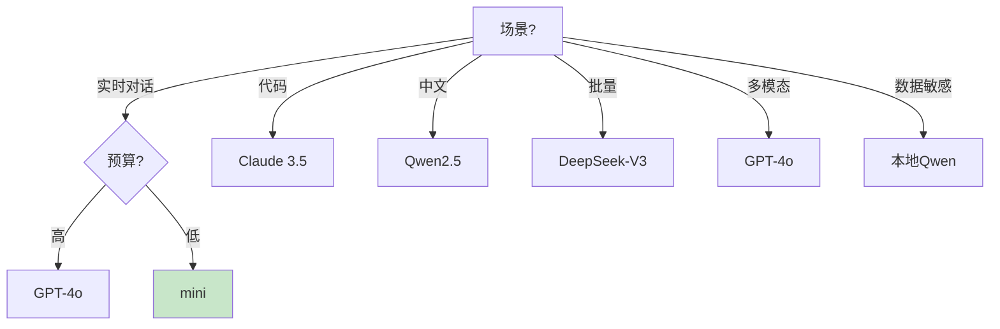

# 模型选型决策矩阵最新

> 知识库 56 仅 97 行、知识库 168 有进阶。这篇整合为最新——8 维度对比、场景化选型和混合策略。

---

## 一、8 维度对比

| 模型 | 效果 | 成本($/1M) | 延迟 | 中文 | 代码 | 多模态 | 本地 | 生态 |
|------|------|-----------|------|------|------|--------|------|------|
| GPT-4o | ★★★★★ | 2.5/10 | 中 | ★★★★ | ★★★★ | ✅ | ❌ | 最大 |
| GPT-4o-mini | ★★★★ | 0.15/0.6 | 低 | ★★★★ | ★★★★ | ✅ | ❌ | 大 |
| Claude 3.5 | ★★★★★ | 3/15 | 中 | ★★★★ | ★★★★★ | ✅ | ❌ | 大 |
| Claude Haiku | ★★★★ | 0.25/1.25 | 低 | ★★★ | ★★★★ | ✅ | ❌ | 中 |
| Qwen2.5-72B | ★★★★ | 0.5/1.5 | 中 | ★★★★★ | ★★★★ | ❌ | ✅ | 中 |
| DeepSeek-V3 | ★★★★ | 0.14/0.28 | 低 | ★★★★★ | ★★★★ | ❌ | ✅ | 新 |

---

## 二、场景化选型



---

## 三、混合策略

```python
HYBRID = {
    "default": "gpt-4o-mini",      # 80%请求
    "complex": "gpt-4o",           # 复杂查询
    "code": "claude-3-5-sonnet",   # 代码
    "batch": "deepseek-v3",         # 批量
    "fallback": "gpt-4o-mini",     # 降级
    "local": "qwen2.5:14b",        # 敏感数据
}
```

---

## 四、最佳实践

| 实践 | 说明 | 优先级 |
|------|------|--------|
| 默认用mini | 80%够用 | ★★★ |
| 中文用Qwen | 中文最强 | ★★★ |
| 代码用Claude | 代码最强 | ★★★ |
| 数据敏感用本地 | 不出内网 | ★★★ |

---

## 五、检查清单

| 检查项 | 状态 |
|--------|------|
| 有8维对比 | ☐ |
| 有场景选型 | ☐ |
