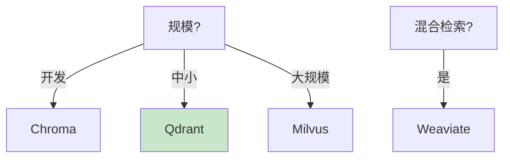

# 向量数据库深度对比最新

> 知识库 12 有 294 行、知识库 242 有最新。这篇整合为完整对比——6 大库 + 选型 + 快速接入。

---

## 一、6 大向量库

| 库 | 开源 | 部署 | 性能 | 适合 |
|----|------|------|------|------|
| Milvus | ✅ | 云/自托管 | 高 | 大规模生产 |
| Qdrant | ✅ | Docker | 高 | 中小生产 |
| Chroma | ✅ | 本地 | 中 | 开发原型 |
| Weaviate | ✅ | Docker | 高 | 混合检索 |
| FAISS | ✅ | 库 | 极高 | 纯计算 |
| Pinecone | ❌ | 云 | 高 | 零运维 |

---

## 二、选型决策



---

## 三、快速接入

```python
# Chroma——最快上手
from langchain_community.vectorstores import Chroma
vs = Chroma(embedding_function=embeddings)

# Qdrant——推荐中小生产
from langchain_community.vectorstores import QdrantVectorStore
vs = QdrantVectorStore(client=client, collection_name="docs", embedding=embeddings)

# Milvus——大规模
from langchain_community.vectorstores import Milvus
vs = Milvus(embedding_function=embeddings, connection_args={"host": "localhost", "port": "19530"})
```

---

## 四、最佳实践

| 实践 | 说明 | 优先级 |
|------|------|--------|
| 开发用Chroma | 零配置 | ★★★ |
| 生产用Qdrant | 轻量高性能 | ★★★ |
| 大规模用Milvus | 分布式 | ★★★ |
| HNSW索引 | 速度精度平衡 | ★★☆ |

---

## 五、检查清单

| 检查项 | 状态 |
|--------|------|
| 有6大对比 | ☐ |
| 有选型 | ☐ |
| 有接入 | ☐ |
