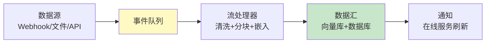

# LLM 应用数据管道深度

> 之前仅 2 篇提及。这篇讲透——实时数据管道架构、事件流处理和数据质量监控。

---

## 一、数据管道架构



---

## 二、实现

```python
import asyncio
from dataclasses import dataclass, field
from datetime import datetime
from enum import Enum
from collections import defaultdict

class EventType(str, Enum):
    CREATE = "create"
    UPDATE = "update"
    DELETE = "delete"

@dataclass
class DataEvent:
    event_id: str
    event_type: EventType
    source: str
    content: str = ""
    metadata: dict = field(default_factory=dict)
    timestamp: str = field(default_factory=lambda: datetime.now().isoformat())

class DataPipeline:
    """LLM应用数据管道。"""

    def __init__(self, vectorstore=None, embeddings=None):
        self.vectorstore = vectorstore
        self.embeddings = embeddings
        self._queue: asyncio.Queue = asyncio.Queue()
        self._handlers: dict[EventType, list] = defaultdict(list)
        self._processed: int = 0
        self._errors: int = 0

    def register_handler(self, event_type: EventType, handler):
        """注册事件处理器。"""
        self._handlers[event_type].append(handler)

    async def push(self, event: DataEvent):
        """推送事件到管道。"""
        await self._queue.put(event)

    async def start(self, batch_size: int = 10, max_events: int = 1000):
        """启动管道处理。"""
        batch = []
        for _ in range(max_events):
            event = await self._queue.get()
            batch.append(event)

            if len(batch) >= batch_size:
                await self._process_batch(batch)
                batch = []

        if batch:
            await self._process_batch(batch)

    async def _process_batch(self, events: list[DataEvent]):
        """处理一批事件。"""
        for event in events:
            try:
                handlers = self._handlers.get(event.event_type, [])
                for handler in handlers:
                    await handler(event, self.vectorstore, self.embeddings)
                self._processed += 1
            except Exception:
                self._errors += 1

    def stats(self) -> dict:
        return {"processed": self._processed, "errors": self._errors, "queue_size": self._queue.qsize()}


class DataQualityMonitor:
    """数据质量监控器。"""

    def __init__(self):
        self.checks: list[dict] = []

    def check(self, event: DataEvent) -> dict:
        """检查数据质量。"""
        issues = []

        if not event.content or len(event.content) < 10:
            issues.append("内容过短")
        if "\ufffd" in event.content:
            issues.append("含编码错误")
        if not event.source:
            issues.append("缺少来源")

        return {"is_valid": len(issues) == 0, "issues": issues}
```

---

## 三、最佳实践

| 实践 | 说明 | 优先级 |
|------|------|--------|
| 事件队列缓冲 | 削峰填谷 | ★★★ |
| 批量处理 | 提高吞吐 | ★★★ |
| 数据质量检查 | 防垃圾入库 | ★★★ |
| 错误隔离 | 单个失败不影响其他 | ★★☆ |

---

## 四、检查清单

| 检查项 | 状态 |
|--------|------|
| 有数据管道 | ☐ |
| 有质量监控 | ☐ |
