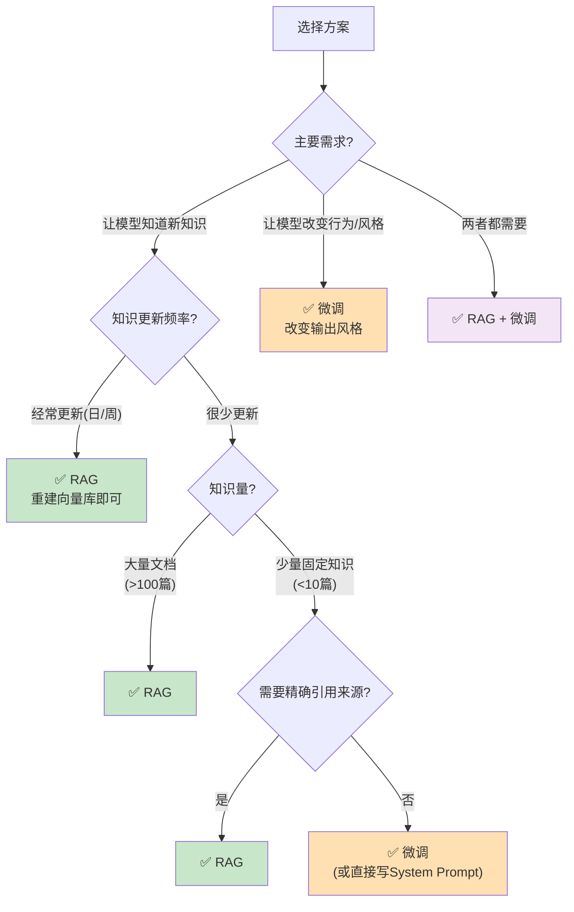
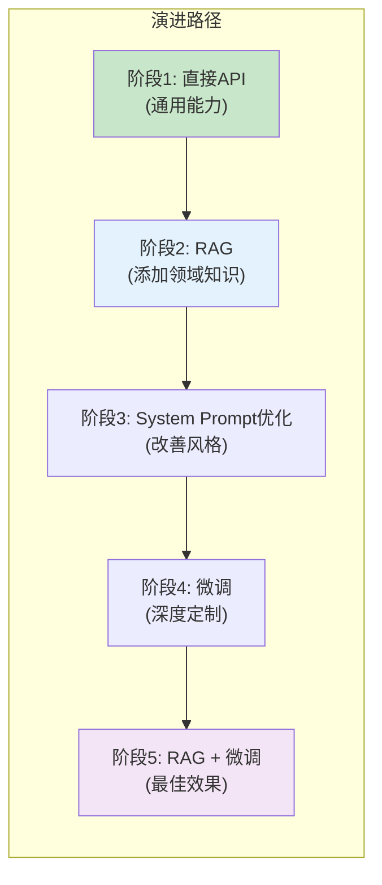
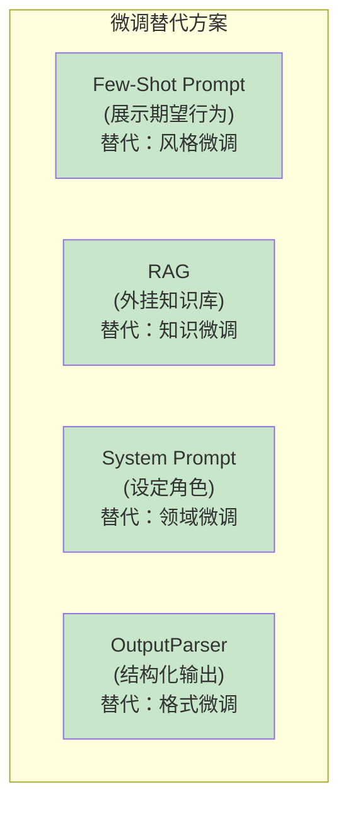

# 微调 vs RAG 选型

> 什么时候用 RAG？什么时候该微调？什么时候两个都用？这份指南帮你做出正确选型。

---

## 一、RAG vs 微调：本质区别

```mermaid
graph TB
    subgraph RAG ["RAG（检索增强生成）"}
        R1["原理：给LLM外挂知识库<br/>检索相关信息→注入上下文→生成"]
        R2["知识来源：外部向量数据库"]
        R3["更新方式：重建向量库即可<br/>(分钟级)"]
        R4["知识可见性：✅ 可追溯检索结果"]
        R5["成本：低（只存向量）"]
        R6["延迟：+检索时间"]
    end

    subgraph FT ["微调（Fine-tuning）"}
        F1["原理：修改模型参数<br/>让模型学会新模式/知识"]
        F2["知识来源：训练数据融入权重"]
        F3["更新方式：重新训练<br/>(小时-天级)"]
        F4["知识可见性：❌ 无法追溯"]
        F5["成本：高（训练+推理）"]
        F6["延迟：无额外延迟"]
    end

    style RAG fill:#C8E6C9
    style FT fill:#FFE0B2
```

## 二、选型决策树



## 三、详细对比

| 维度 | RAG | 微调 | 直接用API |
|------|-----|------|-----------|
| 适合场景 | 知识问答、文档检索 | 特定风格、领域术语 | 通用任务 |
| 知识更新 | 重建向量库(分钟) | 重新训练(小时-天) | 无法更新 |
| 知识量 | 不限 | 训练数据量限制 | 仅训练时知识 |
| 引用来源 | ✅ 可追溯 | ❌ 不可追溯 | ❌ |
| 幻觉控制 | ✅ 强(基于上下文) | ⚠️ 中 | ❌ 弱 |
| 实现难度 | ★★☆ | ★★★★ | ★☆☆ |
| 初始成本 | 低 | 高(数据+训练) | 无 |
| 运行成本 | 中(检索+生成) | 高(微调模型推理) | 低(只调API) |
| 延迟 | 中(检索+生成) | 低(直接推理) | 低 |
| 数据隐私 | ✅ 数据留在本地 | ⚠️ 需上传训练 | ❌ 数据发送API |

## 四、各场景推荐

### 4.1 适合 RAG 的场景

```mermaid
graph TB
    subgraph 适合RAG ["✅ 适合 RAG"}
        S1["企业知识库问答<br/>(产品文档/手册/FAQ)"]
        S2["法律/医疗文献检索<br/>(需要引用来源)"]
        S3["实时信息查询<br/>(新闻/股价/天气)"]
        S4["多文档汇总<br/>(多来源检索+综合)"]
        S5["个人笔记/文档问答<br/>(知识持续增长)"]
    end

    style 适合RAG fill:#C8E6C9
```

### 4.2 适合微调的场景

```mermaid
graph TB
    subgraph 适合微调 ["✅ 适合微调"}
        S1["特定领域术语<br/>(医学/法律/金融专业术语)"]
        S2["特定输出风格<br/>(公司品牌语调)"]
        S3["结构化输出<br/>(特定JSON格式)"]
        S4["减少Token用量<br/>(模型已学会不需要示例)"]
        S5["边缘部署<br/>(小模型微调代替大模型)"]
    end

    style 适合微调 fill:#FFE0B2
```

### 4.3 适合 RAG + 微调的场景

```mermaid
graph TB
    subgraph 组合方案 ["✅ RAG + 微调（最佳实践）"}
        S1["微调：让模型学会领域术语和风格"]
        S2["RAG：提供最新知识和引用来源"]
        S3["效果：模型既懂专业表达，又有最新知识"]
        S4["示例：法律助手<br/>微调→法律术语<br/>RAG→最新法规"]
    end

    style 组合方案 fill:#F3E5F5
```

## 五、RAG 和微调不互斥



## 六、什么时候不选微调

```mermaid
graph TB
    subgraph 不选微调 ["❌ 以下情况不要微调"}
        N1["知识频繁变化<br/>(微调后立即过时)"]
        N2["数据量太少<br/>(<100条训练样本)"]
        N3["预算有限<br/>(微调成本高)"]
        N4["需要引用来源<br/>(微调无法追溯)"]
        N5["团队没有ML经验<br/>(微调需要专业知识)"]
        N6["简单任务<br/>(RAG或Prompt就够了)"]
    end

    style 不选微调 fill:#FFCDD2
```

## 七、替代微调的方案

在大多数情况下，以下方案可以替代微调，且成本更低：



> 💡 **经验法则**：先用 RAG + Prompt 工程。如果效果不够且瓶颈在"模型风格/术语"而非"知识"时，再考虑微调。

## 八、成本对比

```mermaid
graph TB
    subgraph 成本对比 ["月度成本估算（1000用户/天100次调用）"}
        RAG_C["RAG方案<br/>LLM调用: ~$50/月<br/>向量库: ~$5/月<br/>总计: ~$55/月"]
        FT_C["微调方案<br/>训练: ~$100-500(一次性)<br/>推理: ~$200/月(微调模型)<br/>总计: ~$200+/月"]
        API_C["直接API<br/>LLM调用: ~$50/月<br/>总计: ~$50/月"]
    end

    style RAG_C fill:#C8E6C9
    style FT_C fill:#FFE0B2
    style API_C fill:#E3F2FD
```

## 九、最终选型建议

| 你的情况 | 推荐方案 | 理由 |
|---------|----------|------|
| 初学者/学习阶段 | 直接API + Prompt工程 | 成本最低，效果够用 |
| 需要问答私有文档 | RAG | 知识可更新，可追溯 |
| 需要特定输出风格 | Few-Shot Prompt | 简单有效 |
| Few-Shot不够、风格要求高 | 微调 | Prompt无法解决时 |
| 领域知识+特定风格 | RAG + 微调 | 最佳效果 |
| 预算有限 | RAG > 微调 | RAG成本更低 |
| 数据隐私优先 | RAG（本地模型） | 数据不外传 |
| 边缘设备部署 | 微调小模型 | 小模型+微调=低资源需求 |
