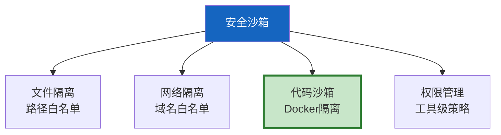

# Agent 安全沙箱整合指南

> 16 篇提及沙箱。这篇整合为完整指南——文件隔离、网络隔离、代码沙箱和权限管理的统一方案。

---

## 一、安全沙箱四层



---

## 二、统一安全检查器

```python
import os, re
from dataclasses import dataclass, field

@dataclass
class SecurityPolicy:
    """统一安全策略。"""
    allowed_dirs: list[str] = field(default_factory=lambda: ["/tmp/agent/"])
    denied_paths: list[str] = field(default_factory=lambda: ["/etc/", "/.ssh/", "/.env", "/root/"])
    allowed_domains: list[str] = field(default_factory=lambda: ["api.openai.com", "api.tavily.com"])
    blocked_domains: list[str] = field(default_factory=lambda: ["evil.com", "malware.cn"])
    max_file_size_mb: int = 10
    max_output_chars: int = 5000
    max_execution_time: int = 30

class UnifiedSecurityGuard:
    """统一安全防护器——文件+网络+代码+权限。"""

    def __init__(self, policy: SecurityPolicy = SecurityPolicy()):
        self.policy = policy

    def check_file(self, path: str, operation: str = "read") -> dict:
        """检查文件访问安全。"""
        abs_path = os.path.abspath(path)

        for denied in self.policy.denied_paths:
            if denied in abs_path:
                return {"allowed": False, "reason": f"禁止路径: {denied}"}

        if self.policy.allowed_dirs:
            if not any(abs_path.startswith(d) for d in self.policy.allowed_dirs):
                return {"allowed": False, "reason": f"不在允许目录: {abs_path}"}

        if operation == "read":
            if os.path.exists(abs_path):
                size = os.path.getsize(abs_path)
                if size > self.policy.max_file_size_mb * 1024 * 1024:
                    return {"allowed": False, "reason": f"文件过大: {size}"}

        return {"allowed": True}

    def check_url(self, url: str) -> dict:
        """检查网络访问安全。"""
        domain_match = re.search(r'https?://([^/]+)', url)
        if not domain_match:
            return {"allowed": False, "reason": "无效URL"}

        domain = domain_match.group(1)

        for blocked in self.policy.blocked_domains:
            if blocked in domain:
                return {"allowed": False, "reason": f"域名被禁止: {domain}"}

        if self.policy.allowed_domains:
            if not any(d in domain for d in self.policy.allowed_domains):
                return {"allowed": False, "reason": f"不在白名单: {domain}"}

        return {"allowed": True, "domain": domain}

    def check_code(self, code: str) -> dict:
        """检查代码安全。"""
        dangerous_patterns = [
            (r"__import__\s*\(", "代码注入"),
            (r"eval\s*\(", "代码执行"),
            (r"exec\s*\(", "代码执行"),
            (r"os\.system\s*\(", "系统命令"),
            (r"subprocess\.", "子进程"),
            (r"open\s*\(\s*['\"]/", "绝对路径访问"),
        ]

        findings = []
        for pattern, desc in dangerous_patterns:
            if re.search(pattern, code, re.IGNORECASE):
                findings.append(desc)

        if findings:
            return {"allowed": False, "reason": f"危险模式: {', '.join(findings)}"}

        if len(code) > 10000:
            return {"allowed": False, "reason": "代码过长"}

        return {"allowed": True}

    def check_tool_call(self, tool_name: str, args: dict) -> dict:
        """检查工具调用安全——综合检查。"""
        for key, value in args.items():
            if isinstance(value, str):
                if "/" in value and not value.startswith("http"):
                    result = self.check_file(value)
                    if not result["allowed"]:
                        return {"allowed": False, "reason": result["reason"], "type": "file"}

                if value.startswith("http"):
                    result = self.check_url(value)
                    if not result["allowed"]:
                        return {"allowed": False, "reason": result["reason"], "type": "network"}

                if "import" in value or "exec" in value:
                    result = self.check_code(value)
                    if not result["allowed"]:
                        return {"allowed": False, "reason": result["reason"], "type": "code"}

        return {"allowed": True}

    def sanitize_output(self, output: str) -> str:
        """输出安全处理。"""
        # PII脱敏
        output = re.sub(r'\b1[3-9]\d{9}\b', '[PHONE]', output)
        output = re.sub(r'\b\d{17}[\dXx]\b', '[ID]', output)
        output = re.sub(r'sk-[a-zA-Z0-9]{40,}', '[KEY]', output)

        # 长度限制
        if len(output) > self.policy.max_output_chars:
            output = output[:self.policy.max_output_chars] + "\n[已截断]"

        return output
```

---

## 三、最佳实践

| 层 | 策略 | 优先级 |
|------|------|--------|
| 文件 | 路径白名单 | ★★★ |
| 网络 | 域名白名单 | ★★★ |
| 代码 | Docker沙箱 | ★★★ |
| 权限 | 工具最小权限 | ★★★ |
| 输出 | PII脱敏+截断 | ★★☆ |

---

## 四、检查清单

| 检查项 | 状态 |
|--------|------|
| 有统一安全检查器 | ☐ |
| 有四层隔离 | ☐ |
