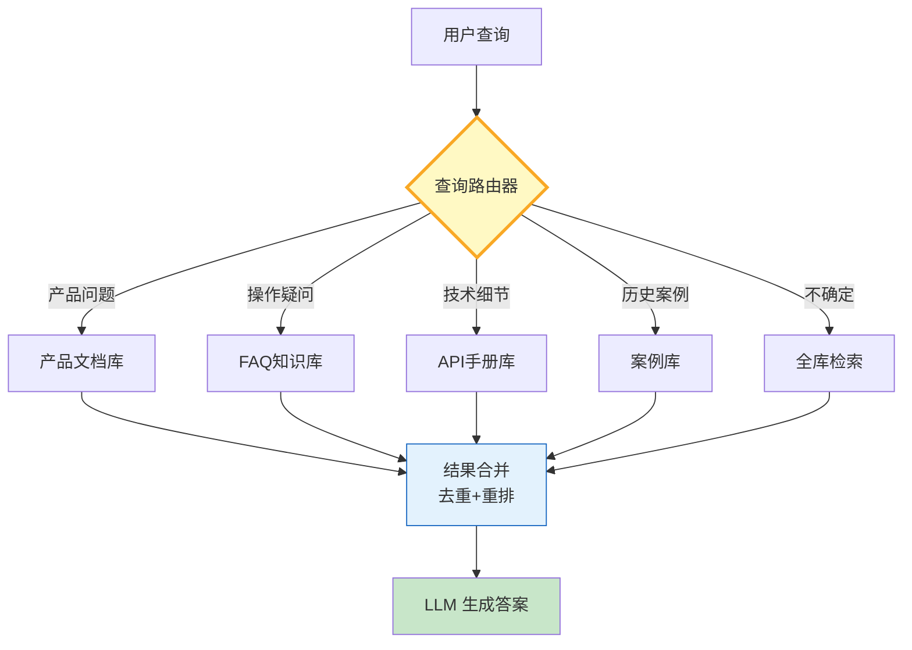

# RAG 查询路由与多知识源选择指南

> 当知识库从 1 个扩展到 N 个（产品文档、FAQ、API 手册、案例库……），"查哪个库"比"怎么查"更关键。这篇指南讲透查询路由的意图分类、知识源选择和结果合并策略。

---

## 一、为什么需要查询路由



单库 RAG 在知识量增大后会出现三个问题：检索精度下降（无关文档淹没目标）、延迟升高（全部库都查一遍）、Token浪费（送入大量不相关上下文）。查询路由通过先判断意图再选择目标库，实现精准命中。

---

## 二、路由策略实现

```python
from langchain_core.prompts import ChatPromptTemplate
from langchain_openai import ChatOpenAI
from langchain_core.output_parsers import StrOutputParser
from enum import Enum
from typing import Optional

llm = ChatOpenAI(model="gpt-4o-mini", temperature=0)

class KnowledgeSource(str, Enum):
    PRODUCT_DOCS = "product_docs"
    FAQ = "faq"
    API_MANUAL = "api_manual"
    CASE_LIBRARY = "case_library"
    ALL = "all"

# 意图分类 prompt
ROUTING_PROMPT = ChatPromptTemplate.from_messages([
    ("system", """你是查询路由分类器。根据用户问题判断应该查询哪个知识库。

可选知识库：
- product_docs: 产品功能、使用指南、最佳实践
- faq: 常见问题解答、操作疑问
- api_manual: API参考、技术细节、参数说明
- case_library: 历史案例、成功故事、行业实践
- all: 无法确定或跨多个领域

只返回知识库名称，不要解释。"""),
    ("human", "{query}"),
])

class QueryRouter:
    """查询路由器——LLM驱动的知识源选择。"""

    def __init__(self, llm):
        self.chain = ROUTING_PROMPT | llm | StrOutputParser()
        self.routing_cache: dict[str, KnowledgeSource] = {}

    async def route(self, query: str) -> KnowledgeSource:
        # 简单缓存：相同查询直接返回
        cache_key = query[:50].lower().strip()
        if cache_key in self.routing_cache:
            return self.routing_cache[cache_key]

        result = await self.chain.ainvoke({"query": query})
        result = result.strip().lower()

        try:
            source = KnowledgeSource(result)
        except ValueError:
            source = KnowledgeSource.ALL

        self.routing_cache[cache_key] = source
        return source

    async def route_multi(self, query: str, top_k: int = 2) -> list[KnowledgeSource]:
        """多路路由——返回top_k个知识源。"""
        # 简化版：主路由 + all 作为备选
        primary = await self.route(query)
        if primary == KnowledgeSource.ALL:
            return [KnowledgeSource.PRODUCT_DOCS, KnowledgeSource.FAQ]
        return [primary]
```

### 知识源配置与检索

```python
from langchain_core.retrievers import BaseRetriever
from langchain_core.documents import Document
from dataclasses import dataclass, field

@dataclass
class KnowledgeSourceConfig:
    """知识源配置。"""
    name: str
    retriever: BaseRetriever
    weight: float = 1.0          # 结果权重
    max_docs: int = 5            # 最大返回文档数
    enabled: bool = True

class MultiSourceRAG:
    """多知识源RAG系统。"""

    def __init__(self, router: QueryRouter):
        self.router = router
        self.sources: dict[str, KnowledgeSourceConfig] = {}

    def register_source(self, config: KnowledgeSourceConfig):
        self.sources[config.name] = config

    async def retrieve(self, query: str) -> list[Document]:
        # 1. 路由判断
        target_sources = await self.router.route_multi(query)

        # 2. 并行检索
        all_docs = []
        for source_name in target_sources:
            config = self.sources.get(source_name.value if hasattr(source_name, 'value') else source_name)
            if config and config.enabled:
                docs = await config.retriever.ainvoke(query)
                # 加权 + 截断
                for doc in docs[:config.max_docs]:
                    doc.metadata["source"] = config.name
                    doc.metadata["weight"] = config.weight
                all_docs.extend(docs[:config.max_docs])

        # 3. 去重（基于内容前100字符）
        seen = set()
        unique_docs = []
        for doc in all_docs:
            key = doc.page_content[:100]
            if key not in seen:
                seen.add(key)
                unique_docs.append(doc)

        # 4. 按权重排序
        unique_docs.sort(key=lambda d: d.metadata.get("weight", 1.0), reverse=True)
        return unique_docs[:10]
```

---

## 三、路由策略对比

| 策略 | 实现方式 | 优点 | 缺点 | 适用场景 |
|------|----------|------|------|----------|
| LLM分类路由 | LLM判断意图 | 灵活、理解自然语言 | 增加一次LLM调用 | 知识源>3个 |
| 关键词规则路由 | 正则/关键词匹配 | 快速、零成本 | 规则维护成本 | 知识源<3个 |
| 嵌入相似度路由 | 查询向量与库摘要比对 | 无需LLM | 需要预计算 | 大规模场景 |
| 混合路由 | 规则优先 + LLM兜底 | 兼顾速度与精度 | 实现复杂 | 生产环境 |

---

## 四、最佳实践

| 实践 | 说明 | 优先级 |
|------|------|--------|
| 路由结果缓存 | 相同查询不重复路由 | ★★★ |
| 全库兜底 | 路由不确定时查全部 | ★★★ |
| 结果去重 | 跨库可能有重复文档 | ★★☆ |
| 按库加权 | 不同库可信度不同 | ★★☆ |
| 监控路由准确率 | 定期评估路由命中 | ★★☆ |
| 渐进式回退 | 精准库→广查库→全库 | ★☆☆ |

---

## 五、检查清单

| 检查项 | 状态 |
|--------|------|
| 有查询路由器 | ☐ |
| 支持多知识源注册 | ☐ |
| 有路由结果缓存 | ☐ |
| 有全库兜底策略 | ☐ |
| 有结果去重机制 | ☐ |
| 有路由准确率监控 | ☐ |
