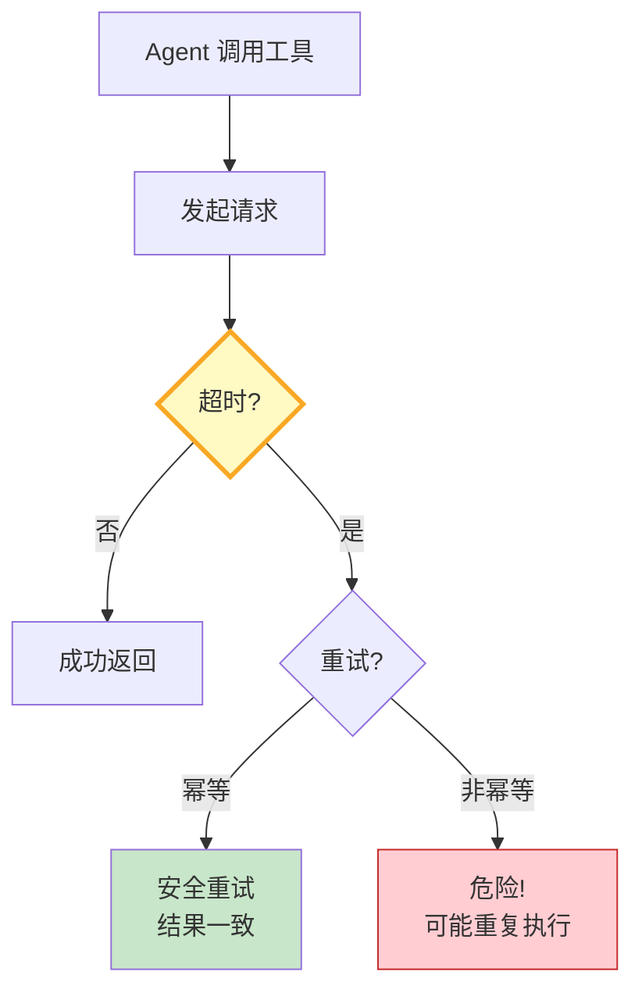

# Agent 工具幂等性与重试策略指南

> Agent 调用外部工具时，网络抖动、超时、部分写入都会导致"调了一次不确定成没成"。这篇指南讲透幂等设计、指数退避重试和死信队列，让工具调用可安全重试。

---

## 一、为什么需要幂等性



非幂等工具重试会导致：重复扣款、重复发邮件、重复创建订单。核心原则是**让每次调用携带唯一请求ID，服务端据此去重**。

---

## 二、幂等性实现

```python
import uuid
import asyncio
import functools
from dataclasses import dataclass, field
from datetime import datetime
from enum import Enum

class RetryPolicy(str, Enum):
    NONE = "none"           # 不重试
    FIXED = "fixed"         # 固定间隔
    EXPONENTIAL = "exp"     # 指数退避
    JITTERED = "jittered"  # 带抖动的指数退避

@dataclass
class RetryConfig:
    """重试配置。"""
    max_retries: int = 3
    base_delay: float = 1.0
    max_delay: float = 30.0
    policy: RetryPolicy = RetryPolicy.JITTERED
    retryable_exceptions: tuple = (TimeoutError, ConnectionError, asyncio.TimeoutError)

class IdempotencyManager:
    """幂等管理器——请求ID去重。"""

    def __init__(self):
        self._cache: dict[str, dict] = {}  # request_id -> result

    def get_or_create_id(self, tool_name: str, args: dict) -> str:
        """获取或创建幂等ID。"""
        # 基于工具名+参数生成确定性ID
        key = f"{tool_name}:{hash(frozenset(args.items()))}"
        if key not in self._cache:
            self._cache[key] = {"status": "pending", "result": None}
        return key

    def check_existing(self, request_id: str) -> dict | None:
        """检查是否已有结果。"""
        entry = self._cache.get(request_id)
        if entry and entry["status"] == "completed":
            return entry["result"]
        return None

    def mark_completed(self, request_id: str, result: dict):
        """标记完成。"""
        if request_id in self._cache:
            self._cache[request_id]["status"] = "completed"
            self._cache[request_id]["result"] = result

def with_retry(config: RetryConfig = RetryConfig()):
    """重试装饰器。"""
    def decorator(func):
        @functools.wraps(func)
        async def wrapper(*args, **kwargs):
            last_exception = None
            for attempt in range(config.max_retries + 1):
                try:
                    return await func(*args, **kwargs)
                except config.retryable_exceptions as e:
                    last_exception = e
                    if attempt == config.max_retries:
                        break
                    delay = _calculate_delay(attempt, config)
                    await asyncio.sleep(delay)
            raise last_exception
        return wrapper
    return decorator

def _calculate_delay(attempt: int, config: RetryConfig) -> float:
    """计算退避延迟。"""
    if config.policy == RetryPolicy.NONE:
        return 0
    elif config.policy == RetryPolicy.FIXED:
        return config.base_delay
    elif config.policy == RetryPolicy.EXPONENTIAL:
        return min(config.base_delay * (2 ** attempt), config.max_delay)
    else:  # JITTERED
        base = min(config.base_delay * (2 ** attempt), config.max_delay)
        import random
        return base * (0.5 + random.random() * 0.5)
```

### 工具集成示例

```python
from langchain_core.tools import tool

idem = IdempotencyManager()

@tool
@with_retry(RetryConfig(max_retries=3, policy=RetryPolicy.JITTERED))
async def send_notification(user_id: str, message: str) -> dict:
    """发送通知（幂等设计）。

    Args:
        user_id: 用户ID
        message: 通知内容
    """
    # 生成幂等键
    req_id = idem.get_or_create_id("send_notification", {"user_id": user_id, "message": message})

    # 检查是否已执行
    existing = idem.check_existing(req_id)
    if existing:
        return {"status": "already_sent", "data": existing, "request_id": req_id}

    # 执行实际发送
    result = {"user_id": user_id, "message": message, "sent_at": datetime.now().isoformat()}

    # 标记完成
    idem.mark_completed(req_id, result)

    return {"status": "sent", "data": result, "request_id": req_id}
```

---

## 三、重试策略对比

| 策略 | 延迟公式 | 优点 | 缺点 | 适用场景 |
|------|----------|------|------|----------|
| 固定间隔 | delay=1s | 简单 | 雷暴效应 | 低频调用 |
| 指数退避 | delay=2^n | 自然收敛 | 无随机性 | 通用场景 |
| 抖动指数 | delay=2^n×random | 避免雷暴 | 实现稍复杂 | 高并发 |
| 不重试 | delay=0 | 安全 | 容错差 | 非幂等操作 |

---

## 四、死信队列

当重试全部失败后，不应丢弃请求，而应进入死信队列供后续人工或定时任务处理。

```python
@dataclass
class DeadLetterEntry:
    tool_name: str
    args: dict
    error: str
    attempts: int
    failed_at: str
    request_id: str

class DeadLetterQueue:
    """死信队列——重试失败后的最终归宿。"""

    def __init__(self):
        self._queue: list[DeadLetterEntry] = []

    def push(self, entry: DeadLetterEntry):
        self._queue.append(entry)

    def drain(self) -> list[DeadLetterEntry]:
        items = self._queue[:]
        self._queue.clear()
        return items

    def pending_count(self) -> int:
        return len(self._queue)
```

---

## 五、最佳实践

| 实践 | 说明 | 优先级 |
|------|------|--------|
| 写操作必须幂等 | 发送、创建、更新 | ★★★ |
| 只重试可重试异常 | 网络超时可重试，参数错误不重试 | ★★★ |
| 抖动指数退避 | 高并发首选 | ★★★ |
| 死信队列兜底 | 不丢弃失败请求 | ★★☆ |
| 请求ID追踪 | 全链路可追溯 | ★★☆ |
| 监控重试率 | 重试率飙升说明下游不稳定 | ★★☆ |

---

## 六、检查清单

| 检查项 | 状态 |
|--------|------|
| 写操作有幂等设计 | ☐ |
| 有重试装饰器 | ☐ |
| 使用抖动指数退避 | ☐ |
| 只重试可重试异常 | ☐ |
| 有死信队列 | ☐ |
| 有请求ID追踪 | ☐ |
