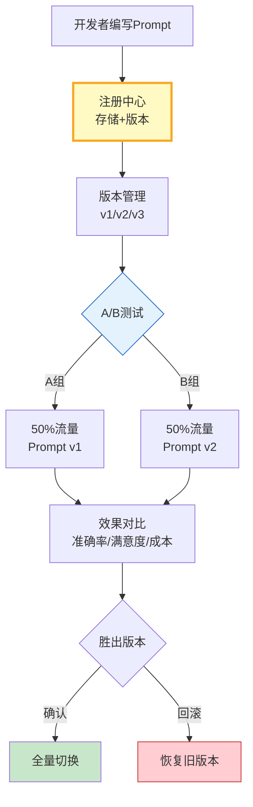

# LLM 应用 Prompt 注册中心与 A/B 测试指南

> Prompt 散落在代码各处、版本混乱、无法对比效果——这是 LLM 应用的"配置债"。这篇指南讲透 Prompt 注册中心设计、版本管理和 A/B 测试，让 Prompt 成为可管理的资产。

---

## 一、Prompt 注册中心架构



---

## 二、Prompt 注册中心实现

```python
from dataclasses import dataclass, field
from datetime import datetime
from enum import Enum
import hashlib
from typing import Optional

class PromptStatus(str, Enum):
    DRAFT = "draft"
    TESTING = "testing"
    ACTIVE = "active"
    ARCHIVED = "archived"

@dataclass
class PromptVersion:
    """Prompt 版本。"""
    prompt_id: str
    version: int
    template: str
    variables: list[str]
    status: PromptStatus = PromptStatus.DRAFT
    created_at: str = field(default_factory=lambda: datetime.now().isoformat())
    hash: str = ""
    metadata: dict = field(default_factory=dict)

    def __post_init__(self):
        self.hash = hashlib.sha256(self.template.encode()).hexdigest()[:12]

    def render(self, **kwargs) -> str:
        """渲染Prompt。"""
        try:
            return self.template.format(**kwargs)
        except KeyError as e:
            raise ValueError(f"缺少变量: {e}")

class PromptRegistry:
    """Prompt 注册中心。"""

    def __init__(self):
        self._registry: dict[str, list[PromptVersion]] = {}

    def register(self, prompt_id: str, template: str, variables: list[str]) -> PromptVersion:
        """注册新版本。"""
        if prompt_id not in self._registry:
            self._registry[prompt_id] = []

        # 检查是否与上一版本相同
        existing = self._registry[prompt_id]
        new_hash = hashlib.sha256(template.encode()).hexdigest()[:12]
        if existing and existing[-1].hash == new_hash:
            return existing[-1]  # 无变化，返回已有版本

        version = PromptVersion(
            prompt_id=prompt_id,
            version=len(existing) + 1,
            template=template,
            variables=variables,
            status=PromptStatus.DRAFT,
        )
        self._registry[prompt_id].append(version)
        return version

    def get_active(self, prompt_id: str) -> Optional[PromptVersion]:
        """获取当前活跃版本。"""
        versions = self._registry.get(prompt_id, [])
        for v in reversed(versions):
            if v.status == PromptStatus.ACTIVE:
                return v
        return versions[-1] if versions else None

    def get_version(self, prompt_id: str, version: int) -> Optional[PromptVersion]:
        """获取指定版本。"""
        for v in self._registry.get(prompt_id, []):
            if v.version == version:
                return v
        return None

    def activate(self, prompt_id: str, version: int) -> bool:
        """激活指定版本，其余降级。"""
        versions = self._registry.get(prompt_id, [])
        found = False
        for v in versions:
            if v.version == version:
                v.status = PromptStatus.ACTIVE
                found = True
            elif v.status == PromptStatus.ACTIVE:
                v.status = PromptStatus.ARCHIVED
        return found

    def list_versions(self, prompt_id: str) -> list[dict]:
        """列出所有版本。"""
        return [
            {"version": v.version, "status": v.status.value, "hash": v.hash, "created_at": v.created_at}
            for v in self._registry.get(prompt_id, [])
        ]
```

### A/B 测试管理器

```python
import random
from dataclasses import dataclass

@dataclass
class ABTestConfig:
    """A/B 测试配置。"""
    test_id: str
    prompt_id: str
    version_a: int
    version_b: int
    traffic_split: float = 0.5  # B组流量比例
    enabled: bool = True

@dataclass
class ABTestResult:
    """A/B 测试结果。"""
    test_id: str
    version_a_metrics: dict
    version_b_metrics: dict
    winner: str

class ABTestManager:
    """A/B 测试管理器。"""

    def __init__(self, registry: PromptRegistry):
        self.registry = registry
        self._tests: dict[str, ABTestConfig] = {}
        self._results: dict[str, list[dict]] = {}

    def create_test(self, config: ABTestConfig):
        self._tests[config.test_id] = config
        self._results[config.test_id] = []

    def assign_group(self, test_id: str, user_id: str) -> str:
        """分配用户到A组或B组。"""
        test = self._tests.get(test_id)
        if not test or not test.enabled:
            return "A"

        # 基于user_id确定性分流
        hash_val = int(hashlib.md5(f"{test_id}:{user_id}".encode()).hexdigest(), 16)
        return "B" if (hash_val % 100) / 100 < test.traffic_split else "A"

    def get_prompt_for_user(self, test_id: str, user_id: str) -> Optional[PromptVersion]:
        """根据A/B测试分配获取Prompt版本。"""
        test = self._tests.get(test_id)
        if not test or not test.enabled:
            return self.registry.get_active(test.prompt_id) if test else None

        group = self.assign_group(test_id, user_id)
        version_num = test.version_b if group == "B" else test.version_a
        return self.registry.get_version(test.prompt_id, version_num)

    def record_result(self, test_id: str, user_id: str, group: str, metrics: dict):
        """记录测试结果。"""
        self._results.setdefault(test_id, []).append({
            "user_id": user_id,
            "group": group,
            "metrics": metrics,
            "timestamp": datetime.now().isoformat(),
        })

    def analyze(self, test_id: str) -> ABTestResult:
        """分析测试结果。"""
        results = self._results.get(test_id, [])
        group_a = [r for r in results if r["group"] == "A"]
        group_b = [r for r in results if r["group"] == "B"]

        def avg(items, key):
            vals = [r["metrics"].get(key, 0) for r in items]
            return sum(vals) / len(vals) if vals else 0

        metrics_a = {k: avg(group_a, k) for k in ["accuracy", "satisfaction", "cost"]}
        metrics_b = {k: avg(group_b, k) for k in ["accuracy", "satisfaction", "cost"]}

        winner = "B" if metrics_b.get("accuracy", 0) > metrics_a.get("accuracy", 0) else "A"
        return ABTestResult(test_id, metrics_a, metrics_b, winner)
```

---

## 三、使用示例

```python
# 初始化
registry = PromptRegistry()
ab_manager = ABTestManager(registry)

# 注册Prompt版本
registry.register(
    "customer_support",
    "你是客服助手。用户问题：{question}\n请给出专业、简洁的回答。",
    ["question"],
)
registry.register(
    "customer_support",
    "你是专业客服助手。请先分析用户意图，再回答。\n用户问题：{question}\n回答要求：分点说明，控制在3点以内。",
    ["question"],
)

# 创建A/B测试
ab_manager.create_test(ABTestConfig(
    test_id="cs_prompt_v1_v2",
    prompt_id="customer_support",
    version_a=1,
    version_b=2,
    traffic_split=0.3,  # 30%流量给v2
))

# 运行时获取Prompt
prompt = ab_manager.get_prompt_for_user("cs_prompt_v1_v2", "user_123")
rendered = prompt.render(question="如何申请退款？")
```

---

## 四、最佳实践

| 实践 | 说明 | 优先级 |
|------|------|--------|
| Prompt内容hash | 自动检测变更 | ★★★ |
| 确定性分流 | 同一用户始终同一组 | ★★★ |
| 先小流量再扩大 | 5%→20%→50%→100% | ★★★ |
| 多指标评估 | 不只看准确率 | ★★☆ |
| 支持秒级回滚 | 出问题立即切回 | ★★☆ |
| 变更审计日志 | 谁在什么时候改了什么 | ★★☆ |

---

## 五、检查清单

| 检查项 | 状态 |
|--------|------|
| 有Prompt注册中心 | ☐ |
| 有版本管理 | ☐ |
| 有A/B测试管理器 | ☐ |
| 支持确定性分流 | ☐ |
| 有效果分析 | ☐ |
| 支持秒级回滚 | ☐ |
