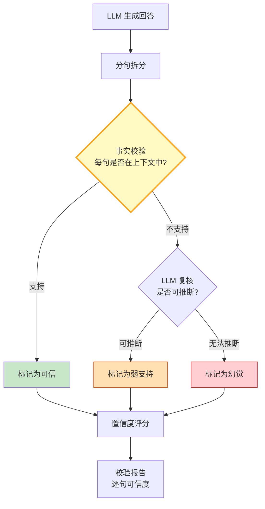

# RAG 幻觉检测与事实校验指南

> LLM 生成的内容看起来合理但不一定真实。RAG 虽然提供了上下文，但模型仍可能编造不在上下文中的信息。这篇指南讲透幻觉检测、事实校验和置信度评估。

---

## 一、幻觉类型与检测架构



### 三种幻觉类型

| 类型 | 定义 | 检测难度 | 示例 |
|------|------|----------|------|
| 上下文矛盾 | 与检索到的文档直接矛盾 | 中 | 文档说A，回答说不 |
| 上下文虚构 | 编造了上下文中不存在的信息 | 高 | 文档未提及日期，回答给出具体日期 |
| 逻辑跳跃 | 推理链断裂或跳跃 | 高 | 从弱证据得出强结论 |

---

## 二、事实校验实现

```python
from langchain_core.prompts import ChatPromptTemplate
from langchain_openai import ChatOpenAI
from langchain_core.output_parsers import StrOutputParser
from dataclasses import dataclass, field
from enum import Enum
import re

llm = ChatOpenAI(model="gpt-4o-mini", temperature=0)

class VerificationStatus(str, Enum):
    SUPPORTED = "supported"        # 上下文直接支持
    WEAK = "weak"                  # 可合理推断
    HALLUCINATED = "hallucinated"  # 无依据
    UNVERIFIABLE = "unverifiable"  # 无法判断

@dataclass
class ClaimVerification:
    """单条断言校验结果。"""
    claim: str
    status: VerificationStatus
    evidence: str
    confidence: float

@dataclass
class VerificationReport:
    """完整校验报告。"""
    answer: str
    claims: list[ClaimVerification] = field(default_factory=list)

    @property
    def hallucination_rate(self) -> float:
        if not self.claims:
            return 0.0
        hallucinated = sum(1 for c in self.claims if c.status == VerificationStatus.HALLUCINATED)
        return hallucinated / len(self.claims)

    @property
    def overall_confidence(self) -> float:
        if not self.claims:
            return 0.0
        weights = {
            VerificationStatus.SUPPORTED: 1.0,
            VerificationStatus.WEAK: 0.5,
            VerificationStatus.HALLUCINATED: 0.0,
            VerificationStatus.UNVERIFIABLE: 0.3,
        }
        total = sum(weights[c.status] for c in self.claims)
        return total / len(self.claims)


def split_claims(answer: str) -> list[str]:
    """将回答拆分为可校验的断言。"""
    # 按句号、换行、分号拆分
    sentences = re.split(r'[。\n；;]', answer)
    # 过滤空句和过短片段
    return [s.strip() for s in sentences if len(s.strip()) > 10]


VERIFICATION_PROMPT = ChatPromptTemplate.from_messages([
    ("system", """你是事实校验器。判断给定断言是否被上下文支持。

返回JSON格式：
{{"status": "supported|weak|hallucinated|unverifiable", "evidence": "上下文中的支持证据或'无'", "confidence": 0.0-1.0}}

- supported: 上下文直接包含支持该断言的信息
- weak: 上下文未直接提及，但可合理推断
- hallucinated: 上下文中无任何依据
- unverifiable: 上下文信息不足以判断"""),
    ("human", "上下文：\n{context}\n\n断言：{claim}"),
])


class HallucinationChecker:
    """幻觉检测器。"""

    def __init__(self, llm):
        self.chain = VERIFICATION_PROMPT | llm | StrOutputParser()

    async def verify_answer(self, answer: str, context: str) -> VerificationReport:
        """校验完整回答。"""
        claims = split_claims(answer)
        report = VerificationReport(answer=answer)

        for claim in claims:
            result = await self.chain.ainvoke({"context": context, "claim": claim})
            # 解析结果（简化版，实际应使用结构化输出）
            import json
            try:
                parsed = json.loads(result)
                status = VerificationStatus(parsed.get("status", "unverifiable"))
                confidence = float(parsed.get("confidence", 0.5))
                evidence = parsed.get("evidence", "无")
            except (json.JSONDecodeError, ValueError):
                status = VerificationStatus.UNVERIFIABLE
                confidence = 0.3
                evidence = "解析失败"

            report.claims.append(ClaimVerification(
                claim=claim,
                status=status,
                evidence=evidence,
                confidence=confidence,
            ))

        return report

    async def check_and_flag(self, answer: str, context: str, threshold: float = 0.7) -> dict:
        """校验并标记低置信度回答。"""
        report = await self.verify_answer(answer, context)

        return {
            "answer": answer,
            "confidence": report.overall_confidence,
            "hallucination_rate": report.hallucination_rate,
            "flagged": report.overall_confidence < threshold,
            "claims_detail": [
                {"claim": c.claim, "status": c.status.value, "confidence": c.confidence}
                for c in report.claims
            ],
            "recommendation": "可信" if report.overall_confidence >= threshold else "需人工复核",
        }
```

---

## 三、使用示例

```python
import asyncio

async def main():
    checker = HallucinationChecker(llm)

    context = """
    LangGraph 是一个用于构建有状态、多角色应用程序的框架。
    它支持循环图、条件分支和持久化执行。
    LangGraph 由 LangChain 团队开发，基于图结构编排。
    """

    answer = """
    LangGraph 是 LangChain 团队开发的框架，用于构建有状态应用程序。
    它支持循环图和条件分支。
    LangGraph 于2023年1月发布，目前已支持超过50种工具集成。
    """

    result = await checker.check_and_flag(answer, context, threshold=0.7)
    print(f"置信度: {result['confidence']:.2f}")
    print(f"幻觉率: {result['hallucination_rate']:.0%}")
    print(f"建议: {result['recommendation']}")
    for claim in result["claims_detail"]:
        print(f"  [{claim['status']}] {claim['claim'][:50]}...")

asyncio.run(main())
```

---

## 四、检测策略对比

| 策略 | 方法 | 优点 | 缺点 | 延迟 |
|------|------|------|------|------|
| 逐句校验 | 每句单独LLM校验 | 精细定位 | 慢、成本高 | 高 |
| 整体校验 | 一次LLM判断整段 | 快 | 无法定位 | 低 |
| 嵌入相似度 | 断言与上下文比对 | 无需LLM | 精度中等 | 极低 |
| NLI模型 | 自然语言推理模型 | 专业 | 需部署模型 | 中 |
| 自我一致性 | 多次采样对比一致性 | 检测内部矛盾 | 多次调用 | 高 |

---

## 五、最佳实践

| 实践 | 说明 | 优先级 |
|------|------|--------|
| 回答附带引用 | 每条断言标注来源 | ★★★ |
| 置信度阈值 | 低于阈值标记需复核 | ★★★ |
| 分层校验 | 先嵌入快筛，再LLM精校 | ★★★ |
| 质量监控面板 | 幻觉率趋势追踪 | ★★☆ |
| 上下文不足时拒答 | 宁可不答不编造 | ★★★ |
| 人工反馈闭环 | 用户标记幻觉→训练数据 | ★★☆ |

---

## 六、检查清单

| 检查项 | 状态 |
|--------|------|
| 有断言拆分 | ☐ |
| 有逐句事实校验 | ☐ |
| 有置信度评分 | ☐ |
| 有幻觉率统计 | ☐ |
| 有低置信度标记 | ☐ |
| 有引用追溯 | ☐ |
