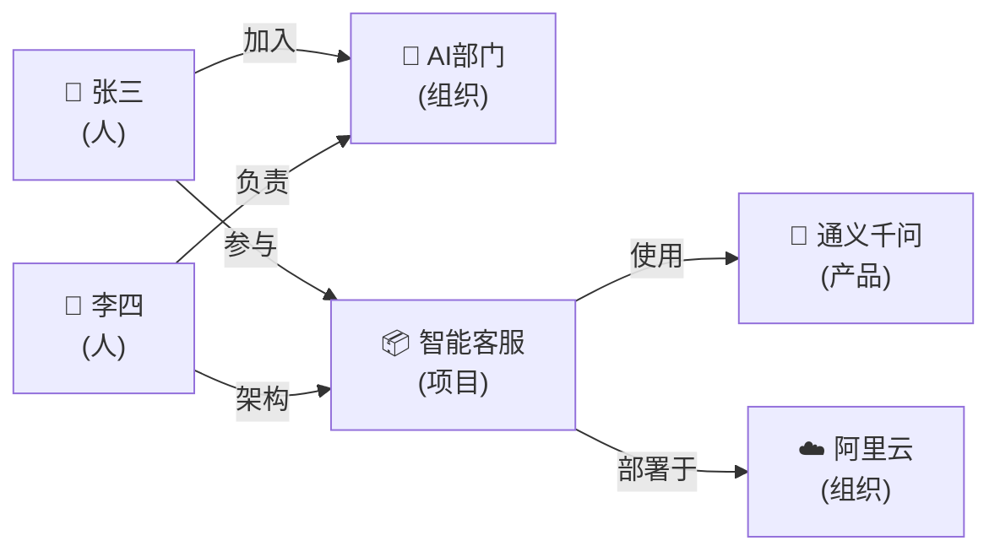

# GraphRAG 知识图谱增强

> 传统 RAG 基于向量相似度检索，知识图谱 RAG 基于实体关系检索，两者结合可以回答更复杂的关联性问题。

---

## 一、传统 RAG 的局限

```mermaid
graph TB
    subgraph 传统RAG局限 ["传统 RAG 回答不了的问题"}
        Q1["'张三和李四分别在哪些项目上合作过？'<br/>→ 需要跨多个文档检索+关系推理"]
        Q2["'这个产品的供应链中有哪些公司？'<br/>→ 需要沿着关系链路遍历"]
        Q3["'A部门的人参与了B部门的哪些项目？'<br/>→ 需要跨实体关联查询"]
        Note1["向量检索只能找'相似'的内容<br/>无法理解实体间的'关系'"]
    end

    style 传统RAG局限 fill:#FFCDD2
```

## 二、知识图谱 RAG 原理

```mermaid
graph TB
    subgraph GraphRAG ["GraphRAG 架构"}
        subgraph 离线 ["离线阶段"]
            D["📄 原始文档"] --> EXT["实体关系抽取<br/>LLM提取实体和关系"]
            EXT --> KG[("🗄️ 知识图谱<br/>节点=实体<br/>边=关系")]
            D --> VEC["向量化<br/>(同传统RAG)"]
            VEC --> VDB[("向量数据库")]
        end

        subgraph 在线 ["在线阶段"]
            Q["用户问题"] --> CLASSIFY{"问题类型?"}
            CLASSIFY -->|"事实查询"| VR["向量检索<br/>(传统RAG)"]
            CLASSIFY -->|"关系查询"| GR["图检索<br/>(知识图谱)"]
            CLASSIFY -->|"混合"| BOTH["两者都检索"]
            VR & GR & BOTH --> MERGE["合并结果"]
            MERGE --> GEN["LLM生成回答"]
        end
    end

    style 离线 fill:#E3F2FD
    style 在线 fill:#FFF3E0
    style KG fill:#F3E5F5,stroke:#6A1B9A,stroke-width:3px
```

## 三、实体关系抽取

### 3.1 用 LLM 从文档中抽取实体和关系

```python
from langchain_openai import ChatOpenAI
from langchain_core.prompts import ChatPromptTemplate
from langchain_core.output_parsers import JsonOutputParser
from pydantic import BaseModel, Field
from typing import List

llm = ChatOpenAI(model="gpt-4o-mini", temperature=0)

class Entity(BaseModel):
    name: str = Field(description="实体名称")
    type: str = Field(description="实体类型: 人/组织/项目/产品/地点")

class Relationship(BaseModel):
    source: str = Field(description="源实体名称")
    target: str = Field(description="目标实体名称")
    relation: str = Field(description="关系类型: 工作/参与/创建/位于/合作")

class ExtractionResult(BaseModel):
    entities: List[Entity]
    relationships: List[Relationship]

def extract_entities_relations(text: str) -> dict:
    """从文本中抽取实体和关系"""
    parser = JsonOutputParser(pydantic_object=ExtractionResult)

    prompt = ChatPromptTemplate.from_template(
        """从以下文本中抽取实体和关系。

        文本：{text}

        {format_instructions}"""
    )

    chain = prompt | llm | parser
    return chain.invoke({
        "text": text,
        "format_instructions": parser.get_format_instructions(),
    })

# 示例
text = """张三在2023年加入了公司AI部门，参与了智能客服项目。
李四是AI部门的技术负责人，也是智能客服项目的架构师。
该项目使用了通义千问模型，部署在阿里云上。"""

result = extract_entities_relations(text)
print(f"实体: {result['entities']}")
print(f"关系: {result['relationships']}")
```

### 3.2 抽取结果示例



## 四、知识图谱存储与检索

### 4.1 用 NetworkX 存储和查询

```python
import networkx as nx

class KnowledgeGraph:
    """简单的知识图谱（基于NetworkX）"""

    def __init__(self):
        self.graph = nx.DiGraph()

    def add_entity(self, name: str, entity_type: str, **attrs):
        self.graph.add_node(name, type=entity_type, **attrs)

    def add_relation(self, source: str, target: str, relation: str, **attrs):
        self.graph.add_edge(source, target, relation=relation, **attrs)

    def find_relations(self, entity: str, depth: int = 2) -> list:
        """查找与实体相关的所有关系（BFS遍历）"""
        results = []
        for source, target in nx.bfs_edges(self.graph, entity, depth_limit=depth):
            edge_data = self.graph.edges[source, target]
            results.append({
                "source": source,
                "target": target,
                "relation": edge_data.get("relation", ""),
            })
        return results

    def find_path(self, entity_a: str, entity_b: str) -> list:
        """查找两个实体之间的路径"""
        try:
            path = nx.shortest_path(self.graph, entity_a, entity_b)
            return path
        except nx.NetworkXNoPath:
            return []

    def find_collaborators(self, entity: str) -> list:
        """查找与某实体有合作关系的其他实体"""
        collaborators = set()
        for source, target, data in self.graph.edges(data=True):
            if data.get("relation") == "合作":
                if source == entity:
                    collaborators.add(target)
                elif target == entity:
                    collaborators.add(source)
        return list(collaborators)

# 构建知识图谱
kg = KnowledgeGraph()

# 从抽取结果添加
for ent in result["entities"]:
    kg.add_entity(ent["name"], ent["type"])

for rel in result["relationships"]:
    kg.add_relation(rel["source"], rel["target"], rel["relation"])

# 查询
print(kg.find_relations("张三"))
print(kg.find_path("张三", "通义千问"))
```

## 五、GraphRAG 完整实现

```python
def graph_rag_query(question: str, vectorstore, kg: KnowledgeGraph, llm) -> str:
    """GraphRAG 查询：结合向量检索和图谱检索"""

    # Step 1: 从问题中提取关键实体
    extract_prompt = ChatPromptTemplate.from_template(
        "从问题中提取关键实体名称，逗号分隔：\n{question}\n\n实体："
    )
    entities_text = (extract_prompt | llm).invoke(
        {"question": question}
    ).content
    entities = [e.strip() for e in entities_text.split(",") if e.strip()]

    # Step 2: 向量检索（传统RAG）
    vector_results = vectorstore.similarity_search(question, k=3)
    vector_context = "\n".join(d.page_content for d in vector_results)

    # Step 3: 图谱检索（关系查询）
    graph_context = ""
    for entity in entities:
        relations = kg.find_relations(entity, depth=2)
        if relations:
            graph_context += f"\n{entity} 的关系：\n"
            for r in relations:
                graph_context += f"  {r['source']} --{r['relation']}--> {r['target']}\n"

    # Step 4: 合并上下文
    combined_context = f"""向量检索结果：
{vector_context}

知识图谱关系：
{graph_context or "(无相关关系)"}"""

    # Step 5: 生成回答
    answer_prompt = ChatPromptTemplate.from_template(
        """基于以下信息回答问题。

        {context}

        问题：{question}
        回答："""
    )
    chain = answer_prompt | llm
    return chain.invoke({
        "context": combined_context,
        "question": question,
    }).content
```

## 六、传统 RAG vs GraphRAG 对比

```mermaid
graph TB
    subgraph 传统RAG ["传统 RAG"}
        R1["检索方式: 向量相似度"]
        R2["擅长: '什么是X？'<br/>'X的特点是什么？'"]
        R3["局限: 'X和Y什么关系？'<br/>'通过谁连接的？'"]
    end

    subgraph GraphRAG ["GraphRAG"}
        G1["检索方式: 实体关系遍历"]
        G2["擅长: 'X和Y什么关系？'<br/>'Z参与了哪些项目？'"]
        G3["局限: 建图成本高<br/>简单事实查询不如向量RAG快"]
    end

    subgraph 混合 ["混合方案（推荐）"}
        M1["事实查询 → 向量RAG"]
        M2["关系查询 → GraphRAG"]
        M3["复杂查询 → 两者结合"]
    end

    style 传统RAG fill:#C8E6C9
    style GraphRAG fill:#E3F2FD
    style 混合 fill:#F3E5F5
```

## 七、选型建议

| 问题类型 | 推荐方案 | 原因 |
|---------|---------|------|
| "什么是量子计算" | 传统RAG | 事实查询，向量检索即可 |
| "张三参与了哪些项目" | GraphRAG | 实体关系查询 |
| "张三和李四通过什么项目认识" | GraphRAG | 关系路径查询 |
| "量子计算的应用场景和发展历史" | 传统RAG | 内容检索 |
| "公司AI部门的人员关系网络" | GraphRAG | 图结构分析 |
| "产品X的技术架构和团队构成" | 混合 | 事实+关系 |
