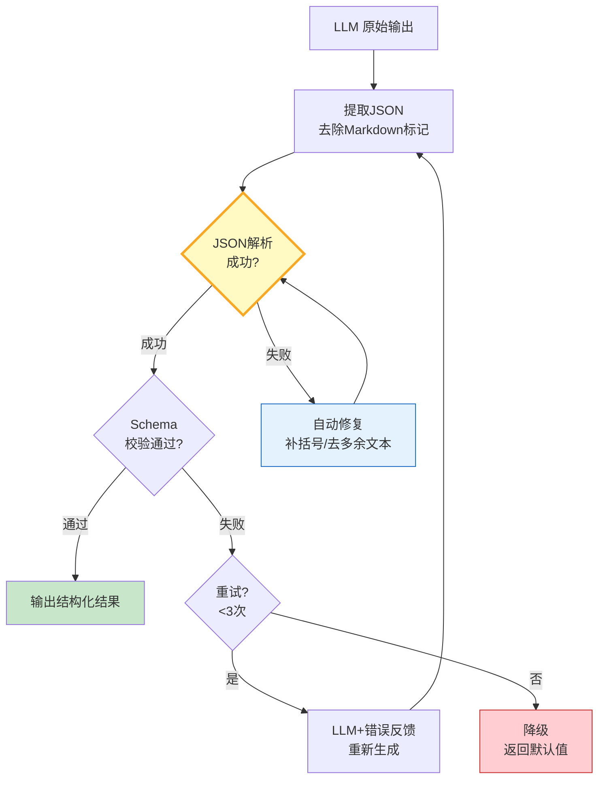

# Agent 输出格式校验与结构化约束指南

> LLM 输出的 JSON 缺括号、多了段前言、字段类型不对——Agent 的下游消费者直接崩溃。这篇指南讲透输出格式约束、JSON Schema 校验和自动修复重试。

---

## 一、输出格式约束架构



---

## 二、校验器实现

```python
from dataclasses import dataclass, field
from enum import Enum
from typing import Any, Optional, Type
import json
import re

class ValidationError(str, Enum):
    JSON_PARSE = "json_parse_error"
    SCHEMA_MISMATCH = "schema_mismatch"
    MISSING_FIELD = "missing_field"
    TYPE_ERROR = "type_error"
    VALUE_CONSTRAINT = "value_constraint"

@dataclass
class FieldSpec:
    """字段规格。"""
    name: str
    type: type
    required: bool = True
    default: Any = None
    min_value: Optional[float] = None
    max_value: Optional[float] = None
    enum_values: Optional[list] = None
    pattern: Optional[str] = None  # 正则

@dataclass
class SchemaSpec:
    """输出Schema规格。"""
    fields: list[FieldSpec]

    def to_dict(self) -> dict:
        return {f.name: f.type.__name__ for f in self.fields}

@dataclass
class ValidationResult:
    """校验结果。"""
    valid: bool
    data: Any = None
    errors: list[str] = field(default_factory=list)
    repaired: bool = False
    attempt: int = 0


class OutputValidator:
    """输出格式校验器。"""

    def __init__(self, schema: SchemaSpec, max_retries: int = 2):
        self.schema = schema
        self.max_retries = max_retries

    def validate(self, raw_output: str) -> ValidationResult:
        """完整校验流程。"""
        # 1. 提取JSON
        json_str = self._extract_json(raw_output)
        if not json_str:
            return ValidationResult(False, errors=["无法从输出中提取JSON"])

        # 2. 解析JSON
        try:
            data = json.loads(json_str)
        except json.JSONDecodeError:
            # 3. 自动修复
            repaired_str = self._repair_json(json_str)
            try:
                data = json.loads(repaired_str)
            except json.JSONDecodeError as e:
                return ValidationResult(False, errors=[f"JSON解析失败: {e}"])

        # 4. Schema校验
        errors = self._validate_schema(data)

        if errors:
            return ValidationResult(False, data=data, errors=errors)

        return ValidationResult(True, data=data)

    def _extract_json(self, text: str) -> Optional[str]:
        """从LLM输出中提取JSON。"""
        # 尝试直接解析
        text = text.strip()
        try:
            json.loads(text)
            return text
        except json.JSONDecodeError:
            pass

        # 尝试从 ```json ``` 块中提取
        code_block = re.search(r'```(?:json)?\s*\n?(.*?)\n?```', text, re.DOTALL)
        if code_block:
            return code_block.group(1).strip()

        # 尝试找第一个 { 到最后一个 }
        first_brace = text.find('{')
        last_brace = text.rfind('}')
        if first_brace != -1 and last_brace != -1 and last_brace > first_brace:
            return text[first_brace:last_brace + 1]

        # 尝试找第一个 [ 到最后一个 ]
        first_bracket = text.find('[')
        last_bracket = text.rfind(']')
        if first_bracket != -1 and last_bracket != -1 and last_bracket > first_bracket:
            return text[first_bracket:last_bracket + 1]

        return None

    def _repair_json(self, json_str: str) -> str:
        """自动修复常见JSON错误。"""
        repaired = json_str

        # 去除尾部逗号
        repaired = re.sub(r',\s*([}\]])', r'\1', repaired)

        # 补全未闭合的括号
        open_braces = repaired.count('{') - repaired.count('}')
        open_brackets = repaired.count('[') - repaired.count(']')

        if open_braces > 0:
            repaired += '}' * open_braces
        if open_brackets > 0:
            repaired += ']' * open_brackets

        # 修复单引号为双引号
        # 只处理键值对中的单引号
        repaired = re.sub(r"(\w+)':", r'"\1":', repaired)

        return repaired

    def _validate_schema(self, data: dict) -> list[str]:
        """校验Schema。"""
        errors = []

        for spec in self.schema.fields:
            if spec.required and spec.name not in data:
                errors.append(f"缺少必填字段: {spec.name}")
                continue

            if spec.name not in data:
                continue

            value = data[spec.name]

            # 类型检查
            if not isinstance(value, spec.type):
                # 宽容处理：str→int
                if spec.type == int and isinstance(value, str) and value.isdigit():
                    data[spec.name] = int(value)
                elif spec.type == str and isinstance(value, (int, float)):
                    data[spec.name] = str(value)
                else:
                    errors.append(f"字段 {spec.name} 类型错误: 期望{spec.type.__name__}, 实际{type(value).__name__}")
                    continue

            value = data[spec.name]

            # 范围检查
            if spec.min_value is not None and isinstance(value, (int, float)):
                if value < spec.min_value:
                    errors.append(f"字段 {spec.name} 值 {value} 小于最小值 {spec.min_value}")

            if spec.max_value is not None and isinstance(value, (int, float)):
                if value > spec.max_value:
                    errors.append(f"字段 {spec.name} 值 {value} 大于最大值 {spec.max_value}")

            # 枚举检查
            if spec.enum_values and value not in spec.enum_values:
                errors.append(f"字段 {spec.name} 值 {value} 不在允许列表 {spec.enum_values}")

            # 正则检查
            if spec.pattern and isinstance(value, str):
                if not re.match(spec.pattern, value):
                    errors.append(f"字段 {spec.name} 值不匹配模式 {spec.pattern}")

        return errors
```

### 带重试的校验流程

```python
from langchain_core.prompts import ChatPromptTemplate
from langchain_openai import ChatOpenAI

llm = ChatOpenAI(model="gpt-4o-mini", temperature=0)

REPAIR_PROMPT = ChatPromptTemplate.from_messages([
    ("system", """你的上一次输出有格式错误。请修正后重新输出JSON。

错误信息:
{errors}

原始输出:
{original}

要求Schema:
{schema}

请只输出修正后的JSON，不要加任何其他文字。"""),
    ("human", "请修正。"),
])


class ValidatedOutput:
    """带校验和重试的输出获取器。"""

    def __init__(self, llm, validator: OutputValidator):
        self.llm = llm
        self.validator = validator

    async def get_validated(self, prompt: str, system_prompt: str = "") -> dict:
        """获取经过校验的结构化输出。"""
        messages = []
        if system_prompt:
            messages.append(("system", system_prompt + "\n\n请输出JSON格式。"))
        messages.append(("human", prompt))

        chat_prompt = ChatPromptTemplate.from_messages(messages)
        chain = chat_prompt | self.llm

        last_output = ""
        for attempt in range(self.validator.max_retries + 1):
            response = await chain.ainvoke({})
            raw_output = response.content
            last_output = raw_output

            result = self.validator.validate(raw_output)
            result.attempt = attempt + 1

            if result.valid:
                return result.data

            # 重试：带错误反馈
            if attempt < self.validator.max_retries:
                repair_chain = REPAIR_PROMPT | self.llm
                response = await repair_chain.ainvoke({
                    "errors": "\n".join(result.errors),
                    "original": raw_output[:500],
                    "schema": str(self.validator.schema.to_dict()),
                })
                last_output = response.content
            else:
                # 最终降级
                if result.data:  # JSON解析成功但Schema校验失败
                    return {**result.data, "_validation_warnings": result.errors}

        return {"_error": "无法获取有效输出", "_raw": last_output[:200]}
```

---

## 三、使用示例

```python
import asyncio

# 定义输出Schema
schema = SchemaSpec(fields=[
    FieldSpec("title", str, required=True),
    FieldSpec("summary", str, required=True),
    FieldSpec("confidence", float, required=True, min_value=0.0, max_value=1.0),
    FieldSpec("category", str, required=True, enum_values=["技术", "商业", "科学"]),
    FieldSpec("tags", list, required=False, default=[]),
])

validator = OutputValidator(schema, max_retries=2)
getter = ValidatedOutput(llm, validator)

async def main():
    result = await getter.get_validated(
        prompt="分析LangChain的技术特点，给出结构化分析。",
        system_prompt="你是技术分析师。输出JSON，包含title/summary/confidence/category/tags字段。",
    )
    print(json.dumps(result, indent=2, ensure_ascii=False))

asyncio.run(main())
```

---

## 四、约束方式对比

| 方式 | 可靠性 | 灵活性 | 成本 | 适用 |
|------|--------|--------|------|------|
| JSON Schema校验 | 高 | 中 | 低 | 结构化输出 |
| Pydantic模型 | 高 | 高 | 低 | Python原生 |
| with_structured_output | 高 | 中 | 低 | LangChain内置 |
| 提示工程约束 | 中 | 高 | 0 | 简单场景 |
| 多次采样+投票 | 高 | 高 | 高 | 高可靠 |

---

## 五、最佳实践

| 实践 | 说明 | 优先级 |
|------|------|--------|
| 先提取再解析 | 去除Markdown和多余文本 | ★★★ |
| 自动修复常见错误 | 尾逗号/未闭合括号 | ★★★ |
| 带错误反馈重试 | LLM知道错在哪 | ★★★ |
| 宽容类型转换 | str↔int 自动转换 | ★★☆ |
| 最终降级策略 | 无法修复时返回半结构化 | ★★☆ |
| 校验日志记录 | 记录修复和重试次数 | ★☆☆ |

---

## 六、检查清单

| 检查项 | 状态 |
|--------|------|
| 有JSON提取器 | ☐ |
| 有自动修复 | ☐ |
| 有Schema校验 | ☐ |
| 有重试+错误反馈 | ☐ |
| 有降级策略 | ☐ |
| 有校验日志 | ☐ |
