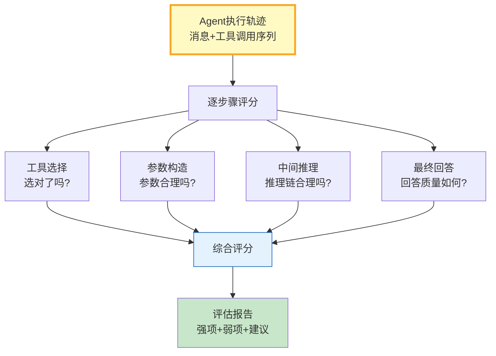

# Agent 自评估与轨迹评分指南

> Agent 执行完成后，你怎么知道它做得好不好？人工抽检太慢、端到端指标太粗。这篇指南讲透 Agent 执行轨迹的自评估——逐步骤评分、工具选择准确率、推理质量打分和自动报告。

---

## 一、轨迹自评估架构



核心思路：把 Agent 的一次执行当作一条轨迹，用 LLM-as-Judge 逐步骤评估每个决策点，最后给出综合评分和改进建议。

---

## 二、轨迹评分实现

```python
from dataclasses import dataclass, field
from datetime import datetime
from enum import Enum
from typing import Any, Optional
import json

class ScoreLevel(str, Enum):
    EXCELLENT = "excellent"  # 0.9-1.0
    GOOD = "good"           # 0.7-0.89
    FAIR = "fair"           # 0.5-0.69
    POOR = "poor"           # 0.0-0.49

@dataclass
class StepScore:
    """单步骤评分。"""
    step_index: int
    step_type: str          # tool_call / reasoning / final_answer
    content: str
    score: float            # 0.0-1.0
    rationale: str          # 评分理由
    issues: list[str] = field(default_factory=list)

    @property
    def level(self) -> ScoreLevel:
        if self.score >= 0.9: return ScoreLevel.EXCELLENT
        if self.score >= 0.7: return ScoreLevel.GOOD
        if self.score >= 0.5: return ScoreLevel.FAIR
        return ScoreLevel.POOR

@dataclass
class TrajectoryEvaluation:
    """完整轨迹评估。"""
    trajectory_id: str
    user_query: str
    steps: list[StepScore] = field(default_factory=list)
    overall_score: float = 0.0
    strengths: list[str] = field(default_factory=list)
    weaknesses: list[str] = field(default_factory=list)
    recommendations: list[str] = field(default_factory=list)
    evaluated_at: str = field(default_factory=lambda: datetime.now().isoformat())

    @property
    def tool_selection_accuracy(self) -> float:
        tool_steps = [s for s in self.steps if s.step_type == "tool_call"]
        if not tool_steps: return 0.0
        return sum(s.score for s in tool_steps) / len(tool_steps)

    @property
    def reasoning_quality(self) -> float:
        reason_steps = [s for s in self.steps if s.step_type == "reasoning"]
        if not reason_steps: return 0.0
        return sum(s.score for s in reason_steps) / len(reason_steps)

    @property
    def final_answer_quality(self) -> float:
        answer_steps = [s for s in self.steps if s.step_type == "final_answer"]
        if not answer_steps: return 0.0
        return answer_steps[0].score


from langchain_core.prompts import ChatPromptTemplate
from langchain_openai import ChatOpenAI
from langchain_core.output_parsers import StrOutputParser

llm = ChatOpenAI(model="gpt-4o-mini", temperature=0)

STEP_EVAL_PROMPT = ChatPromptTemplate.from_messages([
    ("system", """你是Agent执行轨迹评分员。评估以下单个步骤的质量。

评估维度:
- 工具选择: 是否选了正确的工具
- 参数构造: 参数是否合理完整
- 推理质量: 中间推理是否合理
- 回答质量: 最终回答是否准确有用

用户原始问题: {user_query}
当前步骤类型: {step_type}
当前步骤内容: {step_content}
前序步骤摘要: {previous_steps}

请返回JSON:
{{"score": 0.0-1.0, "rationale": "评分理由", "issues": ["问题1", "问题2"]}}"""),
    ("human", "请评分。"),
])

SUMMARY_PROMPT = ChatPromptTemplate.from_messages([
    ("system", """根据以下各步骤评分，生成综合评估报告。

步骤评分:
{step_scores}

请返回JSON:
{{"overall_score": 0.0-1.0, "strengths": ["优点1"], "weaknesses": ["缺点1"], "recommendations": ["建议1"]}}"""),
    ("human", "请生成报告。"),
])


class TrajectoryEvaluator:
    """轨迹评估器。"""

    def __init__(self, llm):
        self.llm = llm
        self.step_chain = STEP_EVAL_PROMPT | llm | StrOutputParser()
        self.summary_chain = SUMMARY_PROMPT | llm | StrOutputParser()

    async def evaluate_trajectory(self, messages: list, user_query: str) -> TrajectoryEvaluation:
        """评估完整轨迹。"""
        eval_result = TrajectoryEvaluation(
            trajectory_id=f"eval-{datetime.now().strftime('%Y%m%d%H%M%S')}",
            user_query=user_query,
        )

        # 拆分轨迹为步骤
        steps = self._extract_steps(messages)
        prev_summary = ""

        for i, step in enumerate(steps):
            result = await self.step_chain.ainvoke({
                "user_query": user_query,
                "step_type": step["type"],
                "step_content": step["content"][:500],
                "previous_steps": prev_summary[:300],
            })

            try:
                parsed = json.loads(result)
                score = float(parsed.get("score", 0.5))
                rationale = parsed.get("rationale", "")
                issues = parsed.get("issues", [])
            except (json.JSONDecodeError, ValueError):
                score = 0.5
                rationale = "解析失败"
                issues = []

            eval_result.steps.append(StepScore(
                step_index=i,
                step_type=step["type"],
                content=step["content"][:200],
                score=score,
                rationale=rationale,
                issues=issues,
            ))
            prev_summary += f"\n步骤{i}: {step['type']} - 分数{score:.1f}"

        # 生成综合报告
        step_scores_text = "\n".join(
            f"步骤{s.step_index} ({s.step_type}): 分数{s.score:.2f} - {s.rationale[:80]}"
            for s in eval_result.steps
        )
        summary_result = await self.summary_chain.ainvoke({"step_scores": step_scores_text})

        try:
            parsed = json.loads(summary_result)
            eval_result.overall_score = float(parsed.get("overall_score", 0.5))
            eval_result.strengths = parsed.get("strengths", [])
            eval_result.weaknesses = parsed.get("weaknesses", [])
            eval_result.recommendations = parsed.get("recommendations", [])
        except (json.JSONDecodeError, ValueError):
            eval_result.overall_score = sum(s.score for s in eval_result.steps) / max(len(eval_result.steps), 1)

        return eval_result

    def _extract_steps(self, messages: list) -> list[dict]:
        """从消息列表提取步骤。"""
        steps = []
        for msg in messages:
            if hasattr(msg, "content"):
                content = msg.content if isinstance(msg.content, str) else str(msg.content)
            else:
                content = str(msg)

            msg_type = getattr(msg, "type", "")

            if "tool" in msg_type.lower():
                steps.append({"type": "tool_call", "content": content})
            elif "ai" in msg_type.lower() or "assistant" in msg_type.lower():
                # 最后一条AI消息是最终回答
                is_last = msg is messages[-1]
                steps.append({"type": "final_answer" if is_last else "reasoning", "content": content})
            elif "human" in msg_type.lower() or "user" in msg_type.lower():
                steps.append({"type": "user_input", "content": content})

        return steps
```

---

## 三、使用示例

```python
import asyncio
from langchain_core.messages import HumanMessage, AIMessage, ToolMessage

async def main():
    evaluator = TrajectoryEvaluator(llm)

    # 模拟一条Agent执行轨迹
    messages = [
        HumanMessage(content="帮我查询北京今天的天气"),
        AIMessage(content="我来帮你查询北京今天的天气。"),
        ToolMessage(content='{"city": "北京", "temp": 25, "weather": "晴"}', tool_call_id="1"),
        AIMessage(content="北京今天天气晴朗，气温25°C，适合外出活动。"),
    ]

    result = await evaluator.evaluate_trajectory(messages, "帮我查询北京今天的天气")

    print(f"综合评分: {result.overall_score:.2f}")
    print(f"工具选择准确率: {result.tool_selection_accuracy:.2f}")
    print(f"推理质量: {result.reasoning_quality:.2f}")
    print(f"回答质量: {result.final_answer_quality:.2f}")
    print(f"\n优点: {result.strengths}")
    print(f"缺点: {result.weaknesses}")
    print(f"建议: {result.recommendations}")

asyncio.run(main())
```

---

## 四、评估维度对比

| 维度 | 评分方式 | 自动化程度 | 价值 |
|------|----------|-----------|------|
| 工具选择准确率 | 选对工具的比例 | 高 | 高 |
| 参数构造质量 | 参数是否合理 | 中 | 中高 |
| 推理链质量 | 中间推理是否合理 | 中 | 高 |
| 最终回答质量 | 回答准确+有用 | 中 | 极高 |
| 轨迹效率 | 是否有多余步骤 | 高 | 中 |
| 端到端延迟 | 总耗时 | 高 | 中 |

---

## 五、最佳实践

| 实践 | 说明 | 优先级 |
|------|------|--------|
| LLM-as-Judge | 用LLM评估LLM | ★★★ |
| 逐步骤而非整体 | 定位具体问题 | ★★★ |
| 多维度评分 | 工具+推理+回答 | ★★★ |
| 批量评估+聚合 | 多条轨迹取均值 | ★★☆ |
| 评分与改进联动 | 低分→改进建议 | ★★☆ |
| 人工校准 | 定期对比人工评分 | ★★☆ |

---

## 六、检查清单

| 检查项 | 状态 |
|--------|------|
| 有轨迹拆分 | ☐ |
| 有逐步骤评分 | ☐ |
| 有综合评分 | ☐ |
| 有优缺点分析 | ☐ |
| 有改进建议 | ☐ |
| 支持批量评估 | ☐ |
