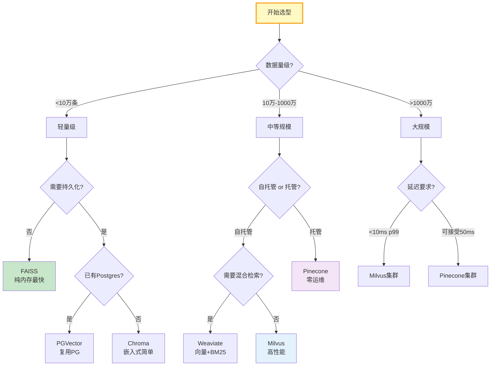

# 向量库选型决策树与性能基准指南

> FAISS、Chroma、PGVector、Milvus、Pinecone、Weaviate……选哪个？这篇指南用决策树+性能基准表帮你一步到位选对向量库。

---

## 一、选型决策树



---

## 二、向量库对比矩阵

```python
from dataclasses import dataclass, field

@dataclass
class VectorDBProfile:
    """向量库特征档案。"""
    name: str
    deployment: str          # self-hosted / managed / embedded
    max_vectors: str        # 规模上限
    hybrid_search: bool      # 混合检索（向量+关键词）
    persistence: bool       # 持久化
    filtering: bool         # 元数据过滤
    multi_tenancy: bool     # 多租户
    upsert: bool            # 实时更新
    gpu_support: bool       # GPU加速
    langchain_integration: bool
    typical_latency_ms: str
    best_for: str

DB_PROFILES = [
    VectorDBProfile("FAISS", "self-hosted", "1亿+", False, False, True, False, False, True, True, "1-5ms", "纯内存超低延迟"),
    VectorDBProfile("Chroma", "embedded", "100万", False, True, True, False, True, False, True, "5-15ms", "原型开发快速上手"),
    VectorDBProfile("PGVector", "self-hosted", "1000万", True, True, True, True, True, False, True, "5-20ms", "已有PostgreSQL团队"),
    VectorDBProfile("Milvus", "self-hosted", "10亿+", True, True, True, True, True, True, True, "3-10ms", "大规模高性能"),
    VectorDBProfile("Pinecone", "managed", "10亿+", True, True, True, True, True, False, True, "10-30ms", "零运维托管"),
    VectorDBProfile("Weaviate", "self-hosted", "1亿+", True, True, True, True, True, False, True, "5-15ms", "混合检索+图谱"),
]


class VectorDBSelector:
    """向量库选择器。"""

    def __init__(self, profiles: list[VectorDBProfile] = DB_PROFILES):
        self.profiles = profiles

    def recommend(self, data_size: str = "medium", deployment: str = "any",
                  hybrid: bool = False, persistence: bool = True,
                  multi_tenancy: bool = False, latency_sensitive: bool = False) -> list[dict]:
        """根据需求推荐向量库。"""
        scores = []
        for db in self.profiles:
            score = 0
            reasons = []

            # 数据量匹配
            size_map = {"small": ["100万", "1000万"], "medium": ["1000万", "1亿+"], "large": ["1亿+", "10亿+"]}
            expected = size_map.get(data_size, ["1000万"])
            if db.max_vectors in expected:
                score += 2
                reasons.append(f"规模匹配: {db.max_vectors}")
            elif db.max_vectors == "10亿+":
                score += 1
                reasons.append(f"可扩展: {db.max_vectors}")

            # 部署方式
            if deployment != "any":
                if db.deployment == deployment:
                    score += 2
                    reasons.append(f"部署匹配: {db.deployment}")
            else:
                score += 1

            # 混合检索
            if hybrid and db.hybrid_search:
                score += 2
                reasons.append("支持混合检索")
            elif hybrid and not db.hybrid_search:
                score -= 1
                reasons.append("不支持混合检索")

            # 持久化
            if persistence and db.persistence:
                score += 1
            elif persistence and not db.persistence:
                score -= 2
                reasons.append("无持久化")

            # 多租户
            if multi_tenancy and db.multi_tenancy:
                score += 1

            # 延迟敏感
            if latency_sensitive:
                lat = int(db.typical_latency_ms.split("-")[0])
                if lat <= 5:
                    score += 2
                    reasons.append(f"低延迟: {db.typical_latency_ms}")
                elif lat > 15:
                    score -= 1

            scores.append({
                "name": db.name,
                "score": score,
                "reasons": reasons,
                "best_for": db.best_for,
                "latency": db.typical_latency_ms,
            })

        scores.sort(key=lambda x: x["score"], reverse=True)
        return scores[:3]
```

### 使用示例

```python
selector = VectorDBSelector()

# 场景1: 小型项目，需要持久化
recs = selector.recommend(data_size="small", persistence=True)
print("小型项目推荐:")
for r in recs:
    print(f"  {r['name']} (分数{r['score']}): {r['best_for']}")

# 场景2: 大规模，需要混合检索+多租户
recs = selector.recommend(data_size="large", hybrid=True, multi_tenancy=True)
print("\n大规模+混合检索推荐:")
for r in recs:
    print(f"  {r['name']} (分数{r['score']}): {r['best_for']}")
```

---

## 三、性能基准参考

| 向量库 | 10万条 QPS | 100万条 QPS | 1000万条 QPS | 内存占用 | 索引构建 | 混合检索 |
|--------|-----------|-------------|-------------|----------|----------|----------|
| FAISS | 8000+ | 5000+ | 2000+ | 低 | 快 | ❌ |
| Chroma | 2000 | 800 | N/A | 中 | 中 | ❌ |
| PGVector | 1500 | 1000 | 300 | 低 | 快 | ✅(pg) |
| Milvus | 6000+ | 4000+ | 1500+ | 中高 | 慢 | ✅ |
| Pinecone | 3000 | 2000 | 1000 | N/A | N/A | ✅ |
| Weaviate | 2500 | 1500 | 500 | 中 | 中 | ✅ |

（注：QPS为近似参考值，实际取决于硬件、向量维度和索引参数）

---

## 四、索引算法对比

| 算法 | 原理 | 召回率 | 速度 | 适用 |
|------|------|--------|------|------|
| Flat | 暴力搜索 | 100% | 慢 | 小数据精确搜索 |
| IVF | 倒排文件 | 90-95% | 中 | 通用 |
| HNSW | 层级小世界图 | 95-99% | 快 | 生产首选 |
| PQ | 乘积量化 | 85-92% | 快 | 内存受限 |
| IVF+PQ | 倒排+量化 | 88-93% | 极快 | 超大规模 |

---

## 五、最佳实践

| 实践 | 说明 | 优先级 |
|------|------|--------|
| 数据量决定选型 | 小→FAISS/Chroma，大→Milvus/Pinecone | ★★★ |
| HNSW默认索引 | 召回率与速度最佳平衡 | ★★★ |
| 先原型后生产 | Chroma原型→Milvus生产 | ★★★ |
| 考虑混合检索需求 | 关键词+向量检索需Weaviate/Milvus | ★★☆ |
| 监控召回率 | 上线后持续评估 | ★★☆ |
| 索引定期重建 | 数据分布漂移后 | ★☆☆ |

---

## 六、检查清单

| 检查项 | 状态 |
|--------|------|
| 有决策树选型 | ☐ |
| 有对比矩阵 | ☐ |
| 有性能基准参考 | ☐ |
| 有索引算法对比 | ☐ |
| 有场景化推荐 | ☐ |
| 有LangChain集成标注 | ☐ |
