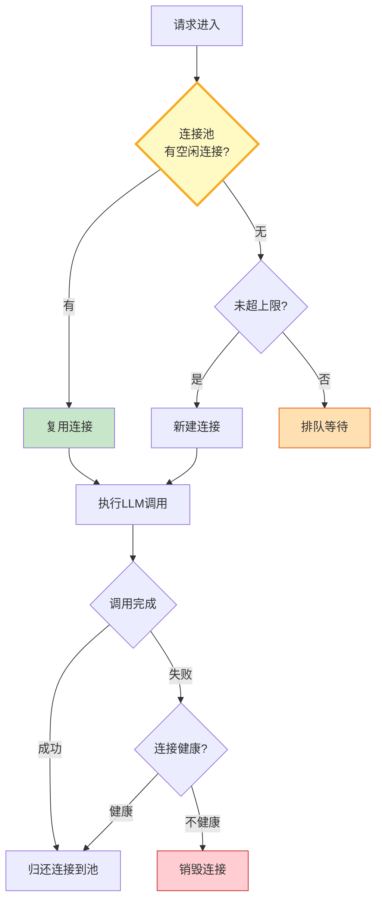

# Agent 连接池与 LLM 资源管理指南

> 每次调用 LLM 都新建一个 HTTP 连接——握手开销大、连接数不可控、高并发时打满端口。这篇指南讲透连接池复用、并发控制、连接预热和资源回收，让 LLM 调用稳定高效。

---

## 一、连接池架构



---

## 二、连接池实现

```python
from dataclasses import dataclass, field
from datetime import datetime
from enum import Enum
import asyncio
import time
from typing import Any, Optional, Callable, Awaitable

class ConnectionState(str, Enum):
    IDLE = "idle"
    BUSY = "busy"
    UNHEALTHY = "unhealthy"
    CLOSED = "closed"

@dataclass
class PooledConnection:
    """连接池中的连接。"""
    conn_id: str
    state: ConnectionState = ConnectionState.IDLE
    created_at: float = field(default_factory=time.monotonic)
    last_used: float = field(default_factory=time.monotonic)
    total_requests: int = 0
    total_errors: int = 0

    @property
    def age_seconds(self) -> float:
        return time.monotonic() - self.created_at

    @property
    def idle_seconds(self) -> float:
        return time.monotonic() - self.last_used

    @property
    def error_rate(self) -> float:
        return self.total_errors / max(self.total_requests, 1)

    def is_healthy(self, max_age: float = 3600, max_idle: float = 300, max_error_rate: float = 0.3) -> bool:
        if self.age_seconds > max_age:
            return False
        if self.idle_seconds > max_idle:
            return False
        if self.error_rate > max_error_rate:
            return False
        return True

@dataclass
class PoolConfig:
    """连接池配置。"""
    min_connections: int = 2
    max_connections: int = 20
    max_idle_seconds: float = 300
    max_age_seconds: float = 3600
    acquire_timeout: float = 10.0
    health_check_interval: float = 60.0
    prewarm_on_start: bool = True

class ConnectionPool:
    """LLM 连接池。"""

    def __init__(self, config: PoolConfig = PoolConfig()):
        self.config = config
        self._connections: list[PooledConnection] = []
        self._available: asyncio.Queue[PooledConnection] = asyncio.Queue()
        self._semaphore = asyncio.Semaphore(config.max_connections)
        self._total_created = 0
        self._total_acquired = 0
        self._total_reused = 0
        self._total_errors = 0

    async def start(self):
        """启动连接池——预热最小连接数。"""
        if self.config.prewarm_on_start:
            for _ in range(self.config.min_connections):
                conn = self._create_connection()
                await self._available.put(conn)

    def _create_connection(self) -> PooledConnection:
        conn = PooledConnection(conn_id=f"conn-{self._total_created}")
        self._connections.append(conn)
        self._total_created += 1
        return conn

    async def acquire(self) -> PooledConnection:
        """获取连接。"""
        try:
            await asyncio.wait_for(self._semaphore.acquire(), timeout=self.config.acquire_timeout)
        except asyncio.TimeoutError:
            raise TimeoutError(f"获取连接超时（{self.config.acquire_timeout}s）")

        # 尝试从空闲队列取
        try:
            conn = self._available.get_nowait()
            if conn.is_healthy(max_age=self.config.max_age_seconds, max_idle=self.config.max_idle_seconds):
                conn.state = ConnectionState.BUSY
                self._total_reused += 1
                return conn
            else:
                self._destroy_connection(conn)
        except asyncio.QueueEmpty:
            pass

        # 新建连接
        conn = self._create_connection()
        conn.state = ConnectionState.BUSY
        self._total_acquired += 1
        return conn

    def release(self, conn: PooledConnection, error: bool = False):
        """归还连接。"""
        conn.total_requests += 1
        conn.last_used = time.monotonic()

        if error:
            conn.total_errors += 1

        if conn.is_healthy(max_age=self.config.max_age_seconds, max_idle=self.config.max_idle_seconds):
            conn.state = ConnectionState.IDLE
            self._available.put_nowait(conn)
        else:
            self._destroy_connection(conn)

        self._semaphore.release()

    def _destroy_connection(self, conn: PooledConnection):
        conn.state = ConnectionState.CLOSED
        if conn in self._connections:
            self._connections.remove(conn)

    async def health_check(self):
        """定期健康检查——清理不健康连接。"""
        for conn in self._connections[:]:
            if conn.state == ConnectionState.IDLE and not conn.is_healthy(
                max_age=self.config.max_age_seconds,
                max_idle=self.config.max_idle_seconds,
            ):
                self._destroy_connection(conn)

        # 补充到最小连接数
        idle_count = self._available.qsize()
        if idle_count < self.config.min_connections:
            for _ in range(self.config.min_connections - idle_count):
                conn = self._create_connection()
                await self._available.put(conn)

    def get_stats(self) -> dict:
        active = sum(1 for c in self._connections if c.state == ConnectionState.BUSY)
        idle = sum(1 for c in self._connections if c.state == ConnectionState.IDLE)
        return {
            "total_created": self._total_created,
            "active_connections": active,
            "idle_connections": idle,
            "total_acquired": self._total_acquired,
            "total_reused": self._total_reused,
            "reuse_rate": round(self._total_reused / max(self._total_acquired + self._total_reused, 1) * 100, 1),
            "total_errors": self._total_errors,
        }

    async def close(self):
        """关闭所有连接。"""
        while not self._available.empty():
            conn = self._available.get_nowait()
            self._destroy_connection(conn)
        self._connections.clear()
```

### 与 LLM 调用集成

```python
from langchain_openai import ChatOpenAI

class ManagedLLMClient:
    """带连接池管理的LLM客户端。"""

    def __init__(self, model: str = "gpt-4o-mini", pool_config: PoolConfig = PoolConfig()):
        self.llm = ChatOpenAI(model=model, temperature=0)
        self.pool = ConnectionPool(pool_config)
        self._health_task: Optional[asyncio.Task] = None

    async def start(self):
        await self.pool.start()
        self._health_task = asyncio.create_task(self._periodic_health_check())

    async def _periodic_health_check(self):
        while True:
            await asyncio.sleep(self.pool.config.health_check_interval)
            self.pool.health_check()

    async def invoke(self, messages: list) -> Any:
        conn = await self.pool.acquire()
        error = False
        try:
            result = await self.llm.ainvoke(messages)
            return result
        except Exception as e:
            error = True
            self.pool._total_errors += 1
            raise
        finally:
            self.pool.release(conn, error=error)

    def get_pool_stats(self) -> dict:
        return self.pool.get_stats()

    async def close(self):
        if self._health_task:
            self._health_task.cancel()
        await self.pool.close()
```

---

## 三、使用示例

```python
import asyncio

async def main():
    client = ManagedLLMClient(model="gpt-4o-mini",
                              pool_config=PoolConfig(min_connections=3, max_connections=15))
    await client.start()

    # 并发调用
    tasks = [client.invoke([{"role": "user", "content": f"问题{i}: 什么是AI?"}]) for i in range(5)]
    results = await asyncio.gather(*tasks, return_exceptions=True)

    stats = client.get_pool_stats()
    print(f"连接复用率: {stats['reuse_rate']}%")
    print(f"活跃连接: {stats['active_connections']}")
    print(f"空闲连接: {stats['idle_connections']}")

    await client.close()

asyncio.run(main())
```

---

## 四、配置调优参考

| 场景 | min_conn | max_conn | max_idle | acquire_timeout | 说明 |
|------|----------|----------|----------|-----------------|------|
| 低频调用 | 1 | 5 | 120s | 10s | 省资源 |
| 中频调用 | 3 | 15 | 300s | 10s | 通用 |
| 高频调用 | 5 | 30 | 600s | 5s | 低延迟 |
| 突发流量 | 2 | 50 | 60s | 15s | 弹性 |

---

## 五、最佳实践

| 实践 | 说明 | 优先级 |
|------|------|--------|
| 预热最小连接 | 启动时建好连接 | ★★★ |
| 连接健康检查 | 定期清理不健康连接 | ★★★ |
| 复用率监控 | 复用率低说明池太小 | ★★★ |
| 错误率追踪 | 单连接错误率高则销毁 | ★★☆ |
| 最大空闲超时 | 长时间空闲的连接回收 | ★★☆ |
| 优雅关闭 | 关闭时归还所有连接 | ★★☆ |

---

## 六、检查清单

| 检查项 | 状态 |
|--------|------|
| 有连接池 | ☐ |
| 有连接复用 | ☐ |
| 有健康检查 | ☐ |
| 有并发限制 | ☐ |
| 有连接预热 | ☐ |
| 有统计监控 | ☐ |
