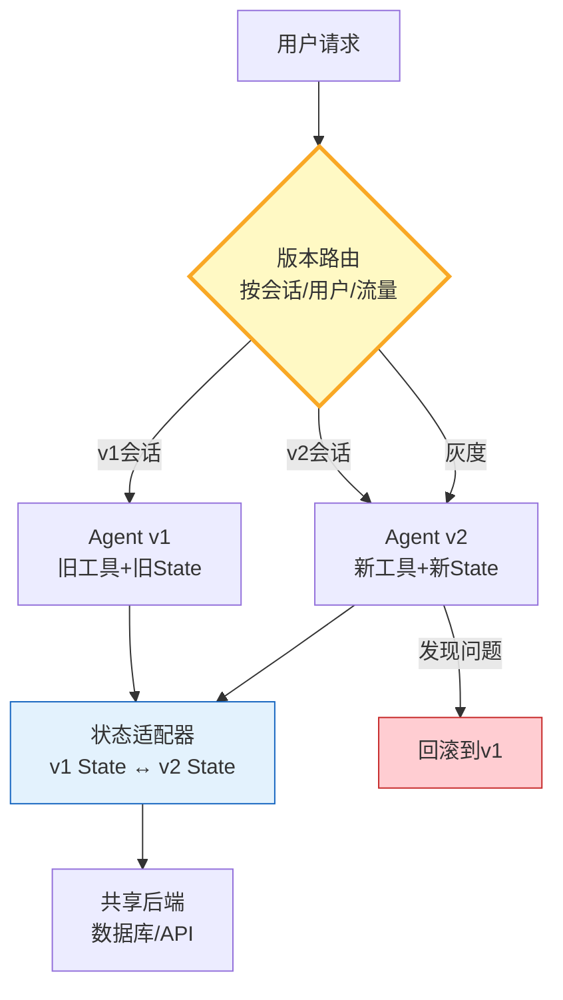

# Agent 版本兼容与平滑迁移指南

> Agent 从 v1 升级到 v2——工具签名变了、State 字段改了、Prompt 重写了。直接切换会让旧会话全崩。这篇指南讲透版本兼容设计、渐进式迁移和回滚策略。

---

## 一、版本兼容架构



---

## 二、版本管理与迁移实现

```python
from dataclasses import dataclass, field
from datetime import datetime
from enum import Enum
from typing import Any, Optional, Callable
import json

class VersionStatus(str, Enum):
    ACTIVE = "active"
    DEPRECATED = "deprecated"
    RETIRED = "retired"

@dataclass
class AgentVersion:
    """Agent版本定义。"""
    version: str               # "1.0.0"
    status: VersionStatus = VersionStatus.ACTIVE
    release_date: str = field(default_factory=lambda: datetime.now().isoformat())
    changes: list[str] = field(default_factory=list)
    breaking_changes: list[str] = field(default_factory=list)
    state_schema: dict = field(default_factory=dict)    # State字段定义
    tool_names: list[str] = field(default_factory=list)  # 工具列表
    migration_from: Optional[str] = None                 # 从哪个版本迁移

@dataclass
class MigrationRule:
    """版本间迁移规则。"""
    from_version: str
    to_version: str
    state_transform: Callable[[dict], dict]  # State转换函数
    notes: str = ""

class VersionManager:
    """版本管理器。"""

    def __init__(self):
        self._versions: dict[str, AgentVersion] = {}
        self._migrations: list[MigrationRule] = []
        self._active_version: str = ""

    def register(self, version: AgentVersion):
        self._versions[version.version] = version
        if version.status == VersionStatus.ACTIVE:
            self._active_version = version.version

    def get_active(self) -> AgentVersion:
        return self._versions.get(self._active_version)

    def get_version(self, version: str) -> Optional[AgentVersion]:
        return self._versions.get(version)

    def add_migration(self, rule: MigrationRule):
        self._migrations.append(rule)

    def migrate_state(self, state: dict, from_version: str, to_version: str) -> dict:
        """迁移状态数据。"""
        if from_version == to_version:
            return state

        # 查找直接迁移规则
        for rule in self._migrations:
            if rule.from_version == from_version and rule.to_version == to_version:
                return rule.state_transform(state)

        # 多步迁移：v1→v2→v3
        path = self._find_migration_path(from_version, to_version)
        if not path:
            raise ValueError(f"无可行迁移路径: {from_version} → {to_version}")

        current_state = state
        current_version = from_version
        for step in path:
            for rule in self._migrations:
                if rule.from_version == current_version and rule.to_version == step:
                    current_state = rule.state_transform(current_state)
                    current_version = step
                    break
        return current_state

    def _find_migration_path(self, from_v: str, to_v: str) -> list[str]:
        """寻找迁移路径（简化BFS）。"""
        if from_v == to_v:
            return []

        visited = {from_v}
        queue = [(from_v, [])]

        while queue:
            current, path = queue.pop(0)
            for rule in self._migrations:
                if rule.from_version == current and rule.to_version not in visited:
                    new_path = path + [rule.to_version]
                    if rule.to_version == to_v:
                        return new_path
                    visited.add(rule.to_version)
                    queue.append((rule.to_version, new_path))
        return []


class VersionRouter:
    """版本路由器——决定用哪个版本的Agent。"""

    def __init__(self, version_manager: VersionManager):
        self.vm = version_manager
        self._session_versions: dict[str, str] = {}  # session_id → version
        self._gray_traffic_pct: float = 0.0  # 灰度比例

    def set_gray_traffic(self, pct: float):
        """设置灰度流量比例。"""
        self._gray_traffic_pct = min(max(pct, 0.0), 1.0)

    def route(self, session_id: str, is_new_session: bool = False) -> str:
        """路由到Agent版本。"""
        # 旧会话：保持原版本
        if not is_new_session and session_id in self._session_versions:
            return self._session_versions[session_id]

        # 新会话：按灰度比例分配
        import random
        if random.random() < self._gray_traffic_pct:
            version = self.vm._active_version
        else:
            # 找到上一个稳定版本
            versions = [v for v in self.vm._versions.values()
                       if v.status != VersionStatus.RETIRED]
            versions.sort(key=lambda v: v.version, reverse=True)
            version = versions[1].version if len(versions) > 1 else versions[0].version

        self._session_versions[session_id] = version
        return version

    def pin_session(self, session_id: str, version: str):
        """固定会话到指定版本。"""
        self._session_versions[session_id] = version

    def rollback_all(self):
        """全部回滚到上一个版本。"""
        old_versions = [v for v in self.vm._versions.values()
                       if v.status != VersionStatus.RETIRED]
        old_versions.sort(key=lambda v: v.version)
        if len(old_versions) >= 2:
            self._gray_traffic_pct = 0.0
            for sid in self._session_versions:
                self._session_versions[sid] = old_versions[-2].version
```

### 使用示例

```python
# 定义版本
vm = VersionManager()

v1 = AgentVersion(
    version="1.0.0",
    state_schema={"query": str, "answer": str},
    tool_names=["search", "summarize"],
    changes=["初始版本"],
)

v2 = AgentVersion(
    version="2.0.0",
    state_schema={"query": str, "answer": str, "sources": list, "confidence": float},
    tool_names=["search", "summarize", "verify"],
    changes=["新增verify工具", "State增加sources和confidence"],
    breaking_changes=["State结构变更"],
    migration_from="1.0.0",
)

vm.register(v1)
vm.register(v2)

# 定义迁移规则
def migrate_v1_to_v2(state: dict) -> dict:
    """v1 State → v2 State。"""
    return {
        "query": state.get("query", ""),
        "answer": state.get("answer", ""),
        "sources": [],           # 新字段默认值
        "confidence": 0.0,       # 新字段默认值
    }

vm.add_migration(MigrationRule("1.0.0", "2.0.0", migrate_v1_to_v2, "补充sources和confidence字段"))

# 路由
router = VersionRouter(vm)
router.set_gray_traffic(0.1)  # 10%灰度

# 迁移旧会话状态
old_state = {"query": "什么是AI", "answer": "AI是人工智能"}
new_state = vm.migrate_state(old_state, "1.0.0", "2.0.0")
print(f"迁移后: {new_state}")
# {'query': '什么是AI', 'answer': 'AI是人工智能', 'sources': [], 'confidence': 0.0}
```

---

## 三、迁移策略对比

| 策略 | 方式 | 风险 | 适用 |
|------|------|------|------|
| 灰度迁移 | 新会话按比例切v2 | 低 | 通用 |
| 会话固定 | 旧会话留v1，新会话走v2 | 极低 | 生产环境 |
| 状态迁移 | 旧State转换为新Schema | 中 | State变更 |
| 双写并行 | v1+v2同时运行对比 | 低 | 高安全要求 |
| 直接切换 | 全部切v2 | 高 | 小规模 |

---

## 四、最佳实践

| 实践 | 说明 | 优先级 |
|------|------|--------|
| 旧会话固定旧版 | 不中断进行中的会话 | ★★★ |
| State向后兼容 | 新字段有默认值 | ★★★ |
| 迁移路径可回溯 | 支持多步迁移 | ★★★ |
| 灰度从小到大 | 5%→20%→50%→100% | ★★☆ |
| 破坏性变更标注 | breaking_changes列表 | ★★☆ |
| 一键回滚 | 出问题立即切回 | ★★★ |

---

## 五、检查清单

| 检查项 | 状态 |
|--------|------|
| 有版本注册 | ☐ |
| 有状态迁移 | ☐ |
| 有版本路由 | ☐ |
| 支持灰度 | ☐ |
| 旧会话固定 | ☐ |
| 支持一键回滚 | ☐ |
