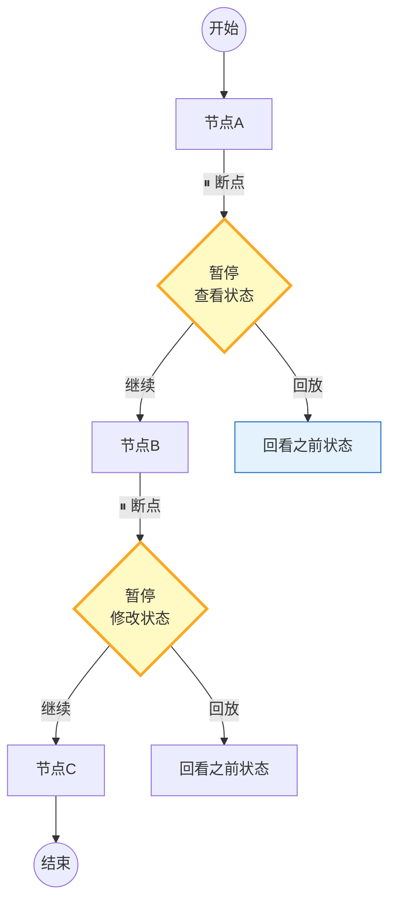

# LangGraph 断点调试与步骤回放指南

> Agent 跑到一半挂了，你想看看中间每步的状态——LangGraph 支持在节点之间设置断点，逐步执行、查看状态、修改变量后继续。这篇指南讲透断点设置、单步执行和状态回放。

---

## 一、断点调试架构



---

## 二、断点调试实现

```python
from langgraph.graph import StateGraph, START, END
from langgraph.checkpoint.memory import MemorySaver
from typing import TypedDict
from langchain_openai import ChatOpenAI
import asyncio

llm = ChatOpenAI(model="gpt-4o-mini", temperature=0)

class DebugState(TypedDict):
    query: str
    retrieved: str
    analysis: str
    answer: str
    logs: list[str]

# 节点定义
def retrieve(state: DebugState) -> DebugState:
    state["retrieved"] = f"检索到关于'{state['query']}'的3篇文档"
    state["logs"].append("Step1: 检索完成")
    return state

def analyze(state: DebugState) -> DebugState:
    response = llm.invoke(f"分析: {state['retrieved']}")
    state["analysis"] = response.content
    state["logs"].append("Step2: 分析完成")
    return state

def generate_answer(state: DebugState) -> DebugState:
    response = llm.invoke(f"基于分析回答: {state['analysis']}\n问题: {state['query']}")
    state["answer"] = response.content
    state["logs"].append("Step3: 生成回答完成")
    return state

# 构建带断点的图——interrupt_before 在指定节点前暂停
checkpointer = MemorySaver()

builder = StateGraph(DebugState)
builder.add_node("retrieve", retrieve)
builder.add_node("analyze", analyze)
builder.add_node("answer", generate_answer)
builder.add_edge(START, "retrieve")
builder.add_edge("retrieve", "analyze")
builder.add_edge("analyze", "answer")
builder.add_edge("answer", END)

# 方式1: 在所有节点前暂停（全断点模式）
debug_graph = builder.compile(
    checkpointer=checkpointer,
    interrupt_before=["analyze", "answer"],  # 在这些节点前暂停
)

# 方式2: 无断点（正常执行）
normal_graph = builder.compile(checkpointer=checkpointer)
```

### 断点调试流程

```python
class DebugSession:
    """断点调试会话。"""

    def __init__(self, graph, checkpointer):
        self.graph = graph
        self.checkpointer = checkpointer
        self.thread_id = ""
        self.step_count = 0
        self._snapshots = []

    async def start(self, initial_state: dict, thread_id: str = "debug-001"):
        """启动调试会话。"""
        self.thread_id = thread_id
        config = {"configurable": {"thread_id": thread_id}}

        # 第一次invoke——会在第一个断点前暂停
        result = await self.graph.ainvoke(initial_state, config=config)
        self.step_count += 1
        self._capture_snapshot()
        return result

    async def step(self):
        """单步执行——从当前断点继续到下一个断点。"""
        config = {"configurable": {"thread_id": self.thread_id}}
        # 传None表示从上次暂停处继续
        result = await self.graph.ainvoke(None, config=config)
        self.step_count += 1
        self._capture_snapshot()
        return result

    def get_current_state(self) -> dict:
        """查看当前状态。"""
        config = {"configurable": {"thread_id": self.thread_id}}
        state = self.graph.get_state(config)
        return state.values if state else {}

    def get_next_nodes(self) -> list[str]:
        """查看下一步将执行哪些节点。"""
        config = {"configurable": {"thread_id": self.thread_id}}
        state = self.graph.get_state(config)
        return list(state.next) if state and state.next else []

    async def modify_state(self, updates: dict):
        """修改当前状态后继续。"""
        config = {"configurable": {"thread_id": self.thread_id}}
        self.graph.update_state(config, updates)
        self._capture_snapshot()

    def get_snapshot_history(self) -> list[dict]:
        """获取所有快照（状态回放）。"""
        config = {"configurable": {"thread_id": self.thread_id}}
        snapshots = []
        for snapshot in self.graph.get_state_history(config):
            snapshots.append({
                "step": len(snapshot.values.get("logs", [])),
                "state": snapshot.values,
                "next": list(snapshot.next) if snapshot.next else [],
            })
        return snapshots

    def _capture_snapshot(self):
        """捕获当前快照。"""
        state = self.get_current_state()
        self._snapshots.append({
            "step": self.step_count,
            "state": {k: v for k, v in state.items() if k != "logs"},
            "logs": state.get("logs", []),
        })

    def replay(self, step: int = None) -> dict:
        """回放指定步骤的状态。"""
        if step is not None:
            for snap in self._snapshots:
                if snap["step"] == step:
                    return snap
        return self._snapshots[-1] if self._snapshots else {}
```

### 使用示例

```python
import asyncio

async def main():
    session = DebugSession(debug_graph, checkpointer)

    # 1. 启动——会在analyze之前暂停
    state = {
        "query": "什么是LangGraph",
        "retrieved": "",
        "analysis": "",
        "answer": "",
        "logs": [],
    }
    await session.start(state)
    print("=== 暂停在 analyze 之前 ===")
    print(f"当前状态: {session.get_current_state()}")
    print(f"下一步: {session.get_next_nodes()}")

    # 2. 修改状态后继续
    await session.modify_state({"query": "什么是LangGraph（修改后）"})
    print("\n=== 修改query后继续 ===")

    # 3. 单步执行到下一个断点
    await session.step()
    print(f"\n=== 暂停在 answer 之前 ===")
    current = session.get_current_state()
    print(f"分析结果: {str(current.get('analysis', ''))[:80]}")
    print(f"下一步: {session.get_next_nodes()}")

    # 4. 继续执行完成
    await session.step()
    print(f"\n=== 执行完成 ===")
    final = session.get_current_state()
    print(f"最终回答: {str(final.get('answer', ''))[:100]}")

    # 5. 回放历史
    print(f"\n=== 快照历史 ===")
    for snap in session.get_snapshot_history():
        print(f"  Step {snap['step']}: next={snap['next']}, logs={snap['state'].get('logs', [])}")

asyncio.run(main())
```

---

## 三、调试方式对比

| 方式 | 实现 | 适用场景 | 优势 |
|------|------|----------|------|
| interrupt_before | 编译时指定节点 | 固定断点调试 | 简单直接 |
| interrupt_after | 节点后暂停 | 检查节点输出 | 精确 |
| 动态interrupt | 运行时判断 | 条件断点 | 灵活 |
| 状态快照回放 | get_state_history | 事后分析 | 不影响执行 |
| update_state | 修改后继续 | 修复+重跑 | 无需重头 |

---

## 四、最佳实践

| 实践 | 说明 | 优先级 |
|------|------|--------|
| 关键节点设断点 | 检索后、LLM调用后 | ★★★ |
| 查看next确认流程 | 确认下一步去哪 | ★★★ |
| 修改状态后继续 | 不用从头跑 | ★★★ |
| 快照历史回放 | 事后分析问题 | ★★☆ |
| 生产环境去掉断点 | 全断点模式只用于调试 | ★★★ |
| 用独立thread_id | 调试不影响生产 | ★★☆ |

---

## 五、检查清单

| 检查项 | 状态 |
|--------|------|
| 有断点设置 | ☐ |
| 有单步执行 | ☐ |
| 有状态查看 | ☐ |
| 有状态修改 | ☐ |
| 有快照回放 | ☐ |
| 有next预览 | ☐ |
