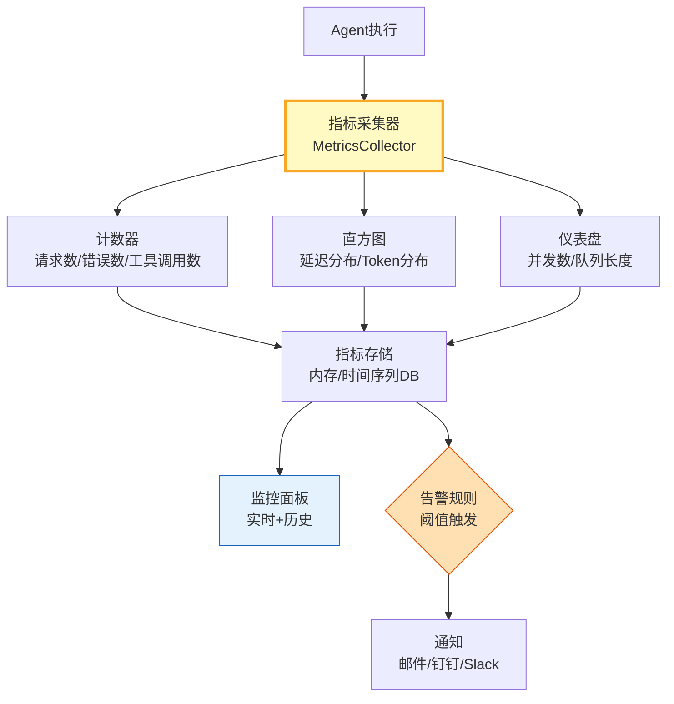

# Agent 指标采集与监控面板指南

> Agent 上线后，你需要知道：每分钟处理多少请求？平均延迟多少？错误率多少？Token消耗多少？这篇指南讲透指标采集架构、核心指标定义和监控面板设计。

---

## 一、指标采集架构



---

## 二、指标采集实现

```python
from dataclasses import dataclass, field
from datetime import datetime, timedelta
from enum import Enum
from collections import defaultdict, deque
from typing import Optional
import time
import asyncio
import statistics

class MetricType(str, Enum):
    COUNTER = "counter"      # 只增不减（请求数、错误数）
    HISTOGRAM = "histogram"  # 分布（延迟、Token数）
    GAUGE = "gauge"          # 可增可减（并发数、队列长度）

@dataclass
class MetricPoint:
    """单个指标数据点。"""
    name: str
    value: float
    timestamp: float
    labels: dict = field(default_factory=dict)

class Counter:
    """计数器。"""

    def __init__(self, name: str, description: str = ""):
        self.name = name
        self.description = description
        self._value: float = 0.0
        self._by_labels: dict[str, float] = defaultdict(float)

    def inc(self, amount: float = 1.0, **labels):
        self._value += amount
        label_key = str(sorted(labels.items()))
        self._by_labels[label_key] += amount

    def get(self, **labels) -> float:
        if not labels:
            return self._value
        label_key = str(sorted(labels.items()))
        return self._by_labels.get(label_key, 0)

    def reset(self):
        self._value = 0.0
        self._by_labels.clear()


class Histogram:
    """直方图——记录分布。"""

    def __init__(self, name: str, buckets: list[float] = None, description: str = ""):
        self.name = name
        self.description = description
        self._values: deque = deque(maxlen=10000)
        self._buckets = buckets or [0.1, 0.5, 1.0, 2.0, 5.0, 10.0, 30.0, 60.0]

    def observe(self, value: float):
        self._values.append(value)

    def summary(self) -> dict:
        if not self._values:
            return {"count": 0}
        vals = sorted(self._values)
        return {
            "count": len(vals),
            "min": round(vals[0], 3),
            "max": round(vals[-1], 3),
            "mean": round(statistics.mean(vals), 3),
            "p50": round(vals[len(vals)//2], 3),
            "p95": round(vals[int(len(vals)*0.95)], 3),
            "p99": round(vals[int(len(vals)*0.99)], 3),
        }

    def bucket_counts(self) -> dict:
        if not self._values:
            return {}
        counts = {}
        for i, bound in enumerate(self._buckets):
            if i == 0:
                counts[f"<{bound}"] = sum(1 for v in self._values if v < bound)
            else:
                counts[f"{self._buckets[i-1]}-{bound}"] = sum(1 for v in self._values if self._buckets[i-1] <= v < bound)
        counts[f">={self._buckets[-1]}"] = sum(1 for v in self._values if v >= self._buckets[-1])
        return counts


class Gauge:
    """仪表盘——可增可减。"""

    def __init__(self, name: str, description: str = ""):
        self.name = name
        self.description = description
        self._value: float = 0.0

    def set(self, value: float):
        self._value = value

    def inc(self, amount: float = 1.0):
        self._value += amount

    def dec(self, amount: float = 1.0):
        self._value -= amount

    def get(self) -> float:
        return self._value


class MetricsCollector:
    """指标采集器——管理所有指标。"""

    def __init__(self):
        self._counters: dict[str, Counter] = {}
        self._histograms: dict[str, Histogram] = {}
        self._gauges: dict[str, Gauge] = {}

    def counter(self, name: str, description: str = "") -> Counter:
        if name not in self._counters:
            self._counters[name] = Counter(name, description)
        return self._counters[name]

    def histogram(self, name: str, buckets: list[float] = None, description: str = "") -> Histogram:
        if name not in self._histograms:
            self._histograms[name] = Histogram(name, buckets, description)
        return self._histograms[name]

    def gauge(self, name: str, description: str = "") -> Gauge:
        if name not in self._gauges:
            self._gauges[name] = Gauge(name, description)
        return self._gauges[name]

    def get_all_metrics(self) -> dict:
        return {
            "counters": {name: {"value": c._value, "by_labels": dict(c._by_labels)} for name, c in self._counters.items()},
            "histograms": {name: h.summary() for name, h in self._histograms.items()},
            "gauges": {name: g.get() for name, g in self._gauges.items()},
        }


# 全局指标采集器
metrics = MetricsCollector()

# 预注册标准指标
metrics.counter("agent_requests_total", "总请求数")
metrics.counter("agent_errors_total", "总错误数")
metrics.counter("tool_calls_total", "工具调用总数")
metrics.histogram("agent_latency_seconds", [0.5, 1.0, 2.0, 5.0, 10.0, 30.0], "Agent延迟(秒)")
metrics.histogram("llm_tokens_total", [100, 500, 1000, 2000, 5000], "LLM Token消耗")
metrics.gauge("agent_concurrent", "当前并发数")
metrics.gauge("agent_queue_length", "当前队列长度")


# ===== Agent指标中间件 =====

class AgentMetricsMiddleware:
    """Agent指标采集中间件。"""

    def __init__(self, collector: MetricsCollector):
        self.collector = collector

    async def wrap_invoke(self, agent, query: str, **kwargs) -> dict:
        """包装Agent调用——自动采集指标。"""
        start = time.monotonic()
        self.collector.counter("agent_requests_total").inc()
        self.collector.gauge("agent_concurrent").inc()

        try:
            result = await agent.ainvoke({"messages": [{"role": "user", "content": query}]}, **kwargs)

            latency = time.monotonic() - start
            self.collector.histogram("agent_latency_seconds").observe(round(latency, 3))

            # 估算Token
            response_text = result.get("messages", [{}])[-1]
            token_count = len(str(response_text)) // 4
            self.collector.histogram("llm_tokens_total").observe(token_count)

            return result
        except Exception as e:
            self.collector.counter("agent_errors_total").inc()
            raise
        finally:
            self.collector.gauge("agent_concurrent").dec()


class DashboardData:
    """监控面板数据。"""

    def __init__(self, collector: MetricsCollector):
        self.collector = collector

    def get_snapshot(self) -> dict:
        """获取当前监控快照。"""
        m = self.collector
        total_req = m.counter("agent_requests_total").get()
        total_err = m.counter("agent_errors_total").get()
        latency = m.histogram("agent_latency_seconds").summary()
        tokens = m.histogram("llm_tokens_total").summary()

        error_rate = (total_err / total_req * 100) if total_req > 0 else 0

        return {
            "summary": {
                "total_requests": int(total_req),
                "total_errors": int(total_err),
                "error_rate_pct": round(error_rate, 2),
                "concurrent": int(m.gauge("agent_concurrent").get()),
            },
            "latency": {
                "p50_ms": latency.get("p50", 0) * 1000,
                "p95_ms": latency.get("p95", 0) * 1000,
                "p99_ms": latency.get("p99", 0) * 1000,
                "mean_ms": latency.get("mean", 0) * 1000,
            },
            "tokens": {
                "avg_per_request": tokens.get("mean", 0),
                "max": tokens.get("max", 0),
            },
            "raw": m.get_all_metrics(),
        }
```

### 使用示例

```python
import asyncio
from langchain_openai import ChatOpenAI
from langgraph.prebuilt import create_react_agent

async def main():
    llm = ChatOpenAI(model="gpt-4o-mini", temperature=0)
    agent = create_react_agent(llm, [], prompt="你是助手。")

    middleware = AgentMetricsMiddleware(metrics)

    # 并发调用
    tasks = [middleware.wrap_invoke(agent, f"问题{i}: 什么是AI") for i in range(3)]
    await asyncio.gather(*tasks, return_exceptions=True)

    # 查看面板
    dashboard = DashboardData(metrics)
    snap = dashboard.get_snapshot()
    print(f"总请求: {snap['summary']['total_requests']}")
    print(f"错误率: {snap['summary']['error_rate_pct']}%")
    print(f"并发数: {snap['summary']['concurrent']}")
    print(f"P50延迟: {snap['latency']['p50_ms']:.0f}ms")
    print(f"P95延迟: {snap['latency']['p95_ms']:.0f}ms")
    print(f"平均Token: {snap['tokens']['avg_per_request']:.0f}")

asyncio.run(main())
```

---

## 三、核心指标定义

| 指标 | 类型 | 说明 | 告警阈值 |
|------|------|------|----------|
| agent_requests_total | Counter | 总请求数 | - |
| agent_errors_total | Counter | 总错误数 | 增量>0 |
| agent_latency_seconds | Histogram | 延迟分布 | p95>5s |
| llm_tokens_total | Histogram | Token消耗 | 日>预算 |
| agent_concurrent | Gauge | 当前并发 | >max×0.8 |
| agent_queue_length | Gauge | 队列长度 | >50 |

---

## 四、最佳实践

| 实践 | 说明 | 优先级 |
|------|------|--------|
| 三种指标类型 | Counter+Histogram+Gauge | ★★★ |
| 中间件自动采集 | 不侵入业务代码 | ★★★ |
| 分位数看延迟 | p50/p95/p99 | ★★★ |
| 按标签拆分 | by model/tool/status | ★★☆ |
| 实时+历史 | 内存快速查+DB长期存 | ★★☆ |
| 面板可导出 | JSON快照 | ★☆☆ |

---

## 五、检查清单

| 检查项 | 状态 |
|--------|------|
| 有Counter计数器 | ☐ |
| 有Histogram直方图 | ☐ |
| 有Gauge仪表盘 | ☐ |
| 有中间件采集 | ☐ |
| 有面板数据 | ☐ |
| 有告警阈值 | ☐ |
