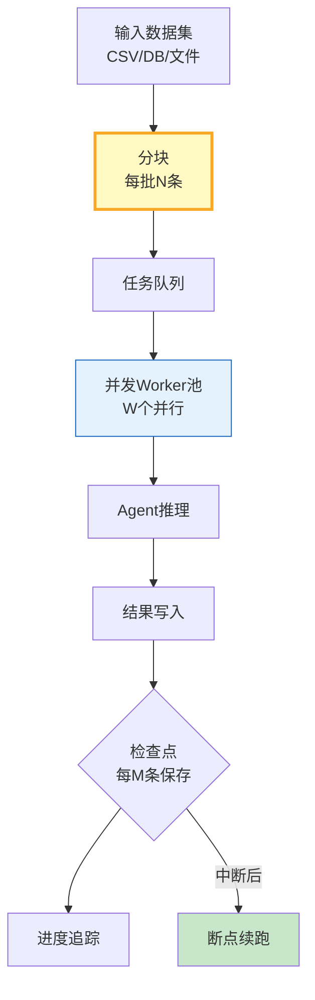

# Agent 离线批量推理管线指南

> 实时推理太贵，很多场景不需要实时——文档分类、数据标注、批量摘要可以离线跑。这篇指南讲透批量推理管线设计、并发控制和断点续跑。

---

## 一、批量推理架构



---

## 二、批量管线实现

```python
from dataclasses import dataclass, field
from datetime import datetime
from enum import Enum
from typing import Any, Optional, Callable, Awaitable
import asyncio
import json
import os

class TaskStatus(str, Enum):
    PENDING = "pending"
    RUNNING = "running"
    COMPLETED = "completed"
    FAILED = "failed"
    SKIPPED = "skipped"

@dataclass
class BatchTask:
    """单个批量任务。"""
    task_id: str
    input_data: Any
    status: TaskStatus = TaskStatus.PENDING
    result: Any = None
    error: str = ""
    started_at: str = ""
    completed_at: str = ""
    retry_count: int = 0

@dataclass
class BatchConfig:
    """批量配置。"""
    batch_size: int = 20          # 每批多少条
    max_concurrency: int = 5      # 最大并发Worker
    max_retries: int = 2          # 单任务最大重试
    checkpoint_interval: int = 50 # 每多少条保存检查点
    checkpoint_file: str = "batch_checkpoint.json"
    rate_limit_per_sec: float = 0  # 0=不限速

class BatchPipeline:
    """批量推理管线。"""

    def __init__(self, config: BatchConfig = BatchConfig()):
        self.config = config
        self._tasks: list[BatchTask] = []
        self._completed_count = 0
        self._failed_count = 0
        self._start_time: float = 0
        self._semaphore: Optional[asyncio.Semaphore] = None
        self._rate_limiter: Optional[asyncio.Semaphore] = None

    def load_data(self, data: list[Any], id_prefix: str = "task"):
        """加载数据。"""
        self._tasks = [
            BatchTask(task_id=f"{id_prefix}-{i:06d}", input_data=item)
            for i, item in enumerate(data)
        ]

    async def run(self, process_fn: Callable[[Any], Awaitable[Any]]) -> dict:
        """运行批量推理。"""
        self._semaphore = asyncio.Semaphore(self.config.max_concurrency)
        self._start_time = datetime.now().timestamp()

        # 加载检查点
        self._load_checkpoint()

        # 过滤掉已完成的任务
        pending = [t for t in self._tasks if t.status != TaskStatus.COMPLETED]
        print(f"总任务: {len(self._tasks)}, 待执行: {len(pending)}, 已完成: {len(self._tasks) - len(pending)}")

        # 批量执行
        for i in range(0, len(pending), self.config.batch_size):
            batch = pending[i:i + self.config.batch_size]
            await self._process_batch(batch, process_fn)

            # 检查点
            if (i + self.config.batch_size) % self.config.checkpoint_interval < self.config.batch_size:
                self._save_checkpoint()
                progress = self._progress()
                print(f"进度: {progress['completed']}/{progress['total']} ({progress['pct']:.1f}%)")

        # 最终保存
        self._save_checkpoint()

        return self._summary()

    async def _process_batch(self, batch: list[BatchTask], process_fn):
        """处理一批任务。"""
        tasks = [self._process_one(task, process_fn) for task in batch]
        await asyncio.gather(*tasks, return_exceptions=True)

    async def _process_one(self, task: BatchTask, process_fn):
        """处理单个任务。"""
        async with self._semaphore:
            task.status = TaskStatus.RUNNING
            task.started_at = datetime.now().isoformat()

            for attempt in range(self.config.max_retries + 1):
                try:
                    result = await process_fn(task.input_data)
                    task.result = result
                    task.status = TaskStatus.COMPLETED
                    task.completed_at = datetime.now().isoformat()
                    self._completed_count += 1
                    return
                except Exception as e:
                    task.retry_count += 1
                    if attempt < self.config.max_retries:
                        await asyncio.sleep(1.0 * (attempt + 1))  # 退避
                    else:
                        task.status = TaskStatus.FAILED
                        task.error = str(e)[:200]
                        self._failed_count += 1

    def _save_checkpoint(self):
        """保存检查点。"""
        checkpoint = {
            "tasks": [
                {
                    "task_id": t.task_id,
                    "status": t.status.value,
                    "result": t.result if isinstance(t.result, (str, int, float, dict, list)) else str(t.result)[:200],
                    "error": t.error,
                    "retry_count": t.retry_count,
                }
                for t in self._tasks
            ],
            "completed": self._completed_count,
            "failed": self._failed_count,
            "saved_at": datetime.now().isoformat(),
        }
        with open(self.config.checkpoint_file, "w", encoding="utf-8") as f:
            json.dump(checkpoint, f, ensure_ascii=False, indent=2)

    def _load_checkpoint(self):
        """加载检查点。"""
        if not os.path.exists(self.config.checkpoint_file):
            return

        with open(self.config.checkpoint_file, "r", encoding="utf-8") as f:
            checkpoint = json.load(f)

        restored = 0
        for saved_task in checkpoint.get("tasks", []):
            for task in self._tasks:
                if task.task_id == saved_task["task_id"] and saved_task["status"] == "completed":
                    task.status = TaskStatus.COMPLETED
                    task.result = saved_task.get("result")
                    restored += 1
                    break

        if restored > 0:
            self._completed_count = restored
            print(f"从检查点恢复 {restored} 个已完成任务")

    def _progress(self) -> dict:
        total = len(self._tasks)
        return {
            "total": total,
            "completed": self._completed_count,
            "failed": self._failed_count,
            "pending": total - self._completed_count - self._failed_count,
            "pct": round(self._completed_count / max(total, 1) * 100, 1),
        }

    def _summary(self) -> dict:
        elapsed = datetime.now().timestamp() - self._start_time
        progress = self._progress()
        return {
            **progress,
            "elapsed_seconds": round(elapsed, 1),
            "throughput_per_sec": round(progress["completed"] / max(elapsed, 1), 2),
            "results": [
                {"task_id": t.task_id, "status": t.status.value, "result": t.result, "error": t.error}
                for t in self._tasks if t.status == TaskStatus.COMPLETED
            ],
        }
```

### 使用示例

```python
from langchain_openai import ChatOpenAI
from langchain_core.messages import HumanMessage

llm = ChatOpenAI(model="gpt-4o-mini", temperature=0)

# 定义推理函数
async def classify_text(text: str) -> dict:
    """文本分类推理。"""
    response = await llm.ainvoke([
        HumanMessage(content=f"将以下文本分类为[技术/商业/科学/其他]，只返回类别：\n{text[:200]}"),
    ])
    return {"text": text[:50], "category": response.content.strip()}

# 准备数据
data = [
    "LangChain是一个LLM应用开发框架",
    "苹果公司发布2024年财报，营收增长5%",
    "量子计算在密码学中的应用",
    "OpenAI推出GPT-5模型",
    "光合作用的分子机制研究",
] * 20  # 100条

# 运行批量管线
pipeline = BatchPipeline(BatchConfig(
    batch_size=10,
    max_concurrency=3,
    max_retries=2,
    checkpoint_interval=20,
    checkpoint_file="/tmp/batch_checkpoint.json",
))
pipeline.load_data(data, id_prefix="classify")

result = await pipeline.run(classify_text)
print(f"\n完成: {result['completed']}/{result['total']}")
print(f"失败: {result['failed']}")
print(f"吞吐: {result['throughput_per_sec']} 条/秒")
print(f"耗时: {result['elapsed_seconds']}秒")
```

---

## 三、并发配置参考

| 场景 | batch_size | max_concurrency | 说明 |
|------|-----------|-----------------|------|
| 轻量推理 | 20 | 5 | 通用 |
| 重推理 | 10 | 3 | 复杂Agent |
| 限流严格 | 5 | 2 | 避免超限 |
| 不限速 | 50 | 10 | 大规模 |

---

## 四、最佳实践

| 实践 | 说明 | 优先级 |
|------|------|--------|
| 检查点断点续跑 | 中断后不重头 | ★★★ |
| 并发数控制 | 不打满API限制 | ★★★ |
| 失败重试+退避 | 指数退避重试 | ★★★ |
| 进度追踪 | 可查看完成率 | ★★☆ |
| 限速保护 | 每秒最多N请求 | ★★☆ |
| 结果增量保存 | 不等全部完成 | ★★☆ |

---

## 五、检查清单

| 检查项 | 状态 |
|--------|------|
| 有批量分块 | ☐ |
| 有并发控制 | ☐ |
| 有检查点 | ☐ |
| 有断点续跑 | ☐ |
| 有失败重试 | ☐ |
| 有进度追踪 | ☐ |
