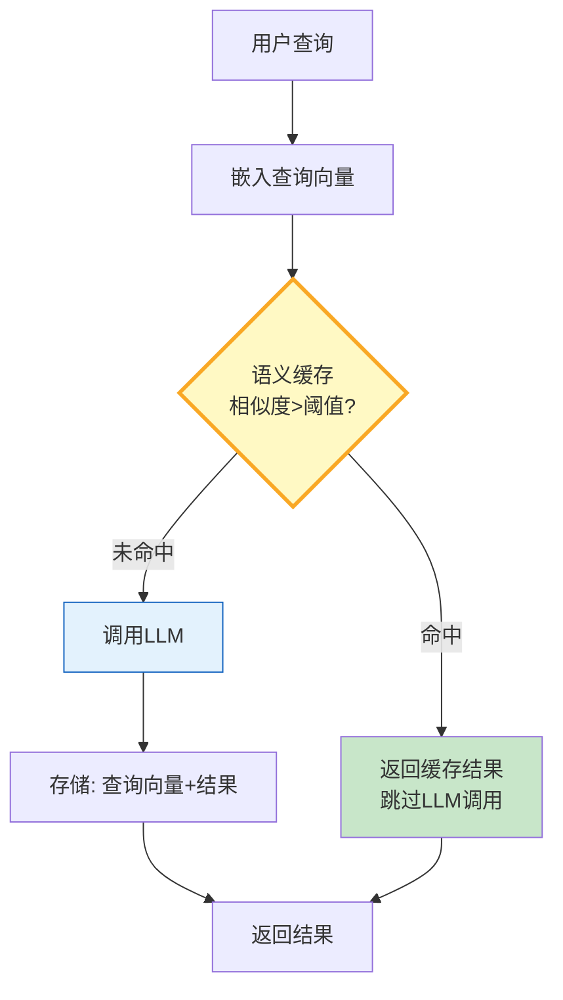

# 语义缓存与查询去重指南

> 用户问"什么是AI"和"AI是什么"——答案一样，但精确缓存命中不了。语义缓存用嵌入相似度判断"这个问题问过没"，实现相似查询的缓存复用。

---

## 一、语义缓存架构



---

## 二、语义缓存实现

```python
from dataclasses import dataclass, field
from datetime import datetime, timedelta
from enum import Enum
from typing import Any, Optional
import numpy as np
import time

@dataclass
class CacheEntry:
    """缓存条目。"""
    query: str
    query_embedding: np.ndarray
    response: Any
    created_at: float = field(default_factory=time.monotonic)
    hit_count: int = 0
    ttl_seconds: float = 3600  # 默认1小时

    @property
    def is_expired(self) -> bool:
        return time.monotonic() - self.created_at > self.ttl_seconds

@dataclass
class CacheConfig:
    """缓存配置。"""
    similarity_threshold: float = 0.92  # 命中阈值
    max_entries: int = 1000             # 最大缓存条数
    ttl_seconds: float = 3600            # 默认TTL
    eviction_strategy: str = "lru"      # lru / lfu / ttl

class SemanticCache:
    """语义缓存。"""

    def __init__(self, embeddings, config: CacheConfig = CacheConfig()):
        self.embeddings = embeddings
        self.config = config
        self._entries: list[CacheEntry] = []
        self._hit_count = 0
        self._miss_count = 0

    async def get(self, query: str) -> Optional[Any]:
        """查询缓存。"""
        if not self._entries:
            self._miss_count += 1
            return None

        # 嵌入查询
        query_emb = np.array(await self.embeddings.aembed_query(query))

        # 找最相似的
        best_entry = None
        best_sim = 0.0

        for entry in self._entries:
            if entry.is_expired:
                continue
            sim = self._cosine(query_emb, entry.query_embedding)
            if sim > best_sim:
                best_sim = sim
                best_entry = entry

        if best_entry and best_sim >= self.config.similarity_threshold:
            best_entry.hit_count += 1
            self._hit_count += 1
            return {
                "response": best_entry.response,
                "similarity": round(best_sim, 4),
                "original_query": best_entry.query,
                "hit_count": best_entry.hit_count,
            }

        self._miss_count += 1
        return None

    async def put(self, query: str, response: Any):
        """存储缓存。"""
        if len(self._entries) >= self.config.max_entries:
            self._evict()

        query_emb = np.array(await self.embeddings.aembed_query(query))
        self._entries.append(CacheEntry(
            query=query,
            query_embedding=query_emb,
            response=response,
            ttl_seconds=self.config.ttl_seconds,
        ))

    def _evict(self):
        """淘汰策略。"""
        # 先清理过期的
        self._entries = [e for e in self._entries if not e.is_expired]

        if len(self._entries) >= self.config.max_entries:
            if self.config.eviction_strategy == "lru":
                # 最久未使用
                self._entries.sort(key=lambda e: e.created_at + e.hit_count * 0.01)
            elif self.config.eviction_strategy == "lfu":
                # 最少使用
                self._entries.sort(key=lambda e: e.hit_count)
            else:
                # TTL
                self._entries.sort(key=lambda e: e.created_at)

            self._entries = self._entries[1:]  # 删最旧的

    def _cosine(self, a: np.ndarray, b: np.ndarray) -> float:
        return float(np.dot(a, b) / (np.linalg.norm(a) * np.linalg.norm(b) + 1e-8))

    def stats(self) -> dict:
        total = self._hit_count + self._miss_count
        return {
            "entries": len(self._entries),
            "hits": self._hit_count,
            "misses": self._miss_count,
            "hit_rate": round(self._hit_count / max(total, 1) * 100, 1),
            "avg_hit_count": round(sum(e.hit_count for e in self._entries) / max(len(self._entries), 1), 1),
        }

    def clear(self):
        self._entries.clear()
        self._hit_count = 0
        self._miss_count = 0


# ===== 带缓存的LLM调用包装器 =====

from langchain_openai import ChatOpenAI
from langchain_core.messages import HumanMessage

class CachedLLMClient:
    """带语义缓存的LLM客户端。"""

    def __init__(self, llm, embeddings, cache_config: CacheConfig = CacheConfig()):
        self.llm = llm
        self.cache = SemanticCache(embeddings, cache_config)
        self.total_tokens_saved = 0

    async def invoke(self, query: str) -> dict:
        """带缓存的调用。"""
        # 1. 查缓存
        cached = await self.cache.get(query)
        if cached:
            # 估算节省的Token
            self.total_tokens_saved += len(str(cached["response"])) // 4
            return {
                "response": cached["response"],
                "from_cache": True,
                "similarity": cached["similarity"],
                "original_query": cached["original_query"],
            }

        # 2. 调LLM
        response = await self.llm.ainvoke([HumanMessage(content=query)])
        result = response.content

        # 3. 存缓存
        await self.cache.put(query, result)

        return {
            "response": result,
            "from_cache": False,
        }

    def get_stats(self) -> dict:
        return {
            **self.cache.stats(),
            "tokens_saved": self.total_tokens_saved,
            "estimated_cost_saved_usd": round(self.total_tokens_saved * 0.00015 / 1000, 4),
        }
```

### 使用示例

```python
import asyncio
from langchain_openai import ChatOpenAI, OpenAIEmbeddings

async def main():
    llm = ChatOpenAI(model="gpt-4o-mini", temperature=0)
    embeddings = OpenAIEmbeddings()
    client = CachedLLMClient(llm, embeddings, CacheConfig(similarity_threshold=0.90, max_entries=500))

    # 第一次调用——缓存未命中
    r1 = await client.invoke("什么是人工智能？")
    print(f"调用1: 缓存={r1['from_cache']}")

    # 第二次——语义相似，应命中缓存
    r2 = await client.invoke("人工智能是什么？")
    print(f"调用2: 缓存={r2['from_cache']}, 相似度={r2.get('similarity', 0)}")

    # 第三次——完全不同的问题
    r3 = await client.invoke("如何部署LangGraph？")
    print(f"调用3: 缓存={r3['from_cache']}")

    # 统计
    stats = client.get_stats()
    print(f"\n缓存统计: 命中率={stats['hit_rate']}%, 条目={stats['entries']}")
    print(f"节省Token: {stats['tokens_saved']}, 估算节省: ${stats['estimated_cost_saved_usd']}")

asyncio.run(main())
```

---

## 三、相似度阈值调优

| 阈值 | 命中率 | 准确率 | 适用场景 |
|------|--------|--------|----------|
| 0.99 | 极低 | 极高 | 严格匹配 |
| 0.95 | 低 | 高 | 精确问答 |
| 0.90 | 中 | 中高 | 通用场景 |
| 0.85 | 高 | 中 | 宽松匹配 |
| 0.80 | 极高 | 低 | 有风险 |

阈值太低→返回错误答案（"AI是什么"命中"什么是Python"的缓存）。阈值太高→命中率低。0.90-0.92是大多数场景的甜点区。

---

## 四、最佳实践

| 实践 | 说明 | 优先级 |
|------|------|--------|
| 阈值0.90起步 | 平衡命中率与准确率 | ★★★ |
| TTL过期 | 防止返回过时信息 | ★★★ |
| 淘汰策略 | LRU最少用先淘汰 | ★★★ |
| 节省成本统计 | 量化缓存价值 | ★★☆ |
| 写入也需缓存 | 相似查询不重复嵌入 | ★☆☆ |
| 监控命中率 | 命中率下降需排查 | ★★☆ |

---

## 五、检查清单

| 检查项 | 状态 |
|--------|------|
| 有语义缓存 | ☐ |
| 有相似度阈值 | ☐ |
| 有TTL过期 | ☐ |
| 有淘汰策略 | ☐ |
| 有命中率统计 | ☐ |
| 有成本节省统计 | ☐ |
