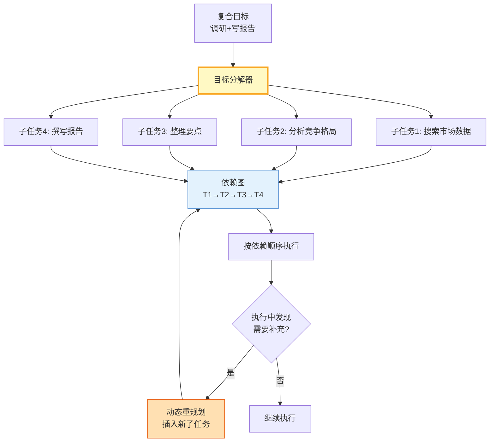

# Agent 目标分解与任务规划指南

> 用户说"帮我调研AI市场并写一份报告"——这是一个复合目标，Agent 需要把它分解为可执行的子任务。这篇指南讲透目标分解策略、任务依赖图构建和动态重规划。

---

## 一、目标分解架构



---

## 二、目标分解与任务图实现

```python
from dataclasses import dataclass, field
from datetime import datetime
from enum import Enum
from typing import Any, Optional, Callable, Awaitable
import asyncio
import json

class TaskStatus(str, Enum):
    PENDING = "pending"
    RUNNING = "running"
    COMPLETED = "completed"
    FAILED = "failed"
    SKIPPED = "skipped"

class TaskType(str, Enum):
    SEARCH = "search"          # 信息检索
    ANALYSIS = "analysis"      # 分析推理
    GENERATION = "generation"  # 内容生成
    VERIFICATION = "verification"  # 验证校验
    SYNTHESIS = "synthesis"    # 综合汇总

@dataclass
class Task:
    """单个子任务。"""
    task_id: str
    description: str
    task_type: TaskType
    dependencies: list[str] = field(default_factory=list)  # 依赖的task_id
    status: TaskStatus = TaskStatus.PENDING
    result: Any = None
    error: str = ""
    estimated_steps: int = 1
    priority: int = 0  # 数字越大越优先

@dataclass
class TaskGraph:
    """任务依赖图。"""
    tasks: dict[str, Task] = field(default_factory=dict)

    def add_task(self, task: Task):
        self.tasks[task.task_id] = task

    def get_ready_tasks(self) -> list[Task]:
        """获取所有依赖已完成的待执行任务。"""
        ready = []
        for task in self.tasks.values():
            if task.status != TaskStatus.PENDING:
                continue
            deps_completed = all(
                self.tasks.get(dep, Task("", "", TaskType.SEARCH, status=TaskStatus.COMPLETED)).status == TaskStatus.COMPLETED
                for dep in task.dependencies
            )
            if deps_completed:
                ready.append(task)
        ready.sort(key=lambda t: t.priority, reverse=True)
        return ready

    def is_complete(self) -> bool:
        return all(t.status in (TaskStatus.COMPLETED, TaskStatus.SKIPPED) for t in self.tasks.values())

    def get_summary(self) -> dict:
        return {
            "total": len(self.tasks),
            "completed": sum(1 for t in self.tasks.values() if t.status == TaskStatus.COMPLETED),
            "failed": sum(1 for t in self.tasks.values() if t.status == TaskStatus.FAILED),
            "pending": sum(1 for t in self.tasks.values() if t.status == TaskStatus.PENDING),
            "running": sum(1 for t in self.tasks.values() if t.status == TaskStatus.RUNNING),
        }

    def topological_order(self) -> list[str]:
        """拓扑排序——返回执行顺序。"""
        visited = set()
        order = []

        def visit(task_id: str):
            if task_id in visited:
                return
            visited.add(task_id)
            task = self.tasks.get(task_id)
            if not task:
                return
            for dep in task.dependencies:
                visit(dep)
            order.append(task_id)

        for tid in self.tasks:
            visit(tid)
        return order


from langchain_core.prompts import ChatPromptTemplate
from langchain_openai import ChatOpenAI
from langchain_core.output_parsers import StrOutputParser

llm = ChatOpenAI(model="gpt-4o-mini", temperature=0)

DECOMPOSE_PROMPT = ChatPromptTemplate.from_messages([
    ("system", """你是目标分解器。将用户目标分解为可执行的子任务。

规则:
- 每个子任务应可通过一次工具调用或LLM推理完成
- 标注任务类型: search/analysis/generation/verification/synthesis
- 标注依赖关系（哪些任务必须先完成）
- 按优先级排序

返回JSON数组:
[{{"id": "t1", "description": "任务描述", "type": "search", "dependencies": [], "priority": 1}}]"""),
    ("human", "目标: {goal}"),
])


class GoalDecomposer:
    """目标分解器。"""

    def __init__(self, llm):
        self.llm = llm
        self.chain = DECOMPOSE_PROMPT | llm | StrOutputParser()

    async def decompose(self, goal: str) -> TaskGraph:
        """分解目标为任务图。"""
        result = await self.chain.ainvoke({"goal": goal})

        try:
            tasks_data = json.loads(result)
        except json.JSONDecodeError:
            # 降级：创建一个单任务
            tasks_data = [{"id": "t1", "description": goal, "type": "synthesis", "dependencies": [], "priority": 1}]

        graph = TaskGraph()
        for td in tasks_data[:10]:  # 最多10个子任务
            task_type_str = td.get("type", "synthesis")
            try:
                task_type = TaskType(task_type_str)
            except ValueError:
                task_type = TaskType.SYNTHESIS

            task = Task(
                task_id=td.get("id", f"t{len(graph.tasks)+1}"),
                description=td.get("description", ""),
                task_type=task_type,
                dependencies=td.get("dependencies", []),
                priority=td.get("priority", 0),
            )
            graph.add_task(task)

        return graph

    async def replan(self, graph: TaskGraph, reason: str, new_tasks: list[dict] = None) -> TaskGraph:
        """动态重规划——插入新任务。"""
        if new_tasks:
            for td in new_tasks:
                task_id = f"t{len(graph.tasks)+1}_replan"
                try:
                    task_type = TaskType(td.get("type", "search"))
                except ValueError:
                    task_type = TaskType.SEARCH

                task = Task(
                    task_id=task_id,
                    description=td.get("description", reason),
                    task_type=task_type,
                    dependencies=td.get("dependencies", []),
                    priority=td.get("priority", 5),  # 重规划任务高优先级
                )
                graph.add_task(task)

        return graph


class TaskExecutor:
    """任务执行器——按依赖顺序执行任务图。"""

    def __init__(self, llm):
        self.llm = llm

    async def execute_graph(self, graph: TaskGraph, context: dict = None) -> dict:
        """执行任务图。"""
        context = context or {}
        max_iterations = len(graph.tasks) * 2
        iteration = 0

        while not graph.is_complete() and iteration < max_iterations:
            iteration += 1
            ready = graph.get_ready_tasks()

            if not ready:
                # 无可执行任务——检查是否有失败
                failed = [t for t in graph.tasks.values() if t.status == TaskStatus.FAILED]
                if failed:
                    # 跳过依赖失败的任务
                    for t in graph.tasks.values():
                        if t.status == TaskStatus.PENDING:
                            t.status = TaskStatus.SKIPPED
                break

            # 执行就绪任务（可并行）
            for task in ready:
                task.status = TaskStatus.RUNNING
                try:
                    result = await self._execute_task(task, context)
                    task.result = result
                    task.status = TaskStatus.COMPLETED
                    context[task.task_id] = result
                except Exception as e:
                    task.status = TaskStatus.FAILED
                    task.error = str(e)[:200]

        return {
            "graph_summary": graph.get_summary(),
            "execution_order": graph.topological_order(),
            "context": {k: str(v)[:200] for k, v in context.items()},
        }

    async def _execute_task(self, task: Task, context: dict) -> str:
        """执行单个任务。"""
        # 构建上下文摘要
        dep_context = ""
        for dep_id in task.dependencies:
            if dep_id in context:
                dep_context += f"\n{dep_id}结果: {str(context[dep_id])[:200]}"

        prompt = f"任务: {task.description}\n类型: {task.task_type.value}\n前序结果:{dep_context}"
        response = await self.llm.ainvoke(prompt)
        return response.content
```

### 使用示例

```python
import asyncio

async def main():
    decomposer = GoalDecomposer(llm)
    executor = TaskExecutor(llm)

    # 分解目标
    graph = await decomposer.decompose("调研2024年AI编程助手市场，分析竞争格局，撰写市场报告")
    print("=== 任务图 ===")
    for tid in graph.topological_order():
        t = graph.tasks[tid]
        print(f"  {tid}: [{t.task_type.value}] {t.description[:50]} (依赖: {t.dependencies})")

    # 执行
    result = await executor.execute_graph(graph)
    print(f"\n=== 执行结果 ===")
    print(f"摘要: {result['graph_summary']}")
    print(f"执行顺序: {result['execution_order']}")

asyncio.run(main())
```

---

## 三、分解策略对比

| 策略 | 方式 | 优点 | 缺点 | 适用 |
|------|------|------|------|------|
| LLM分解 | 用LLM拆解目标 | 灵活适应 | 增加调用 | 通用 |
| 模板分解 | 预定义分解模板 | 快速稳定 | 不灵活 | 固定流程 |
| 递归分解 | 子任务再分解 | 精细控制 | 可能过深 | 复杂目标 |
| 混合 | 模板+LLM兜底 | 兼顾 | 复杂 | 生产 |

---

## 四、最佳实践

| 实践 | 说明 | 优先级 |
|------|------|--------|
| 限制最大子任务 | 不超过10个防止发散 | ★★★ |
| 依赖图必须无环 | 拓扑排序检测 | ★★★ |
| 就绪任务可并行 | 无依赖的同时执行 | ★★☆ |
| 支持动态重规划 | 执行中发现需要补充 | ★★★ |
| 失败时跳过依赖链 | 不阻塞整体 | ★★☆ |
| 上下文在任务间传递 | 前序结果供后续使用 | ★★★ |

---

## 五、检查清单

| 检查项 | 状态 |
|--------|------|
| 有目标分解器 | ☐ |
| 有任务依赖图 | ☐ |
| 有拓扑排序 | ☐ |
| 有就绪任务检测 | ☐ |
| 有动态重规划 | ☐ |
| 有上下文传递 | ☐ |
