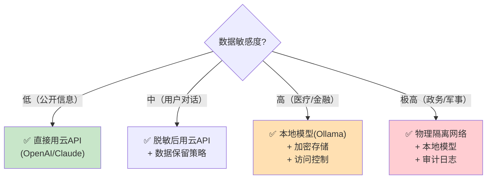

# 数据隐私与合规指南

> LLM 应用涉及用户数据上传到云端。这份指南帮你满足 GDPR、数据安全和个人信息保护法的要求。

---

## 一、隐私风险全景

```mermaid
graph TB
    subgraph 隐私风险 {"LLM应用的隐私风险"}
        R1["📤 用户数据上传到LLM API<br/>(如OpenAI)"]
        R2["💾 对话历史持久化存储<br/>(可能含敏感信息)"]
        R3["📊 向量数据库中存有原始文档<br/>(可能含PII)"]
        R4["🔄 日志和追踪中<br/>(可能记录了用户输入)"]
        R5["🤖 Agent执行时<br/>(可能泄露到工具调用)"]
    end

    style R1 fill:#FFCDD2
    style R2 fill:#FFE0B2
    style R3 fill:#FFF9C4
    style R4 fill:#E3F2FD
    style R5 fill:#F3E5F5
```

## 二、法规要求速查

```mermaid
graph TB
    subgraph 法规 {"主要隐私法规"}
        GDPR["GDPR（欧盟）<br/>用户有权删除/导出数据<br/>需明确告知数据用途<br/>数据可携带权"]
        PIPL["个人信息保护法（中国）<br/>需用户同意<br/>最小必要原则<br/>数据本地化"]
        CCPA["CCPA（加州）<br/>用户有权知道收集了什么<br/>有权要求删除<br/>有权选择退出数据出售"]
    end

    style GDPR fill:#E3F2FD
    style PIPL fill:#FFF9C4
    style CCPA fill:#C8E6C9
```

### 核心合规要求

| 要求 | 说明 | 实现方式 |
|------|------|----------|
| 知情同意 | 用户知道数据如何被使用 | 隐私政策+勾选同意 |
| 最小必要 | 只收集必要的数据 | PII脱敏后发送 |
| 数据删除 | 用户可要求删除自己的数据 | 按session_id删除历史 |
| 数据导出 | 用户可获取自己的数据 | 按session_id导出 |
| 数据保护 | 存储的数据需要保护 | 加密存储+访问控制 |
| 保留期限 | 数据不能永久保存 | 定期清理旧数据 |

## 三、数据脱敏

### 3.1 PII 脱敏

```python
import re

def mask_pii(text: str) -> str:
    """脱敏个人身份信息(PII)"""
    # 手机号
    text = re.sub(r'1[3-9]\d{9}', '[手机号]', text)
    # 邮箱
    text = re.sub(r'[\w.-]+@[\w.-]+', '[邮箱]', text)
    # 身份证号
    text = re.sub(r'\d{17}[\dXx]', '[身份证号]', text)
    # 银行卡号
    text = re.sub(r'\d{16,19}', '[银行卡号]', text)
    # 地址关键词
    text = re.sub(r'\d+号?\d*室?', '[地址]', text)
    return text

# 使用
safe_input = mask_pii("我的手机号是13800138000，邮箱是test@example.com")
# "我的手机号是[手机号]，邮箱是[邮箱]"
```

### 3.2 脱敏-恢复映射

```python
import uuid

class PIIMasker:
    """PII脱敏与恢复（双向映射）"""

    def __init__(self):
        self.mapping = {}  # 原文 -> 占位符

    def mask(self, text: str) -> str:
        """脱敏"""
        patterns = {
            r'1[3-9]\d{9}': 'PHONE',
            r'[\w.-]+@[\w.-]+': 'EMAIL',
            r'\d{17}[\dXx]': 'IDCARD',
        }

        for pattern, pii_type in patterns.items():
            matches = re.finditer(pattern, text)
            for match in matches:
                original = match.group()
                if original not in self.mapping:
                    placeholder = f"[{pii_type}_{uuid.uuid4().hex[:8]}]"
                    self.mapping[original] = placeholder
                text = text.replace(original, self.mapping[original])

        return text

    def unmask(self, text: str) -> str:
        """恢复"""
        for original, placeholder in self.mapping.items():
            text = text.replace(placeholder, original)
        return text

# 使用
masker = PIIMasker()
safe = masker.mask("联系我: 13800138000, test@example.com")
# "联系我: [PHONE_abc12345], [EMAIL_def67890]"

# LLM处理后恢复
restored = masker.unmask(safe)
# "联系我: 13800138000, test@example.com"
```

## 四、数据生命周期管理

```mermaid
graph LR
    subgraph 数据生命周期 {"数据生命周期管理"}
        C["收集<br/>用户输入"] --> U["使用<br/>发送LLM(脱敏后)"]
        U --> S["存储<br/>加密存储对话历史"]
        S --> R["保留<br/>定期清理(如30天)"]
        R --> D["删除<br/>用户请求删除/到期"]
    end

    style C fill:#E3F2FD
    style U fill:#FFF9C4
    style S fill:#FFE0B2
    style R fill:#F3E5F5
    style D fill:#FFCDD2
```

### 数据清理

```python
import sqlite3
from datetime import datetime, timedelta

def cleanup_old_data(db_path: str, days: int = 30):
    """清理过期数据"""
    conn = sqlite3.connect(db_path)
    cursor = conn.cursor()

    cutoff = (datetime.now() - timedelta(days=days)).isoformat()

    cursor.execute(
        "DELETE FROM chat_history WHERE created_at < ?",
        (cutoff,)
    )
    deleted = cursor.rowcount
    conn.commit()
    conn.close()

    print(f"✅ 清理了{deleted}条过期数据（{days}天前）")

def delete_user_data(db_path: str, session_id: str):
    """删除指定用户的所有数据"""
    conn = sqlite3.connect(db_path)
    cursor = conn.cursor()
    cursor.execute(
        "DELETE FROM chat_history WHERE session_id = ?",
        (session_id,)
    )
    deleted = cursor.rowcount
    conn.commit()
    conn.close()
    print(f"✅ 删除了session {session_id} 的{deleted}条数据")

def export_user_data(db_path: str, session_id: str) -> list:
    """导出用户数据（数据可携带权）"""
    conn = sqlite3.connect(db_path)
    cursor = conn.cursor()
    cursor.execute(
        "SELECT * FROM chat_history WHERE session_id = ? ORDER BY created_at",
        (session_id,)
    )
    rows = cursor.fetchall()
    conn.close()
    return rows
```

## 五、API 提供商的隐私政策

```mermaid
graph TB
    subgraph 各提供商政策 {"主要 LLM 提供商的隐私政策"}
        OAI["OpenAI<br/>✅ API数据不用于训练<br/>✅ 30天后自动删除<br/>⚠️ 数据经过美国服务器"]
        ANT["Anthropic<br/>✅ API数据不用于训练<br/>⚠️ 数据经过美国服务器"]
        QWEN["通义千问<br/>✅ 数据在中国境内<br/>⚠️ 确认是否用于训练"]
        SPARK["星火<br/>✅ 数据在中国境内<br/>✅ 政务场景合规"]
        OLLAMA["Ollama本地<br/>✅ 数据不离开设备<br/>✅ 最安全"]
    end

    style OAI fill:#FFE0B2
    style OLLAMA fill:#C8E6C9
    style SPARK fill:#E3F2FD
```

## 六、隐私保护架构选型



## 七、合规检查清单

| 检查项 | 说明 | 状态 |
|--------|------|------|
| 隐私政策 | 有明确的隐私政策告知用户数据用途 | ☐ |
| 用户同意 | 收集数据前获得用户明确同意 | ☐ |
| PII 脱敏 | 发送到 LLM 前脱敏敏感信息 | ☐ |
| 数据加密 | 存储的数据加密（至少数据库加密） | ☐ |
| 访问控制 | 只有授权人员能访问用户数据 | ☐ |
| 数据删除 | 用户可要求删除自己的数据 | ☐ |
| 数据导出 | 用户可导出自己的数据 | ☐ |
| 保留期限 | 设定数据保留期限并自动清理 | ☐ |
| 日志管理 | 日志中不记录敏感信息 | ☐ |
| API 选择 | 了解 LLM 提供商的数据政策 | ☐ |
| 数据本地化 | 敏感数据不出境（国内法规） | ☐ |
| 审计日志 | 记录数据访问行为 | ☐ |
