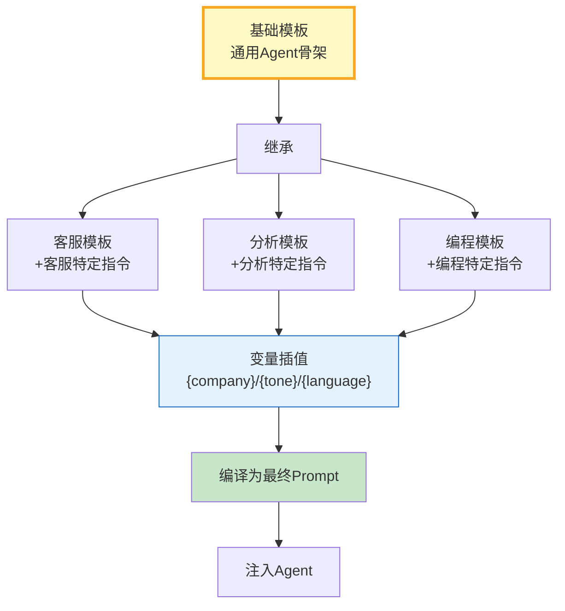

# Agent 提示词模板库与复用模式指南

> 每个项目都重写一遍 System Prompt——重复劳动、质量参差。这篇指南讲透 Prompt 模板库设计、变量插值、条件组合和模板继承。

---

## 一、模板库架构



---

## 二、模板库实现

```python
from dataclasses import dataclass, field
from datetime import datetime
from enum import Enum
from typing import Any, Optional
import re

class TemplateType(str, Enum):
    SYSTEM = "system"       # 系统提示
    HUMAN = "human"         # 用户提示
    FEW_SHOT = "few_shot"   # 少样本
    TOOL_DESC = "tool_desc" # 工具描述

@dataclass
class PromptTemplate:
    """Prompt模板。"""
    template_id: str
    template_type: TemplateType
    content: str
    variables: list[str] = field(default_factory=list)
    parent_id: Optional[str] = None  # 继承的父模板
    conditionals: dict[str, str] = field(default_factory=dict)  # 条件块
    description: str = ""
    version: int = 1
    created_at: str = field(default_factory=lambda: datetime.now().isoformat())

    def render(self, **kwargs) -> str:
        """渲染模板。"""
        result = self.content

        # 1. 条件块处理
        for condition, block in self.conditionals.items():
            pattern = f"{{{{if {condition}}}}}(.*?){{{{endif}}}}"
            match = re.search(pattern, result, re.DOTALL)
            if match:
                should_include = kwargs.get(condition, False)
                if should_include:
                    result = result.replace(match.group(0), match.group(1))
                else:
                    result = result.replace(match.group(0), "")

        # 2. 变量插值
        for var in self.variables:
            pattern = f"{{{var}}}"
            value = str(kwargs.get(var, ""))
            result = result.replace(pattern, value)

        # 3. 清理未填充的变量
        result = re.sub(r'\{(\w+)\}', '', result)

        return result.strip()


class PromptTemplateLibrary:
    """Prompt模板库。"""

    def __init__(self):
        self._templates: dict[str, PromptTemplate] = {}
        self._init_base_templates()

    def _init_base_templates(self):
        """初始化基础模板。"""
        # 通用Agent骨架
        self.register(PromptTemplate(
            template_id="base_agent",
            template_type=TemplateType.SYSTEM,
            content="""你是{role_name}。

{{{{if strict_mode}}}}## 严格要求
- 必须基于事实回答，不确定时说明
- 禁止编造数据或来源{{{{endif}}}}

{{{{if safety_mode}}}}## 安全规则
- 拒绝有害请求
- 不输出个人隐私信息{{{{endif}}}}

## 你的能力
{capabilities}

## 工作流程
{workflow}

## 回答要求
- 使用{language}回答
- 语气：{tone}
{output_format}""",
            variables=["role_name", "capabilities", "workflow", "language", "tone", "output_format"],
            conditionals={"strict_mode": "", "safety_mode": ""},
            description="通用Agent系统提示骨架",
        ))

        # 客服模板——继承base_agent
        self.register(PromptTemplate(
            template_id="customer_service",
            template_type=TemplateType.SYSTEM,
            content="",
            parent_id="base_agent",
            variables=["company_name", "product_info"],
        ))

        # 分析师模板
        self.register(PromptTemplate(
            template_id="data_analyst",
            template_type=TemplateType.SYSTEM,
            content="",
            parent_id="base_agent",
            variables=["analysis_domain", "data_sources"],
        ))

        # 编程助手模板
        self.register(PromptTemplate(
            template_id="coding_assistant",
            template_type=TemplateType.SYSTEM,
            content="",
            parent_id="base_agent",
            variables=["language", "framework"],
        ))

    def register(self, template: PromptTemplate):
        self._templates[template.template_id] = template

    def get(self, template_id: str) -> Optional[PromptTemplate]:
        return self._templates.get(template_id)

    def render(self, template_id: str, **kwargs) -> str:
        """渲染模板——支持继承。"""
        template = self._templates.get(template_id)
        if not template:
            return ""

        # 处理继承
        if template.parent_id:
            parent = self._templates.get(template.parent_id)
            if parent:
                # 合并变量
                all_vars = list(set(parent.variables + template.variables))
                # 合并条件块
                all_conditionals = {**parent.conditionals, **template.conditionals}
                # 合并内容
                merged = PromptTemplate(
                    template_id=template.template_id,
                    template_type=template.template_type,
                    content=parent.content,
                    variables=all_vars,
                    conditionals=all_conditionals,
                )
                return merged.render(**kwargs)

        return template.render(**kwargs)

    def list_templates(self) -> list[dict]:
        return [
            {"id": t.template_id, "type": t.template_type.value, "parent": t.parent_id,
             "variables": t.variables, "description": t.description}
            for t in self._templates.values()
        ]


# 预定义场景模板
class ScenarioTemplates:
    """预定义场景模板。"""

    @staticmethod
    def customer_service_prompt(company: str, product: str, language: str = "中文") -> str:
        lib = PromptTemplateLibrary()
        return lib.render("customer_service",
            role_name=f"{company}客服助手",
            capabilities=f"1. 查询订单状态\n2. 退换货处理\n3. 产品咨询: {product}",
            workflow="1. 理解用户问题\n2. 查询相关信息\n3. 给出解决方案",
            language=language,
            tone="专业、亲切",
            output_format="- 分点回答\n- 控制在3点以内",
            company_name=company,
            product_info=product,
            strict_mode=True,
            safety_mode=True,
        )

    @staticmethod
    def data_analyst_prompt(domain: str, sources: str, language: str = "中文") -> str:
        lib = PromptTemplateLibrary()
        return lib.render("data_analyst",
            role_name=f"{domain}数据分析师",
            capabilities=f"1. 数据统计分析\n2. 趋势预测\n3. 可视化建议",
            workflow="1. 理解分析需求\n2. 提取关键数据\n3. 分析并总结",
            language=language,
            tone="客观、专业",
            output_format="- 用数据支撑结论\n- 标注数据来源",
            analysis_domain=domain,
            data_sources=sources,
            strict_mode=True,
        )
```

### 使用示例

```python
# 场景1: 客服
prompt1 = ScenarioTemplates.customer_service_prompt(
    company="XX科技", product="SaaS管理平台", language="中文"
)
print("=== 客服Prompt ===")
print(prompt1[:300])

# 场景2: 数据分析师
prompt2 = ScenarioTemplates.data_analyst_prompt(
    domain="电商", sources="销售数据/用户行为/市场调研"
)
print("\n=== 分析师Prompt ===")
print(prompt2[:300])

# 场景3: 自定义（关闭严格模式）
lib = PromptTemplateLibrary()
prompt3 = lib.render("base_agent",
    role_name="创意助手",
    capabilities="1. 创意生成\n2. 头脑风暴",
    workflow="发散思维，不设限",
    language="中文",
    tone="活泼、有创意",
    output_format="",
    strict_mode=False,  # 关闭严格模式
    safety_mode=False,
)
print("\n=== 创意助手Prompt ===")
print(prompt3[:300])
```

---

## 三、模板复用模式对比

| 模式 | 方式 | 优点 | 缺点 | 适用 |
|------|------|------|------|------|
| 继承 | 子模板继承父模板 | 复用骨架 | 灵活性受限 | 同类场景 |
| 组合 | 多模板拼接 | 灵活 | 管理复杂 | 复杂场景 |
| 参数化 | 变量插值 | 简单 | 不够灵活 | 通用 |
| 条件块 | if-else块 | 动态 | 解析复杂 | 可配置 |
| 预设场景 | 固定组合 | 开箱即用 | 不灵活 | 常见场景 |

---

## 四、最佳实践

| 实践 | 说明 | 优先级 |
|------|------|--------|
| 基础模板+继承 | 减少重复 | ★★★ |
| 变量插值 | 不硬编码 | ★★★ |
| 条件块 | 可选功能按需开关 | ★★★ |
| 模板版本管理 | 迭代可追溯 | ★★☆ |
| 预设场景 | 开箱即用 | ★★☆ |
| 未填充变量清理 | 防止残留{} | ★★☆ |

---

## 五、检查清单

| 检查项 | 状态 |
|--------|------|
| 有模板库 | ☐ |
| 有继承机制 | ☐ |
| 有变量插值 | ☐ |
| 有条件块 | ☐ |
| 有预设场景 | ☐ |
| 有模板列表 | ☐ |
