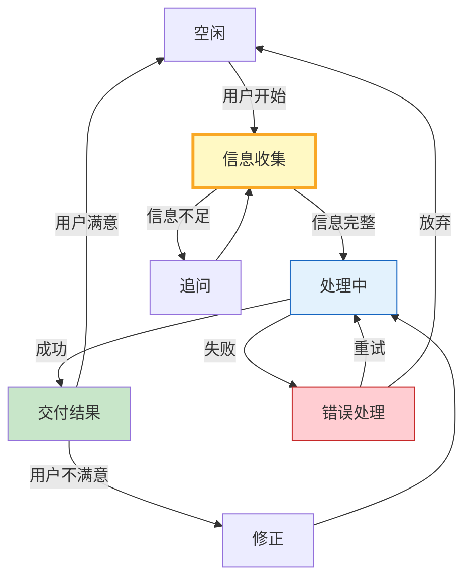

# LangGraph 状态机设计模式指南

> 很多 Agent 流程不是简单的线性管道，而是有状态转换的——对话在不同阶段做不同事。这篇指南讲透状态机设计模式、状态转换表和常见流程编排。

---

## 一、状态机模式



---

## 二、状态机实现

```python
from langgraph.graph import StateGraph, START, END
from typing import TypedDict, Literal
from enum import Enum
from dataclasses import dataclass, field
from langchain_openai import ChatOpenAI

llm = ChatOpenAI(model="gpt-4o-mini", temperature=0)

class ConversationState(str, Enum):
    IDLE = "idle"
    GATHERING = "gathering"
    PROCESSING = "processing"
    DELIVERING = "delivering"
    ERROR = "error"

class WorkflowState(TypedDict):
    user_input: str
    collected_info: dict
    current_state: str
    messages: list[str]
    result: str
    error: str
    retry_count: int

# 状态转换表
TRANSITIONS = {
    "idle": {"user_start": "gathering"},
    "gathering": {"info_complete": "processing", "info_insufficient": "gathering"},
    "processing": {"success": "delivering", "failure": "error"},
    "error": {"retry": "processing", "give_up": "idle"},
    "delivering": {"satisfied": "idle", "not_satisfied": "processing"},
}

def gather_info(state: WorkflowState) -> WorkflowState:
    """信息收集节点。"""
    user_input = state["user_input"]
    info = state.get("collected_info", {})

    # 简单的信息提取逻辑
    if "订单" in user_input:
        info["order_id"] = user_input.split("订单")[-1].strip()[:20]
    if "退款" in user_input:
        info["request_type"] = "退款"
    elif "查询" in user_input:
        info["request_type"] = "查询"

    state["collected_info"] = info
    state["messages"].append(f"[收集] 提取信息: {info}")

    # 判断信息是否完整
    if info.get("order_id") and info.get("request_type"):
        state["current_state"] = "processing"
    else:
        state["current_state"] = "gathering"

    return state

def process_request(state: WorkflowState) -> WorkflowState:
    """处理请求节点。"""
    info = state.get("collected_info", {})
    request_type = info.get("request_type", "")

    state["messages"].append(f"[处理] 处理{request_type}请求")

    # 模拟处理
    if request_type == "退款":
        state["result"] = f"退款已提交，订单{info.get('order_id')}将在3-5个工作日到账"
        state["current_state"] = "delivering"
    elif request_type == "查询":
        state["result"] = f"订单{info.get('order_id')}状态: 已发货，预计明天到达"
        state["current_state"] = "delivering"
    else:
        state["error"] = "无法识别请求类型"
        state["current_state"] = "error"

    return state

def deliver_result(state: WorkflowState) -> WorkflowState:
    """交付结果节点。"""
    state["messages"].append(f"[交付] {state['result']}")
    state["current_state"] = "idle"
    return state

def handle_error(state: WorkflowState) -> WorkflowState:
    """错误处理节点。"""
    retry_count = state.get("retry_count", 0)
    state["messages"].append(f"[错误] {state.get('error', '未知错误')}, 重试{retry_count}")

    if retry_count < 2:
        state["retry_count"] = retry_count + 1
        state["current_state"] = "processing"
    else:
        state["result"] = f"抱歉，处理失败: {state.get('error', '')}"
        state["current_state"] = "delivering"

    return state

def route(state: WorkflowState) -> str:
    """路由函数——根据当前状态决定下一步。"""
    current = state.get("current_state", "idle")
    if current == "processing":
        return "process"
    elif current == "delivering":
        return "deliver"
    elif current == "error":
        return "error"
    elif current == "idle":
        return "end"
    return "gather"

# 构建状态机图
builder = StateGraph(WorkflowState)
builder.add_node("gather", gather_info)
builder.add_node("process", process_request)
builder.add_node("deliver", deliver_result)
builder.add_node("error", handle_error)

builder.add_edge(START, "gather")
builder.add_conditional_edges("gather", route, {
    "process": "process",
    "gather": "gather",  # 信息不足→继续收集
    "end": END,
})
builder.add_conditional_edges("process", route, {
    "deliver": "deliver",
    "error": "error",
})
builder.add_conditional_edges("error", route, {
    "process": "process",
    "deliver": "deliver",
})
builder.add_edge("deliver", END)

state_machine_graph = builder.compile()
```

### 使用示例

```python
import asyncio

async def main():
    result = await state_machine_graph.ainvoke({
        "user_input": "我要退款订单A12345",
        "collected_info": {},
        "current_state": "idle",
        "messages": [],
        "result": "",
        "error": "",
        "retry_count": 0,
    })

    print("=== 执行流程 ===")
    for msg in result["messages"]:
        print(f"  {msg}")
    print(f"\n最终结果: {result['result']}")

asyncio.run(main())
```

---

## 三、常见状态机模式

| 模式 | 状态流 | 适用场景 |
|------|--------|----------|
| 问答型 | idle→gather→answer→idle | 客服、FAQ |
| 审批型 | submit→review→approve/reject | 流程审批 |
| 订单型 | create→pay→ship→deliver→done | 电商 |
| 对话型 | listen→understand→respond | 聊天 |
| 修复型 | detect→diagnose→fix→verify | 运维 |
| 迭代型 | draft→review→revise→approve | 内容创作 |

---

## 四、状态转换表设计

```python
@dataclass
class StateTransition:
    """状态转换。"""
    from_state: str
    event: str
    to_state: str
    action: str = ""
    guard: str = ""  # 守卫条件

class StateMachineSpec:
    """状态机规格——声明式定义。"""

    def __init__(self, initial_state: str):
        self.initial_state = initial_state
        self.transitions: list[StateTransition] = []
        self.states: set[str] = {initial_state}

    def add_transition(self, from_state: str, event: str, to_state: str, action: str = "", guard: str = ""):
        self.transitions.append(StateTransition(from_state, event, to_state, action, guard))
        self.states.add(from_state)
        self.states.add(to_state)

    def get_next_state(self, current: str, event: str) -> Optional[str]:
        for t in self.transitions:
            if t.from_state == current and t.event == event:
                return t.to_state
        return None

    def to_mermaid(self) -> str:
        """生成Mermaid状态图。"""
        lines = ["stateDiagram-v2"]
        for t in self.transitions:
            label = f" : {t.event}" + (f" [{t.guard}]" if t.guard else "")
            lines.append(f"    {t.from_state} --> {t.to_state}{label}")
        return "\n".join(lines)
```

---

## 五、最佳实践

| 实践 | 说明 | 优先级 |
|------|------|--------|
| 显式状态字段 | State中有current_state | ★★★ |
| 路由函数纯函数 | 只读状态不做副作用 | ★★★ |
| 状态转换表 | 声明式定义转换 | ★★★ |
| 错误有重试上限 | 防止死循环 | ★★★ |
| 信息不足时追问 | 不直接报错 | ★★☆ |
| 状态图可视化 | Mermaid可导出 | ★☆☆ |

---

## 六、检查清单

| 检查项 | 状态 |
|--------|------|
| 有状态机定义 | ☐ |
| 有状态转换路由 | ☐ |
| 有错误重试 | ☐ |
| 有信息收集循环 | ☐ |
| 有状态转换表 | ☐ |
| 支持Mermaid导出 | ☐ |
